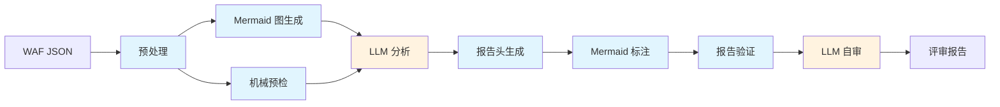

# AWS WAF 规则评审工具

[English](README_EN.md)

一个用于评审 AWS WAF Web ACL 配置的 [Agent Skill](https://agentskills.io)，帮助发现安全问题、配置错误和优化机会。

## 工作流程



蓝色 = Python 脚本（确定性），橙色 = LLM 推理

脚本处理结构化提取、图表生成和机械验证，LLM 聚焦于安全分析和报告撰写。如果脚本未安装，自动回退到纯 LLM 工作流。

## 功能

给定一个 AWS WAF Web ACL 的 JSON 导出文件，该 skill 会：

1. **预处理** — 提取结构化规则摘要，压缩输入（56KB → 16KB）
2. **机械预检** — 自动检测 token domain 冗余、版本过旧、冗余规则等 5 项确定性问题
3. **LLM 分析** — 按 18 项检查清单逐项审查，覆盖 Allow 规则审计、scope-down 验证、AntiDDoS AMR 配置、Bot Control 设置、SEO 影响、速率限制、跨规则依赖等
4. **报告生成** — 按严重程度分级的评审报告（Critical / Medium / Low / Awareness）
5. **Mermaid 流程图** — 自动生成规则执行流程图，标注问题引用
6. **自审** — 机械验证 + 对抗性检查，确保报告准确性

## 安装

将 `aws-waf-rules-reviewer` 目录复制到你的 AI 编程工具的 skill 目录。例如在 Kiro CLI 中：

```bash
./install.sh
```

安装后的目录结构：

```
~/.kiro/skills/aws-waf-rules-reviewer/
├── SKILL.md
├── references/
│   ├── checklist.md
│   ├── antiddos-amr.md
│   ├── bot-control.md
│   ├── challenge-captcha.md
│   ├── common-patterns.md
│   ├── crawler-seo.md
│   ├── ip-reputation.md
│   ├── managed-overrides.md
│   └── rate-based.md
└── scripts/
    ├── managed-labels.json
    ├── waf-preprocess.py
    ├── waf-generate-mermaid.py
    ├── waf-pre-checks.py
    ├── waf-generate-appendix.py
    ├── waf-generate-report-header.py
    ├── waf-annotate-mermaid.py
    └── waf-validate-report.py
```

**依赖**: Python 3.10+（标准库，无需 pip install）

对于其他工具（Claude Code、OpenRouter 等），将目录复制到对应的 skill 目录即可。脚本通过 `glob` 自动发现安装位置，无需配置路径。

## 输入

AWS WAF Web ACL 的 JSON 格式配置文件，通常通过以下方式获取：

- 从 AWS 控制台导出（Web ACL → "Download web ACL as JSON"）
- 使用 AWS CLI：`aws wafv2 get-web-acl --name <name> --scope <REGIONAL|CLOUDFRONT> --id <id>`

可以提供 JSON 文件的直接路径，也可以提供包含 JSON 文件的目录路径。支持三种 JSON 格式：AWS CLI 输出（PascalCase）、控制台导出、snake_case 自定义格式。

## 输出

一份 Markdown 格式的评审报告（`waf-review/waf-review-report.md`），包含：

- **摘要表** — 所有发现的问题及其严重程度和影响一览
- **详细发现** — 每个问题对应的规则、当前配置、问题描述和修复建议
- **待用户确认项** — 需要业务上下文才能判断严重程度的发现，标记为 ⏳
- **附录：规则执行流** — Mermaid 流程图，自动标注问题引用

### 严重程度

| 等级 | 含义 |
|------|------|
| 🔴 Critical | 攻击者可以完全绕过防护，或核心防护机制被禁用 |
| 🟡 Medium | 存在防护缺口，但需要特定条件才能利用 |
| 🟢 Low | 配置不够优化，但不直接影响安全性 |
| 🔵 Awareness | 非漏洞 — 用户应了解的运维信息 |

## 性能预期

LLM 分析步骤的耗时主要取决于参考文档的 context 大小（checklist + 领域知识库共 ~60KB），而非规则数量。以下为使用 Claude Sonnet 4.6 (1M) 的实测数据：

| 规则数量 | LLM 分析 thinking 时间 | 脚本步骤耗时 | 总耗时（估算） |
|---------|----------------------|------------|-------------|
| 27 条（实测） | ~10 分钟 | < 1 分钟 | ~15 分钟 |
| 100+ 条（预估） | ~15-20 分钟 | < 1 分钟 | ~25 分钟 |

> Thinking 时间受模型版本影响较大。随着模型对长 context 推理效率的提升，耗时预计会自然下降。

## 示例

`examples/` 目录包含一个完整的输入输出示例：

- `web-acl-example.json` — 组装的 27 条规则 WAF 配置（涵盖 AntiDDoS AMR、Bot Control、rate-based、自定义规则等典型场景）
- `waf-review/waf-review-report.md` — 实测输出的评审报告（中文，16 个 findings）
- `waf-review/` 下的其他文件 — 脚本生成的中间文件（summary、pre-checks、Mermaid 图等）

使用 Claude Sonnet 4.6 模型生成。

## 检查清单覆盖范围

评审涵盖 18 个类别，分为两个阶段：

**Phase 1: 独立检查**

1. Allow 规则审计（可伪造性、绕过风险）
2. Scope-down 语句（过窄 / 过宽）
3. AntiDDoS AMR 配置（ChallengeAllDuringEvent、豁免正则、SEO 影响、双实例模式）
4. Challenge 动作适用性（POST/API/原生 App 限制、Count 规则切换风险）
5. Bot Control 配置（Allow 覆盖风险、verified vs unverified bot）
6. 速率规则（激活延迟、阈值合理性、重叠 scope-down）
7. IP 信誉和匿名 IP 规则
8. Landing Page 和 Cookie 逻辑
9. 缺失的基线防护（CRS、KnownBadInputs）
10. WCU 容量感知
11. Token Domain 配置
12. 托管规则组版本
13. 日志和监控
14. byte_match_statement 中的哈希/不透明 search_string
15. Default Action（冗余的尾部 Allow-all 规则检测）
16. Landing Page Always-on Challenge（主动 DDoS 防御、免疫时间、爬虫排除）

**Phase 2: 全局交叉检查**

17. 跨规则和标签依赖分析（标签来源核实 + 修复影响分析）
18. 规则优先级排序（标签生产者在消费者之前）

## 版本历史

见 [CHANGELOG.md](CHANGELOG.md)。

## 支持的模型

本工具需要具备足够 **output token 容量** 的模型——评审报告可能很长，自审阶段还需要额外的输出空间。

**最低要求：64K output tokens。**

### Kiro CLI 用户

Kiro CLI 仅支持 Amazon Bedrock 上的 Claude 模型。在 Kiro 中使用 `/model` 切换模型。

| 模型 | 输入 Tokens | 输出 Tokens | 适用场景 |
|------|------------|------------|---------|
| Claude Sonnet 4.6 (1M) | 1M | 64K | ✅ 默认 — ≤100 条规则 |
| Claude Opus 4.6 (1M) | 1M | 128K | ✅ >100 条规则，复杂配置 |
| Claude Opus 4.5 | 200K | 64K | ✅ ≤100 条规则 |
| Claude Sonnet 4.5 | 200K | 64K | ✅ ≤100 条规则 |
| Claude Opus 4.1 | 200K | 64K | ✅ ≤100 条规则 |

### 其他 Agent 工具用户

任何满足 64K output 要求的模型均可使用。以下模型已确认满足最低要求：

#### 国内厂商

| 模型 | 厂商 | 输入 Tokens | 输出 Tokens | 备注 |
|------|------|------------|------------|------|
| MiMo-V2-Pro | 小米 | 1M | 128K | 1T 参数 MoE（42B 激活） |
| Kimi K2.5 | 月之暗面 | 256K | 64K | 1T 参数 MoE（32B 激活） |
| GLM5 Turbo | 智谱 AI | ~203K | 131K | 针对 OpenClaw agent 工作流优化 |
| MiniMax M2.5 | MiniMax | 196K | 64K | 230B MoE（10B 激活） |
| Step 3.5 Flash | 阶跃星辰 | 256K | 256K | 196B MoE（11B 激活） |

#### 国际厂商

| 模型 | 厂商 | 输入 Tokens | 输出 Tokens | 备注 |
|------|------|------------|------------|------|
| Amazon Nova 2 Lite | Amazon | 1M | 64K | 可通过 OpenRouter 使用 |
| GPT-5.3 Codex | OpenAI | 400K | 128K | 代码/工程专用 |
| GPT-5.4 | OpenAI | 922K | 128K | 首个具备 Codex 能力的主线推理模型 |
| Grok 4 | xAI | 256K | 256K | 推理常开；超过 128K 输入时价格翻倍 |
| Gemini 2.5 Pro | Google | 1M | 64K | 自适应思考 |
| Gemini 2.5 Flash | Google | 1M | 64K | 可控思考预算 |
| Gemini 3.1 Pro Preview | Google | 1M | 64K | 多模态旗舰 |

> 以上模型未经本工具实际测试。兼容性取决于你的 agent 框架如何将 skill 编排逻辑映射到模型 API。

## 免责声明

本工具由 AI 驱动，可能产生不准确或不完整的发现。生成的报告旨在作为人工评审的起点，而非替代。在根据报告做出任何变更之前，请务必结合实际 WAF 配置和业务上下文进行验证。
