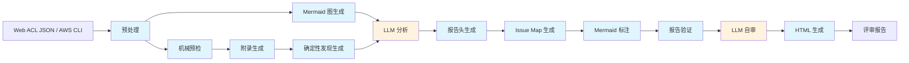

# AWS WAF 规则评审工具

<!-- NOTE: Keep README.md and README_EN.md in sync when making changes. -->

[English](README_EN.md)

给 AI 编程 agent 用的 AWS WAF Web ACL 配置评审工具，找安全问题、配置错误和可优化的地方。不用安装。你的 agent 读完 [AGENTS.md](AGENTS.md) 就会照着做。Claude Code、Codex、Cursor、Kiro 都能用，其他能跑 shell 命令的 agent 也行。

> [!WARNING]
> 不要用 Claude Opus 5.5 或 Claude Sonnet 5.5，请用更早的 Claude 模型，比如 Claude Sonnet 5。
>
> 评审时，agent 要分析 SQLi/XSS 规则匹配、绕过路径、Bot 和 DDoS 防护这类安全内容。我们用 Claude Opus 5.5 评审真实的 Web ACL 时，报告生成被 safety classifier 中断过，报错是 `Error: Not run: the response that made this tool call was stopped by a safety classifier.`。Claude Sonnet 5.5 比 Opus 5.5 发布得还晚，很可能也有同样的问题。
>
> 也不要用 Amazon Bedrock 上的 GPT 系列模型，除非你测试过自己的完整流程。这类防御性的 WAF 分析可能被上游的网络安全检查静默拦截，看起来就像 agent 不再响应了。

## 工作流程


```mermaid
flowchart LR
    A["Web ACL JSON / AWS CLI"] --> B["预处理"]
    B --> C["Mermaid 图生成"]
    B --> D["机械预检"]
    D --> D2["附录生成"]
    D2 --> D3["确定性发现生成"]
    C --> E["LLM 分析"]
    D3 --> E
    E --> E2["报告头生成"]
    E2 --> E3["Issue Map 生成"]
    E3 --> F["Mermaid 标注"]
    F --> G["报告验证"]
    G --> H["LLM 自审"]
    H --> J["HTML 生成"]
    J --> I["评审报告"]

    style B fill:#e1f5fe
    style C fill:#e1f5fe
    style D fill:#e1f5fe
    style D2 fill:#e1f5fe
    style D3 fill:#e1f5fe
    style E2 fill:#e1f5fe
    style E3 fill:#e1f5fe
    style F fill:#e1f5fe
    style G fill:#e1f5fe
    style J fill:#e1f5fe
    style E fill:#fff3e0
    style H fill:#fff3e0
```

蓝色 = Python 脚本（确定性），橙色 = LLM 推理

脚本处理结构化提取、图表生成、机械验证和确定性发现生成，LLM 仅聚焦于需要判断力的安全分析（Bot Control 策略、Cookie 逻辑、跨规则依赖）。

## 功能

给一个 Web ACL，可以是 JSON 文件，也可以让 agent 从你的账号里拉，agent 会：

1. **拉取配置**（可选）：用只读的 AWS CLI 命令拉 Web ACL 和它的日志配置
2. **预处理**：提取结构化规则摘要，压缩输入（56KB → 16KB）
3. **机械预检**：自动检测 token domain 冗余、版本过旧、冗余规则等 13 项确定性问题
4. **确定性发现生成**：26 个生成器自动产出大部分发现（可伪造 Allow、只按路径放行的 Allow、恒为真的 UriFragment 条件、路径规则缺少 URL 解码、处于 Count 的防护、托管规则未固定版本、真正有后果的顺序问题、建议补充的防护等），支持中英双语
5. **LLM 分析**：仅分析需要判断力的检查项（Bot Control 策略、Cookie 逻辑、跨规则依赖），按 21 项检查清单中脚本未覆盖的部分逐项审查
6. **报告生成**：按严重程度分级的评审报告（Critical / Medium / Low / Awareness）
7. **Mermaid 流程图**：自动生成规则执行流程图，标注问题引用
8. **自审**：机械验证 + 对抗性检查（仅针对 LLM 生成的发现），确保报告准确性
9. **HTML 报告**：脚本把 Markdown 报告转成单文件 HTML，不依赖 JavaScript，离线可看，Issue 编号可以点击跳转

## 使用

没有安装这一步。需要 Python 3.10+（只用标准库），agent 要能跑 shell 命令。

**在任意项目里用。** 对你的 agent 说：

> 读一下 https://raw.githubusercontent.com/chenghit/aws-waf-rules-reviewer/main/AGENTS.md ，帮我评审 AWS WAF Web ACL。

agent 会把这个仓库 clone 到临时目录，在那里跑脚本。报告写在你当前目录下。

**clone 下来用。**

```bash
git clone https://github.com/chenghit/aws-waf-rules-reviewer.git
cd aws-waf-rules-reviewer
```

在这个目录里启动 agent。Codex、Cursor 等大多数 agent 会自己加载 `AGENTS.md`，Claude Code 通过 `CLAUDE.md` 加载。如果你的 agent 不会自动加载，第一句先说"读一下 AGENTS.md"。然后直接提需求，比如"评审 us-east-1 的 Web ACL prod-acl"，或者"评审 examples/web-acl-example.json"。

## 输入

**JSON 文件或目录。** 可以从 AWS 控制台导出（Web ACL → "Download web ACL as JSON"），也可以用 `aws wafv2 get-web-acl` 拿。给文件路径，或者给包含该文件的目录都行。支持三种 JSON 格式：AWS CLI 输出（PascalCase）、控制台导出、snake_case 自定义格式。

**什么都不给。** agent 用 AWS CLI 自己拉。它会先用 `aws sts get-caller-identity` 给你看当前账号，再问 scope、region 和要评审哪个 Web ACL。全程只读，凭证需要 `wafv2:ListWebACLs`、`wafv2:GetWebACL`、`wafv2:GetLoggingConfiguration` 三个权限。它还会顺带拉日志配置。JSON 导出里没有这一项，所以拉下来之后报告才能说清日志到底开没开。

## 输出

同一份报告有两个文件：`waf-review-report.html` 用来看和发给别人，`waf-review-report.md` 用来改（改完让 agent 重新生成 HTML）。输入是本地文件时，报告放在文件旁边的 `waf-review/` 里。从账号拉取时，放在当前目录的 `./waf-review/<web-acl-name>/` 里。中间产物都在旁边的 `work/` 子目录里，包括拉下来的 `web-acl.json` 和 `logging-configuration.json`，不用管它们。报告包含：

- **摘要表**：所有发现的问题及其严重程度和影响一览
- **详细发现**：每个问题对应的规则、当前配置、问题描述和修复建议
- **待用户确认项**：需要业务上下文才能判断严重程度的发现，标记为 ⏳
- **附录：规则执行流**：按 priority 排列的规则链，标出每条规则的动作和相关问题。Markdown 里是 Mermaid 图，HTML 里直接画成卡片

### 严重程度

| 等级 | 含义 |
|------|------|
| 🔴 Critical | 攻击者可以完全绕过防护，或核心防护机制被禁用 |
| 🟡 Medium | 存在防护缺口，但需要特定条件才能利用 |
| 🟢 Low | 配置不够优化，但不直接影响安全性 |
| 🔵 Awareness | 非漏洞，用户应了解的运维信息 |

## 性能预期

v0.4 将约 80% 的发现从 LLM 分析转移到确定性脚本生成，大幅减少 LLM 的输出量和参考文档读取量。

| 规则数量 | LLM 分析（Step 4） | 自审（Step 7） | 全部脚本步骤 | 总耗时 |
|---------|------------------|--------------|------------|-------|
| 27 条（v0.7.1 实测） | 约 7.7 分钟 | 约 1.4 分钟 | < 10 秒 | 约 9.6 分钟 |

实测环境：Claude Code，Claude Opus 5.5，`examples/web-acl-example.json`。

> 相比 v0.3，总耗时未显著减少，但用户体验有明显改善：只有 Step 4（LLM 分析）有一段 thinking 等待，其他步骤均有连续输出。此外，脚本生成的发现支持中英双语，报告细节更加丰富。

## 示例

`examples/` 目录包含一个完整的输入输出示例：

- `web-acl-example.json`：组装的 27 条规则 WAF 配置（涵盖 AntiDDoS AMR、Bot Control、rate-based、自定义规则等典型场景）
- `waf-review/waf-review-report.html`、`waf-review/waf-review-report.md`：实测输出的评审报告（中文）
- `waf-review/work/`：脚本生成的中间文件（summary、pre-checks、Mermaid 图等）

使用 Claude Code + Claude Opus 5.5 生成。示例配置是组装的，这次没有触发 safety classifier，但在真实配置上触发过，见顶部的警告。

## 检查清单覆盖范围

评审涵盖 21 个类别：

**Phase 1: 独立检查**

1. Allow 规则审计（可伪造性、绕过风险）
2. Scope-down 语句（过窄 / 过宽）
3. AntiDDoS AMR 配置（ChallengeAllDuringEvent、豁免正则、SEO 影响、双实例模式）
4. Challenge 动作适用性（POST/API/原生 App 限制、Count 规则切换风险）
5. Bot Control 配置（Allow 覆盖风险、verified vs unverified bot）
6. 速率规则（激活延迟、阈值合理性、重叠 scope-down）
7. IP 信誉和匿名 IP 规则
8. Landing Page 和 Cookie 逻辑
9. 缺失的基线防护（CRS、KnownBadInputs）
10. WCU 容量感知
11. Token Domain 配置
12. 托管规则组版本（未固定版本、Bot Control 旧版本、SQLi 版本线）
13. 日志和监控
14. byte_match_statement 中的哈希/不透明 search_string
15. Default Action（冗余的尾部 Allow-all 规则检测）
16. Landing Page Always-on Challenge（主动 DDoS 防御、免疫时间、爬虫排除）

**Phase 2: 全局交叉检查**

17. 跨规则和标签依赖分析（标签来源核实 + 修复影响分析）
18. 规则优先级排序（只报真正有后果的顺序：标签先被消费后才产生、黑名单排在 Allow 之后、白名单 ACL 里内容检测排在 Allow 之后）

**附加检查**

19. 自定义规则的匹配是否正确（路径规则的 URL 解码、字面通配符、UriPath 上的查询串模式、UriFragment fallback）
20. 处于 Count 的防护（托管规则组整组 Count、内容检测规则被改成 Count）
21. 支付类客户的 PCI DSS 注意事项（ASV 扫描干扰、Requirement 6.4.2）

## 版本历史

见 [CHANGELOG.md](CHANGELOG.md)。

## 模型要求

模型至少要有 64K output tokens：报告可能很长，自审阶段还要额外的输出空间。推荐用 1M context 的模型，规则多的 Web ACL 和参考文档都要放进上下文。选模型前请先看顶部的警告。
## 免责声明

本工具由 AI 驱动，可能产生不准确或不完整的发现。生成的报告旨在作为人工评审的起点，而非替代。在根据报告做出任何变更之前，请务必结合实际 WAF 配置和业务上下文进行验证。
