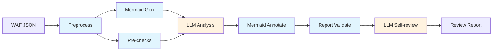

# AWS WAF Rules Reviewer

[中文版](README.md)

An [Agent Skill](https://agentskills.io) that reviews AWS WAF Web ACL configurations for security issues, misconfigurations, and optimization opportunities.

## Workflow



Blue = Python scripts (deterministic), Orange = LLM reasoning

Scripts handle structured extraction, diagram generation, and mechanical validation. LLM focuses on security analysis and report writing. Falls back to pure LLM workflow if scripts are not installed.

## What It Does

Given an AWS WAF Web ACL JSON export, this skill:

1. **Preprocesses** — extracts structured rule summaries, compresses input (56KB → 16KB)
2. **Pre-checks** — automatically detects token domain redundancy, outdated versions, redundant rules, and 5 other deterministic issues
3. **LLM analysis** — reviews against an 18-item checklist covering Allow rule audits, scope-down validation, AntiDDoS AMR configuration, Bot Control settings, SEO impact, rate limiting, cross-rule dependencies, and more
4. **Report generation** — severity-rated findings (Critical / Medium / Low / Awareness)
5. **Mermaid flow diagram** — auto-generated rule execution flow with issue annotations
6. **Self-review** — mechanical validation + adversarial checks for report accuracy

## Installation

Copy the `aws-waf-rules-reviewer` directory to your AI coding tool's skill directory. For Kiro CLI:

```bash
./install.sh
```

Installed structure:

```
~/.kiro/skills/aws-waf-rules-reviewer/
├── SKILL.md
├── references/
│   ├── checklist.md
│   └── waf-knowledge.md
└── scripts/
    ├── managed-labels.json
    ├── waf-preprocess.py
    ├── waf-generate-mermaid.py
    ├── waf-pre-checks.py
    ├── waf-annotate-mermaid.py
    └── waf-validate-report.py
```

**Dependencies**: Python 3.10+ (stdlib only, no pip install needed)

For other tools (Claude Code, OpenRouter, etc.), copy the directory to the corresponding skill location. Scripts auto-discover their install path via `glob` — no path configuration needed.

## Input

An AWS WAF Web ACL configuration in JSON format. Typically obtained by:

- Exporting from the AWS Console (Web ACL → "Download web ACL as JSON")
- Using the AWS CLI: `aws wafv2 get-web-acl --name <name> --scope <REGIONAL|CLOUDFRONT> --id <id>`

You can provide either a direct file path or a directory path containing the JSON file(s). Supports three JSON formats: AWS CLI output (PascalCase), Console export, and snake_case custom formats.

## Output

A Markdown report (`waf-review/waf-review-report.md`) containing:

- **Summary table** — all findings with severity and impact at a glance
- **Detailed findings** — each issue with the affected rule, current state, problem description, and recommendation
- **Items needing user confirmation** — findings where business context may change the severity, marked with ⏳
- **Appendix: Rule Execution Flow** — Mermaid diagram with issue annotations

### Severity Levels

| Level | Meaning |
|-------|---------|
| 🔴 Critical | Attackers can bypass protection entirely, or a core mechanism is disabled |
| 🟡 Medium | Protection gap exists but requires specific conditions to exploit |
| 🟢 Low | Suboptimal configuration without direct security impact |
| 🔵 Awareness | Not a vulnerability — operational information the user should know |

## Checklist Coverage

The review covers 18 categories in two phases:

**Phase 1: Independent Checks**

1. Allow rules audit (forgeability, bypass risk)
2. Scope-down statements (too narrow / too broad)
3. AntiDDoS AMR configuration (ChallengeAllDuringEvent, exempt regex, SEO impact, dual instance pattern)
4. Challenge action applicability (POST/API/native app limitations, Count-to-Challenge staging risk)
5. Bot Control configuration (Allow override risks, verified vs unverified bots)
6. Rate-based rules (activation delay, threshold reasonableness, overlapping scope-down)
7. IP reputation and anonymous IP rules
8. Landing page and cookie-based logic
9. Missing baseline protections (CRS, KnownBadInputs)
10. WCU capacity awareness
11. Token domain configuration
12. Managed rule group versions
13. Logging and monitoring
14. Hashed/opaque search_string in byte_match_statement
15. Default action (redundant trailing Allow-all detection)
16. Always-on Challenge for HTML pages (proactive DDoS defense, immunity time, crawler exclusion)

**Phase 2: Global Cross-checks**

17. Cross-rule and label dependency analysis (label source verification + fix impact analysis)
18. Rule priority ordering (label producers before consumers)

## Version History

See [CHANGELOG.md](CHANGELOG.md).

## Disclaimer

This skill is powered by AI, which may produce inaccurate or incomplete findings. The generated report is intended as a starting point for human review — not a substitute for it. Always verify findings against the actual WAF configuration and your business context before making changes.
