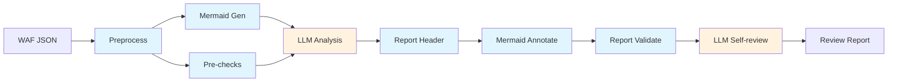

# AWS WAF Rules Reviewer

[中文版](README.md)

An [Agent Skill](https://agentskills.io) that reviews AWS WAF Web ACL configurations for security issues, misconfigurations, and optimization opportunities.

## Workflow



Blue = Python scripts (deterministic), Orange = LLM reasoning

Scripts handle structured extraction, diagram generation, and mechanical validation. LLM focuses on security analysis and report writing. Falls back to pure LLM workflow if scripts are not installed.

## What It Does

Given an AWS WAF Web ACL JSON export, this skill:

1. **Preprocesses** — extracts structured rule summaries, compresses input (56KB → 16KB)
2. **Pre-checks** — automatically detects token domain redundancy, outdated versions, redundant rules, and 5 other deterministic issues
3. **LLM analysis** — reviews against an 18-item checklist covering Allow rule audits, scope-down validation, AntiDDoS AMR configuration, Bot Control settings, SEO impact, rate limiting, cross-rule dependencies, and more
4. **Report generation** — severity-rated findings (Critical / Medium / Low / Awareness)
5. **Mermaid flow diagram** — auto-generated rule execution flow with issue annotations
6. **Self-review** — mechanical validation + adversarial checks for report accuracy

## Installation

Copy the `aws-waf-rules-reviewer` directory to your AI coding tool's skill directory. For Kiro CLI:

```bash
./install.sh
```

Installed structure:

```
~/.kiro/skills/aws-waf-rules-reviewer/
├── SKILL.md
├── references/
│   ├── checklist.md
│   └── waf-knowledge.md
└── scripts/
    ├── managed-labels.json
    ├── waf-preprocess.py
    ├── waf-generate-mermaid.py
    ├── waf-pre-checks.py
    ├── waf-annotate-mermaid.py
    └── waf-validate-report.py
```

**Dependencies**: Python 3.10+ (stdlib only, no pip install needed)

For other tools (Claude Code, OpenRouter, etc.), copy the directory to the corresponding skill location. Scripts auto-discover their install path via `glob` — no path configuration needed.

## Input

An AWS WAF Web ACL configuration in JSON format. Typically obtained by:

- Exporting from the AWS Console (Web ACL → "Download web ACL as JSON")
- Using the AWS CLI: `aws wafv2 get-web-acl --name <name> --scope <REGIONAL|CLOUDFRONT> --id <id>`

You can provide either a direct file path or a directory path containing the JSON file(s). Supports three JSON formats: AWS CLI output (PascalCase), Console export, and snake_case custom formats.

## Output

A Markdown report (`waf-review/waf-review-report.md`) containing:

- **Summary table** — all findings with severity and impact at a glance
- **Detailed findings** — each issue with the affected rule, current state, problem description, and recommendation
- **Items needing user confirmation** — findings where business context may change the severity, marked with ⏳
- **Appendix: Rule Execution Flow** — Mermaid diagram with issue annotations

### Severity Levels

| Level | Meaning |
|-------|---------|
| 🔴 Critical | Attackers can bypass protection entirely, or a core mechanism is disabled |
| 🟡 Medium | Protection gap exists but requires specific conditions to exploit |
| 🟢 Low | Suboptimal configuration without direct security impact |
| 🔵 Awareness | Not a vulnerability — operational information the user should know |

## Performance Expectations

The LLM analysis step's duration is primarily driven by reference context size (checklist + knowledge base, ~60KB combined), not rule count. Measured with Claude Sonnet 4.6 (1M):

| Rule Count | LLM Analysis Thinking Time | Script Steps | Total (estimated) |
|-----------|---------------------------|-------------|-------------------|
| 27 rules (measured) | ~10 min | < 1 min | ~15 min |
| 100+ rules (estimated) | ~15-20 min | < 1 min | ~25 min |

> Thinking time varies significantly across model versions. As models improve long-context reasoning efficiency, these times are expected to decrease.

## Examples

The `examples/` directory contains a complete input/output example:

- `web-acl-example.json` — assembled 27-rule WAF configuration (covers AntiDDoS AMR, Bot Control, rate-based, custom rules, and other typical scenarios)
- `waf-review/waf-review-report.md` — actual review report output (Chinese, 16 findings)
- `waf-review/` other files — script-generated intermediate files (summary, pre-checks, Mermaid diagrams, etc.)

Generated using Claude Sonnet 4.6.

## Checklist Coverage

The review covers 18 categories in two phases:

**Phase 1: Independent Checks**

1. Allow rules audit (forgeability, bypass risk)
2. Scope-down statements (too narrow / too broad)
3. AntiDDoS AMR configuration (ChallengeAllDuringEvent, exempt regex, SEO impact, dual instance pattern)
4. Challenge action applicability (POST/API/native app limitations, Count-to-Challenge staging risk)
5. Bot Control configuration (Allow override risks, verified vs unverified bots)
6. Rate-based rules (activation delay, threshold reasonableness, overlapping scope-down)
7. IP reputation and anonymous IP rules
8. Landing page and cookie-based logic
9. Missing baseline protections (CRS, KnownBadInputs)
10. WCU capacity awareness
11. Token domain configuration
12. Managed rule group versions
13. Logging and monitoring
14. Hashed/opaque search_string in byte_match_statement
15. Default action (redundant trailing Allow-all detection)
16. Always-on Challenge for landing pages (proactive DDoS defense, immunity time, crawler exclusion)

**Phase 2: Global Cross-checks**

17. Cross-rule and label dependency analysis (label source verification + fix impact analysis)
18. Rule priority ordering (label producers before consumers)

## Version History

See [CHANGELOG.md](CHANGELOG.md).

## Supported Models

This tool requires a model with sufficient **output token capacity** — the review report can be long, and the self-review stage needs additional output headroom.

**Minimum requirement: 64K output tokens.**

### Kiro CLI Users

Kiro CLI only supports Claude models on Amazon Bedrock. Switch models with `/model` in Kiro.

| Model | Input Tokens | Output Tokens | Use Case |
|-------|-------------|--------------|----------|
| Claude Sonnet 4.6 (1M) | 1M | 64K | ✅ Default — ≤100 rules |
| Claude Opus 4.6 (1M) | 1M | 128K | ✅ >100 rules, complex configs |
| Claude Opus 4.5 | 200K | 64K | ✅ ≤100 rules |
| Claude Sonnet 4.5 | 200K | 64K | ✅ ≤100 rules |
| Claude Opus 4.1 | 200K | 64K | ✅ ≤100 rules |

### Other Agent Tool Users

Any model meeting the 64K output requirement should work. The following models have been confirmed to meet the minimum:

#### Chinese Providers

| Model | Provider | Input Tokens | Output Tokens | Notes |
|-------|----------|-------------|--------------|-------|
| MiMo-V2-Pro | Xiaomi | 1M | 128K | 1T-param MoE (42B active) |
| Kimi K2.5 | Moonshot AI | 256K | 64K | 1T-param MoE (32B active) |
| GLM5 Turbo | Z.AI (Zhipu) | ~203K | 131K | Optimized for OpenClaw agent workflows |
| MiniMax M2.5 | MiniMax | 196K | 64K | 230B MoE (10B active) |
| Step 3.5 Flash | StepFun | 256K | 256K | 196B MoE (11B active) |

#### International Providers

| Model | Provider | Input Tokens | Output Tokens | Notes |
|-------|----------|-------------|--------------|-------|
| Amazon Nova 2 Lite | Amazon | 1M | 64K | Available via OpenRouter |
| GPT-5.3 Codex | OpenAI | 400K | 128K | Code/engineering focused |
| GPT-5.4 | OpenAI | 922K | 128K | First mainline reasoning model with Codex capabilities |
| Grok 4 | xAI | 256K | 256K | Reasoning always-on; pricing doubles above 128K input |
| Gemini 2.5 Pro | Google | 1M | 64K | Adaptive thinking |
| Gemini 2.5 Flash | Google | 1M | 64K | Controllable thinking budget |
| Gemini 3.1 Pro Preview | Google | 1M | 64K | Multimodal flagship |

> These models are not tested with this tool. Compatibility depends on how well your agent framework maps the skill orchestration logic to the model's API.

## Disclaimer

This skill is powered by AI, which may produce inaccurate or incomplete findings. The generated report is intended as a starting point for human review — not a substitute for it. Always verify findings against the actual WAF configuration and your business context before making changes.
