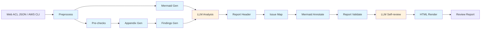

# AWS WAF Rules Reviewer

<!-- NOTE: Keep README.md and README_EN.md in sync when making changes. -->

[中文版](README.md)

A tool for AI coding agents that reviews AWS WAF Web ACL configurations for security issues, misconfigurations, and optimization opportunities. There's nothing to install. Your agent reads [AGENTS.md](AGENTS.md) and follows it. It works with Claude Code, Codex, Cursor, Kiro, and any other agent that can run shell commands.

## Workflow


```mermaid
flowchart LR
    A["Web ACL JSON / AWS CLI"] --> B["Preprocess"]
    B --> C["Mermaid Gen"]
    B --> D["Pre-checks"]
    D --> D2["Appendix Gen"]
    D2 --> D3["Findings Gen"]
    C --> E["LLM Analysis"]
    D3 --> E
    E --> E2["Report Header"]
    E2 --> E3["Issue Map"]
    E3 --> F["Mermaid Annotate"]
    F --> G["Report Validate"]
    G --> H["LLM Self-review"]
    H --> J["HTML Render"]
    J --> I["Review Report"]

    style B fill:#e1f5fe
    style C fill:#e1f5fe
    style D fill:#e1f5fe
    style D2 fill:#e1f5fe
    style D3 fill:#e1f5fe
    style E2 fill:#e1f5fe
    style E3 fill:#e1f5fe
    style F fill:#e1f5fe
    style G fill:#e1f5fe
    style J fill:#e1f5fe
    style E fill:#fff3e0
    style H fill:#fff3e0
```

Blue = Python scripts (deterministic), Orange = LLM reasoning

Scripts handle structured extraction, diagram generation, mechanical validation, and deterministic finding generation. LLM focuses only on judgment-heavy security analysis (Bot Control strategy, cookie logic, cross-rule dependencies).

## What It Does

Given a Web ACL, either as a JSON file or fetched from your account, the agent:

1. **Fetches** (optional): pulls the Web ACL and its logging config with read-only AWS CLI calls
2. **Preprocesses**: extracts structured rule summaries, compresses input (56KB → 16KB)
3. **Pre-checks**: automatically detects token domain redundancy, outdated versions, redundant rules, challenge on POST/API paths, and other deterministic issues (13 checks total)
4. **Deterministic findings**: 26 generators auto-produce most findings (forgeable Allow, path-only Allow, UriFragment conditions that always match, path rules without URL decoding, protections left in Count, unpinned managed rule versions, ordering problems with real consequences, recommended protections, etc.) with bilingual support (en/zh)
5. **LLM analysis**: only analyzes judgment-heavy checklist items (Bot Control strategy, cookie logic, cross-rule dependencies) from the sections not covered by scripts
6. **Report generation**: severity-rated findings (Critical / Medium / Low / Awareness)
7. **Mermaid flow diagram**: auto-generated rule execution flow with issue annotations
8. **Self-review**: mechanical validation + adversarial checks (LLM-generated findings only) for report accuracy
9. **HTML report**: a script turns the Markdown report into a single HTML file that needs no JavaScript, works offline, and links issue numbers to their findings

## Usage

There's no install step. You need Python 3.10+ (standard library only), and your agent needs to be able to run shell commands.

**From any project.** Tell your agent:

> Read https://raw.githubusercontent.com/<OWNER>/aws-waf-rules-reviewer/main/AGENTS.md and review my AWS WAF Web ACL.

The agent clones this repo into a temp directory and runs the scripts from there. The report goes under your current directory.

**From a clone.**

```bash
git clone https://github.com/<OWNER>/aws-waf-rules-reviewer.git
cd aws-waf-rules-reviewer
```

Start your agent in that directory. Codex, Cursor, and most other agents load `AGENTS.md` on their own. Claude Code loads it through `CLAUDE.md`. If yours doesn't, begin with "read AGENTS.md". Then ask for a review, e.g. "review the Web ACL prod-acl in us-east-1" or "review examples/web-acl-example.json".

## Input

**A JSON file or directory.** Export it from the AWS Console (Web ACL → "Download web ACL as JSON") or with `aws wafv2 get-web-acl`. You can give the file path, or a directory that contains the file. Three JSON formats work: AWS CLI output (PascalCase), Console export, and snake_case custom formats.

**Nothing.** The agent fetches the Web ACL with the AWS CLI. It first shows you the account from `aws sts get-caller-identity`, then asks for the scope, the region, and which Web ACL. It only makes read calls, so your credentials need `wafv2:ListWebACLs`, `wafv2:GetWebACL`, and `wafv2:GetLoggingConfiguration`. It also fetches the logging config, which a JSON export doesn't include, so the report can say whether logging is actually on.

## Output

The report comes as two files: `waf-review-report.html` to read and share, and `waf-review-report.md` to edit (ask the agent to render the HTML again after editing). For a local file they go in `waf-review/` next to that file. For a fetched Web ACL they go in `./waf-review/<web-acl-name>/`. Intermediate files, including the fetched `web-acl.json` and `logging-configuration.json`, sit in a `work/` subfolder you can ignore. The report contains:

- **Summary table**: all findings with severity and impact at a glance
- **Detailed findings**: each issue with the affected rule, current state, problem description, and recommendation
- **Items needing user confirmation**: findings where business context may change the severity, marked with ⏳
- **Appendix: Rule Execution Flow**: the rules in priority order, with each rule's action and related issues. A Mermaid diagram in the Markdown, drawn as cards in the HTML

### Severity Levels

| Level | Meaning |
|-------|---------|
| 🔴 Critical | Attackers can bypass protection entirely, or a core mechanism is disabled |
| 🟡 Medium | Protection gap exists but requires specific conditions to exploit |
| 🟢 Low | Suboptimal configuration without direct security impact |
| 🔵 Awareness | Not a vulnerability. Operational information the user should know |

## Performance Expectations

v0.4 moves ~80% of findings from LLM analysis to deterministic script generation, significantly reducing LLM output volume and reference context reads.

| Rule Count | LLM Analysis Thinking Time | Script Steps | Total (estimated) |
|-----------|---------------------------|-------------|-------------------|
| 27 rules (measured) | ~4 min | < 1 min | ~10 min |
| 100+ rules (estimated) | ~8 min | < 1 min | ~15 min |

> Compared to v0.3, total time has not decreased significantly, but user experience is noticeably better: only Step 4 (LLM analysis) has a thinking wait period. All other steps produce continuous output. Additionally, scripted findings support bilingual output (en/zh) and provide richer report details.

## Examples

The `examples/` directory contains a complete input/output example:

- `web-acl-example.json`: assembled 27-rule WAF configuration (covers AntiDDoS AMR, Bot Control, rate-based, custom rules, and other typical scenarios)
- `waf-review/waf-review-report.md`: actual review report output (Chinese)
- `waf-review/` other files: script-generated intermediate files (summary, pre-checks, Mermaid diagrams, etc.)

Generated using Claude Sonnet 4.6.

## Checklist Coverage

The review covers 21 categories:

**Phase 1: Independent Checks**

1. Allow rules audit (forgeability, bypass risk)
2. Scope-down statements (too narrow / too broad)
3. AntiDDoS AMR configuration (ChallengeAllDuringEvent, exempt regex, SEO impact, dual instance pattern)
4. Challenge action applicability (POST/API/native app limitations, Count-to-Challenge staging risk)
5. Bot Control configuration (Allow override risks, verified vs unverified bots)
6. Rate-based rules (activation delay, threshold reasonableness, overlapping scope-down)
7. IP reputation and anonymous IP rules
8. Landing page and cookie-based logic
9. Missing baseline protections (CRS, KnownBadInputs)
10. WCU capacity awareness
11. Token domain configuration
12. Managed rule group versions (unpinned groups, old Bot Control versions, SQLi version lineages)
13. Logging and monitoring
14. Hashed/opaque search_string in byte_match_statement
15. Default action (redundant trailing Allow-all detection)
16. Always-on Challenge for landing pages (proactive DDoS defense, immunity time, crawler exclusion)

**Phase 2: Global Cross-checks**

17. Cross-rule and label dependency analysis (label source verification + fix impact analysis)
18. Rule priority ordering (only orderings with real consequences: labels consumed before they're produced, block lists after Allow rules, inspection after Allow rules in allow-list ACLs)

**Additional Checks**

19. Custom rule matching correctness (URL decoding on path rules, literal wildcards, query patterns on UriPath, UriFragment fallback)
20. Protections left in Count (whole managed groups, content rules overridden to Count)
21. PCI DSS considerations for payment customers (ASV scan interference, Requirement 6.4.2)

## Version History

See [CHANGELOG.md](CHANGELOG.md).

## Supported Models

This tool requires a model with sufficient **output token capacity**. The review report can be long, and the self-review stage needs additional output headroom.

**Minimum requirement: 64K output tokens.**

### Claude

| Model | Input Tokens | Output Tokens | Use Case |
|-------|-------------|--------------|----------|
| Claude Sonnet 4.6 (1M) | 1M | 64K | ✅ Default, ≤100 rules |
| Claude Opus 4.6 (1M) | 1M | 128K | ✅ >100 rules, complex configs |
| Claude Opus 4.5 | 200K | 64K | ✅ ≤100 rules |
| Claude Sonnet 4.5 | 200K | 64K | ✅ ≤100 rules |
| Claude Opus 4.1 | 200K | 64K | ✅ ≤100 rules |

### Other Models

Any model that meets the 64K output requirement should work. These models are confirmed to meet it:

#### Chinese Providers

| Model | Provider | Input Tokens | Output Tokens | Notes |
|-------|----------|-------------|--------------|-------|
| MiMo-V2-Pro | Xiaomi | 1M | 128K | 1T-param MoE (42B active) |
| Kimi K2.5 | Moonshot AI | 256K | 64K | 1T-param MoE (32B active) |
| GLM5 Turbo | Z.AI (Zhipu) | ~203K | 131K | Optimized for OpenClaw agent workflows |
| MiniMax M2.5 | MiniMax | 196K | 64K | 230B MoE (10B active) |
| Step 3.5 Flash | StepFun | 256K | 256K | 196B MoE (11B active) |

#### International Providers

| Model | Provider | Input Tokens | Output Tokens | Notes |
|-------|----------|-------------|--------------|-------|
| Amazon Nova 2 Lite | Amazon | 1M | 64K | Available via OpenRouter |
| GPT-5.3 Codex | OpenAI | 400K | 128K | Code/engineering focused |
| GPT-5.4 | OpenAI | 922K | 128K | First mainline reasoning model with Codex capabilities |
| Grok 4 | xAI | 256K | 256K | Reasoning always-on; pricing doubles above 128K input |
| Gemini 2.5 Pro | Google | 1M | 64K | Adaptive thinking |
| Gemini 2.5 Flash | Google | 1M | 64K | Controllable thinking budget |
| Gemini 3.1 Pro Preview | Google | 1M | 64K | Multimodal flagship |

> These models are not tested with this tool. Compatibility depends on how well your agent follows the workflow in AGENTS.md. Model specs and availability may change at any time. Refer to each provider's official documentation.

## Disclaimer

This tool is powered by AI, which may produce inaccurate or incomplete findings. The generated report is a starting point for human review and doesn't replace it. Always verify findings against the actual WAF configuration and your business context before making changes.
