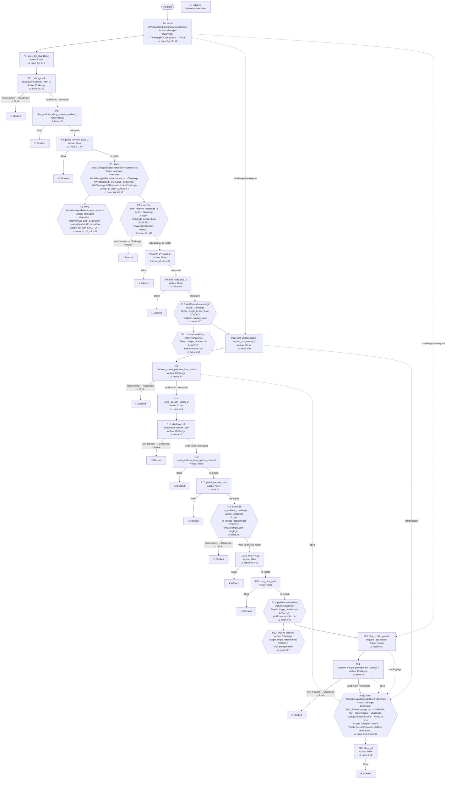

```mermaid
flowchart TD
    START(["Request"]) --> rule_0

    rule_0["P0: AWS-AWSManagedRulesAntiDDoSRuleSet\nAction: Managed\nOverrides: ChallengeAllDuringEvent→Count\n⚠️ Issue #4, #5, #6"]

    rule_1["P1: spec_43_JA4_DDoS\nAction: Count\n⚠️ Issue #6, #16"]

    rule_2["P2: challenge-all-reasonable-specific_path_2\nAction: Challenge\n⚠️ Issue #6, #7"]
    rule_2 -->|"non-browser → Challenge = Block"| BLOCK_rule_2["🚫 Blocked"]

    rule_3["P3: chat_platform_deny_options_method_2\nAction: Block\n⚠️ Issue #6"]
    rule_3 -->|"Block"| BLOCK_rule_3["🚫 Blocked"]

    rule_4["P4: probe_service_pass_2\nAction: Allow\n⚠️ Issue #1, #6"]
    rule_4 -->|"Allow"| ALLOW_rule_4["✅ Allowed"]

    rule_5{{"P5: AWS-AWSManagedRulesAmazonIpReputationList\nAction: Managed\nOverrides: AWSManagedReconnaissanceList→Challenge, AWSManagedIPDDoSList→Challenge, AWSManagedIPReputationList→Challenge\nScope: uri_path EXACTLY '/'\n⚠️ Issue #6, #8, #21"}}
    rule_6{{"P6: AWS-AWSManagedRulesAnonymousIpList\nAction: Managed\nOverrides: AnonymousIPList→Challenge, HostingProviderIPList→Allow\nScope: uri_path EXACTLY '/'\n⚠️ Issue #2, #6, #8, #21"}}
    rule_5 --> rule_6

    rule_7{{"P7: example-com_ratelimit_challenge_2\nAction: Challenge\nScope: OR(single_header:host EXACTLY 'www.example.com', single_h...\n⚠️ Issue #6, #17"}}
    rule_7 -->|"non-browser → Challenge = Block"| BLOCK_rule_7["🚫 Blocked"]

    rule_8["P8: APP-BYPASS_2\nAction: Allow\n⚠️ Issue #3, #6, #19"]
    rule_8 -->|"Allow"| ALLOW_rule_8["✅ Allowed"]

    rule_9["P9: ban_chat_ipv6_2\nAction: Block\n⚠️ Issue #6"]
    rule_9 -->|"Block"| BLOCK_rule_9["🚫 Blocked"]

    rule_10{{"P10: platform-all-ratelimit_2\nAction: Challenge\nScope: single_header:host EXACTLY 'platform.example.com'\n⚠️ Issue #17"}}
    rule_11{{"P11: chat-all-ratelimit_2\nAction: Challenge\nScope: single_header:host EXACTLY 'chat.example.com'\n⚠️ Issue #17"}}
    rule_10 --> rule_11

    rule_12["P12: chat_challengeable-request_bot_control_2\nAction: Count\n⚠️ Issue #20"]

    rule_13["P13: platform_create_payment_bot_control\nAction: Challenge\n⚠️ Issue #7"]
    rule_13 -->|"non-browser → Challenge = Block"| BLOCK_rule_13["🚫 Blocked"]

    rule_14["P14: spec_43_JA4_DDoS_2\nAction: Count\n⚠️ Issue #16"]

    rule_15["P15: challenge-all-reasonable-specific_path\nAction: Challenge\n⚠️ Issue #7"]
    rule_15 -->|"non-browser → Challenge = Block"| BLOCK_rule_15["🚫 Blocked"]

    rule_16["P16: chat_platform_deny_options_method\nAction: Block"]
    rule_16 -->|"Block"| BLOCK_rule_16["🚫 Blocked"]

    rule_17["P17: probe_service_pass\nAction: Allow\n⚠️ Issue #1"]
    rule_17 -->|"Allow"| ALLOW_rule_17["✅ Allowed"]

    rule_18{{"P18: example-com_ratelimit_challenge\nAction: Challenge\nScope: OR(single_header:host EXACTLY 'www.example.com', single_h...\n⚠️ Issue #17"}}
    rule_18 -->|"non-browser → Challenge = Block"| BLOCK_rule_18["🚫 Blocked"]

    rule_19["P19: APP-BYPASS\nAction: Allow\n⚠️ Issue #3, #19"]
    rule_19 -->|"Allow"| ALLOW_rule_19["✅ Allowed"]

    rule_20["P20: ban_chat_ipv6\nAction: Block"]
    rule_20 -->|"Block"| BLOCK_rule_20["🚫 Blocked"]

    rule_21{{"P21: platform-all-ratelimit\nAction: Challenge\nScope: single_header:host EXACTLY 'platform.example.com'\n⚠️ Issue #17"}}
    rule_22{{"P22: chat-all-ratelimit\nAction: Challenge\nScope: single_header:host EXACTLY 'chat.example.com'\n⚠️ Issue #17"}}
    rule_21 --> rule_22

    rule_23["P23: chat_challengeable-request_bot_control\nAction: Count\n⚠️ Issue #20"]

    rule_24["P24: platform_create_payment_bot_control_2\nAction: Challenge\n⚠️ Issue #7"]
    rule_24 -->|"non-browser → Challenge = Block"| BLOCK_rule_24["🚫 Blocked"]

    rule_25{{"P25: AWS-AWSManagedRulesBotControlRuleSet\nAction: Managed\nOverrides: TGT_TokenReuseIpLow→CAPTCHA, TGT_TokenAbsent→Challenge, CategorySearchEngine→Allow, +1 more\nScope: OR(label_match 'challenge:spec' (scope=LABEL), label_matc...\n⚠️ Issue #12, #13, #19"}}

    rule_26["P26: allow_all\nAction: Allow\n⚠️ Issue #14"]
    rule_26 -->|"Allow"| ALLOW_rule_26["✅ Allowed"]

    rule_0 --> rule_1
    rule_1 --> rule_2
    rule_2 -->|"valid token / no match"| rule_3
    rule_3 -->|"no match"| rule_4
    rule_4 -->|"no match"| rule_5
    rule_5 --> rule_7
    rule_7 -->|"valid token / no match"| rule_8
    rule_8 -->|"no match"| rule_9
    rule_9 -->|"no match"| rule_10
    rule_10 --> rule_12
    rule_12 --> rule_13
    rule_13 -->|"valid token / no match"| rule_14
    rule_14 --> rule_15
    rule_15 -->|"valid token / no match"| rule_16
    rule_16 -->|"no match"| rule_17
    rule_17 -->|"no match"| rule_18
    rule_18 -->|"valid token / no match"| rule_19
    rule_19 -->|"no match"| rule_20
    rule_20 -->|"no match"| rule_21
    rule_21 --> rule_23
    rule_23 --> rule_24
    rule_24 -->|"valid token / no match"| rule_25
    rule_25 --> rule_26
    DEFAULT_ACTION["✅ Allowed\nDefault Action: allow"]

    rule_0 -.->|"challengeable-request"| rule_12
    rule_0 -.->|"challengeable-request"| rule_23
    rule_13 -.->|"spec"| rule_25
    rule_24 -.->|"spec"| rule_25
    rule_12 -.->|"landingpage"| rule_25
    rule_23 -.->|"landingpage"| rule_25
```
