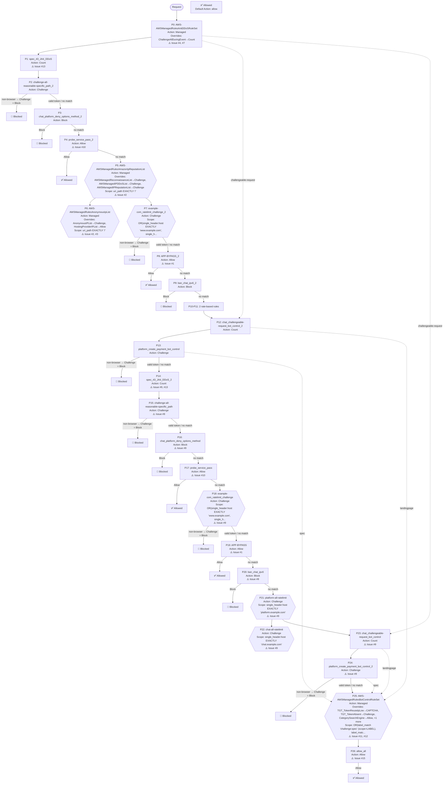

# AWS WAF Web ACL Rules Review Report

**Web ACL**: example-prod
**Review Date**: 2026-03-30
**Objective**: Review WAF configuration for security issues, misconfigurations, and optimization opportunities

## Summary

| Severity | Issue | Impact |
|----------|-------|--------|
| 🔴 Critical | #1 APP-BYPASS 规则基于可伪造的 User-Agent 实现全局绕过 | User-Agent 是完全可伪造的请求头，攻击者只需在请求中添加 `User-Agent: example/1.0` 即可触发 Allow，跳过所有后续... |
| 🔴 Critical | #2 IP 信誉和匿名 IP 规则组的 scope-down 仅覆盖首页 | 绝大多数请求（API 调用、页面导航、资源请求等）的 URI 不是精确的 `/`，因此这两个规则组对实际流量几乎没有任何保护作用 |
| 🔴 Critical | #3 HostingProviderIPList 被 override 为 Allow | Allow 是终止动作，来自云托管平台 IP 的请求将跳过所有后续规则（速率限制、Bot Control 等） |
| 🔴 Critical | #4 AntiDDoS AMR 的 ChallengeAllDuringEvent 被 override 为 Count | `ChallengeAllDuringEvent` 是 AntiDDoS AMR 的核心软性缓解机制：在检测到 DDoS 事件时，对所有可 Challen... |
| 🟡 Medium | #5 缺少针对 HTML 页面的 Always-on Challenge 规则 | AntiDDoS AMR 是被动检测机制，需要时间建立流量基线（约 15 分钟）才能开始检测异常，在此窗口期内攻击流量不受限制 |
| 🟡 Medium | #6 缺少搜索引擎爬虫标记规则，AntiDDoS AMR 可能影响 SEO | AntiDDoS AMR 的 `ChallengeAllDuringEvent` 在 DDoS 事件期间会对所有可 Challenge 的请求执行 Cha... |
| 🟡 Medium | #7 AntiDDoS AMR 的 URI 豁免正则表达式未锚定，存在绕过风险 | 未锚定的路径模式是"包含"匹配，而非"以...开头"匹配 |
| 🟡 Medium | #8 缺少应用层基础防护规则组（CRS、KnownBadInputs） | 当前 Web ACL 专注于 DDoS 防护和 Bot 检测，缺少 OWASP Top 10 防护（SQLi、XSS 等） |
| 🟡 Medium | #9 Web ACL 中存在大量完全重复的规则 | 优先级较低（数字较大）的重复规则永远不会被执行：当请求到达 P14-P24 时，P1-P13 中相同条件的规则已经处理过该请求（Allow/Block 已... |
| 🟢 Low | #10 probe_service_pass 规则基于可伪造的请求头实现 Allow | 自定义请求头是可伪造的条件，任何人都可以在请求中添加此头部来触发 Allow，绕过所有后续规则 |
| 🟢 Low | #11 BotControlRuleSet 版本过旧（4.0 < 5.0） | Version 5.0 的 Common 级别可识别近 700 种 Bot 类型（基于 UA 和 IP），较旧版本显著提升 |
| 🟢 Low | #12 CategorySearchEngine 和 CategorySeo 被 override 为 Allow | Category 规则只匹配**未验证的** Bot（自称搜索引擎爬虫但无法通过反向 DNS 验证的请求）；已验证的爬虫（真实 Googlebot 等）本... |
| 🔵 Awareness | #13 spec_43_JA4_DDoS 规则 Count 但不产生任何标签 | Count 规则不产生标签时，下游规则无法基于此规则的匹配结果做任何决策 |
| 🔵 Awareness | #14 token_domains 包含冗余子域名 | `example.com`（顶级域）自动覆盖所有一级子域名（`*.example.com`），无需单独列出 |
| 🔵 Awareness | #15 allow_all 规则与 default_action Allow 冗余 | 此规则永远不会改变任何请求的最终结果——到达 P26 的请求无论如何都会被 default_action Allow |
| 🔵 Awareness | #16 Web ACL 当前 WCU 使用量提示 | 本报告建议添加多条新规则（爬虫标记规则、Always-on Challenge、CRS、KnownBadInputs 等），同时建议删除大量重复规则 |

---

## Issue 1 (Critical): APP-BYPASS 规则基于可伪造的 User-Agent 实现全局绕过

**Rules**: APP-BYPASS_2 (priority 8), APP-BYPASS (priority 19)

**Current state**: 两条规则均匹配 `user-agent` 以 `'example'` 开头的请求，动作为 Allow，无任何不可伪造的验证维度。

**Problem**:
- User-Agent 是完全可伪造的请求头，攻击者只需在请求中添加 `User-Agent: example/1.0` 即可触发 Allow，跳过所有后续规则（IP 信誉、匿名 IP、速率限制、Bot Control 等）
- Allow 是终止动作，一旦命中，后续所有规则均不再执行，等同于为攻击者提供了完整的 WAF 绕过通道
- 两条规则逻辑完全相同，均存在此漏洞（见 Issue #9 关于重复规则的说明）

**Recommendation**:
- 如果此规则用于标识原生 App 流量，应改用不可伪造的维度（如 IP 集合、WAF Token、HMAC 签名）进行验证，或改为 Count+Label 动作，不使用 Allow
- 短期方案：将 Allow 改为 Count+Label（如 `native-app:identified`），再由下游规则针对该标签做差异化处理
- 中期方案：集成 AWS WAF Mobile SDK，使原生 App 请求携带合法 WAF Token，然后基于 Token 状态而非 UA 做决策
- **绝不应**仅凭 User-Agent 前缀授予 Allow 权限

---

## Issue 2 (Critical): IP 信誉和匿名 IP 规则组的 scope-down 仅覆盖首页

**Rules**: AWS-AWSManagedRulesAmazonIpReputationList (priority 5), AWS-AWSManagedRulesAnonymousIpList (priority 6)

**Current state**: 两个规则组均配置了 `scope_down: uri_path EXACTLY '/'`，即只对访问根路径 `/` 的请求生效。

**Problem**:
- 绝大多数请求（API 调用、页面导航、资源请求等）的 URI 不是精确的 `/`，因此这两个规则组对实际流量几乎没有任何保护作用
- 已知恶意 IP、侦察 IP、TOR 节点、匿名代理等流量在访问 `/api/`、`/messages`、`/payments` 等路径时完全不受检查
- 这两个规则组的 WCU 成本（25 + 50 = 75）被完全浪费

**Recommendation**:
- 移除两个规则组的 scope-down，使其检查所有流量
- 如果出于性能考虑需要保留 scope-down，应使用更宽泛的条件（如排除静态资源扩展名），而非精确匹配单一路径

---

## Issue 3 (Critical): HostingProviderIPList 被 override 为 Allow

**Rule**: AWS-AWSManagedRulesAnonymousIpList (priority 6)

**Current state**: `HostingProviderIPList` 规则被 override 为 Allow 动作。

**Problem**:
- Allow 是终止动作，来自云托管平台 IP 的请求将跳过所有后续规则（速率限制、Bot Control 等）
- 大量 DDoS 攻击流量来自云平台（AWS、GCP、Azure 等）的租用实例，此配置为这类攻击提供了完整的 WAF 绕过通道
- 与 Issue #2 叠加：即使修复了 scope-down，HostingProviderIPList 的 Allow override 仍会让云平台来源的攻击流量绕过所有后续保护

**Recommendation**:
- 将 `HostingProviderIPList` override 改为 **Count**，保留标签用于下游规则的差异化处理
- 如需对云平台流量做速率限制，可在下游添加基于 `awswaf:managed:aws:anonymous-ip-list:hosting-provider-ip-list` 标签的速率限制规则

---

## Issue 4 (Critical): AntiDDoS AMR 的 ChallengeAllDuringEvent 被 override 为 Count

**Rule**: AWS-AWSManagedRulesAntiDDoSRuleSet (priority 0)

**Current state**: `ChallengeAllDuringEvent` 规则被 override 为 Count，在 DDoS 事件期间不会对可 Challenge 的请求执行 Challenge 动作。

**Problem**:
- `ChallengeAllDuringEvent` 是 AntiDDoS AMR 的核心软性缓解机制：在检测到 DDoS 事件时，对所有可 Challenge 的请求（浏览器 GET + text/html）执行 Challenge，过滤无法完成 JS 验证的攻击工具
- 将其 override 为 Count 后，AMR 仍会检测 DDoS 事件并打标签，但不会在事件期间主动缓解可 Challenge 的流量，防护效果大幅下降
- 当前 Web ACL 没有 Always-on Challenge 规则（见 Issue #5），也没有其他能在 DDoS 事件期间替代此功能的机制，导致 DDoS 防护存在重大缺口

**Recommendation**:
- 如果禁用 `ChallengeAllDuringEvent` 是为了避免影响原生 App 流量（原生 App 无法完成 Challenge），应采用双实例模式：
  1. 在 AMR 之前添加 Count+Label 规则标识原生 App 流量（如 `native-app:identified`）
  2. AMR 实例 1（浏览器流量）：scope-down 排除原生 App 标签，启用 `ChallengeAllDuringEvent`，Block 灵敏度 LOW
  3. AMR 实例 2（原生 App 流量）：scope-down 仅匹配原生 App 标签，禁用 `ChallengeAllDuringEvent`，Block 灵敏度 MEDIUM
- 如果没有原生 App 流量，直接移除 `ChallengeAllDuringEvent` 的 Count override，恢复默认行为

---

## Issue 5 (Medium): 缺少针对 HTML 页面的 Always-on Challenge 规则

**Rule**: N/A（缺失规则）

**Current state**: Web ACL 中没有针对浏览器 HTML 页面请求（GET + Accept: text/html）的常态化 Challenge 规则。

**Problem**:
- AntiDDoS AMR 是被动检测机制，需要时间建立流量基线（约 15 分钟）才能开始检测异常，在此窗口期内攻击流量不受限制
- Always-on Challenge 是主动防御：要求所有浏览器 HTML 页面请求在首次访问时完成 JS 验证，无需等待检测，从第一个请求起即过滤无法执行 JS 的攻击工具
- 两者互补：Always-on Challenge 处理检测窗口期，AMR 处理更复杂的攻击模式

**Recommendation**:
- 在 IP 信誉、匿名 IP 和速率限制规则之后添加 Always-on Challenge 规则，并将 Token 免疫时间设置为至少 4 小时（14400 秒）
- **注意**：添加此规则前，必须先添加爬虫标记规则（见 Issue #6），否则搜索引擎爬虫将在每次请求时被 Challenge，导致无法正常索引页面内容

```json
{
  "Name": "always-on-challenge-html",
  "Priority": 8,
  "Action": { "Challenge": {} },
  "ChallengeConfig": {
    "ImmunityTimeProperty": {
      "ImmunityTime": 14400
    }
  },
  "VisibilityConfig": {
    "SampledRequestsEnabled": true,
    "CloudWatchMetricsEnabled": true,
    "MetricName": "always-on-challenge-html"
  },
  "Statement": {
    "AndStatement": {
      "Statements": [
        {
          "ByteMatchStatement": {
            "FieldToMatch": { "Method": {} },
            "PositionalConstraint": "EXACTLY",
            "SearchString": "GET",
            "TextTransformations": [{ "Priority": 0, "Type": "NONE" }]
          }
        },
        {
          "ByteMatchStatement": {
            "FieldToMatch": {
              "SingleHeader": { "Name": "accept" }
            },
            "PositionalConstraint": "CONTAINS",
            "SearchString": "text/html",
            "TextTransformations": [{ "Priority": 0, "Type": "NONE" }]
          }
        },
        {
          "NotStatement": {
            "Statement": {
              "LabelMatchStatement": {
                "Scope": "LABEL",
                "Key": "crawler:verified"
              }
            }
          }
        }
      ]
    }
  }
}
```

---

## Issue 6 (Medium): 缺少搜索引擎爬虫标记规则，AntiDDoS AMR 可能影响 SEO

**Rule**: N/A（缺失规则）

**Current state**: Web ACL 中没有基于 ASN + User-Agent 双重验证的爬虫标记规则。

**Problem**:
- AntiDDoS AMR 的 `ChallengeAllDuringEvent` 在 DDoS 事件期间会对所有可 Challenge 的请求执行 Challenge，包括搜索引擎爬虫（Googlebot、Bingbot 等发送 GET + Accept: text/html 请求）
- 真实案例表明，爬虫在 DDoS 事件期间可能将 Challenge 拦截页（HTTP 202 + JS）作为页面内容索引，严重损害 SEO 排名
- 如果按 Issue #5 的建议添加 Always-on Challenge，爬虫将在每次请求时被持续 Challenge（不仅限于 DDoS 事件期间），完全阻断爬虫索引

**Recommendation**:
- 在 AntiDDoS AMR（priority 0）之前添加爬虫标记规则，使用 ASN（不可伪造）+ User-Agent（可伪造，但与 ASN 组合后可靠）双重验证：

```json
{
  "Name": "label-verified-crawlers",
  "Priority": -1,
  "Action": { "Count": {} },
  "RuleLabels": [{ "Name": "crawler:verified" }],
  "VisibilityConfig": {
    "SampledRequestsEnabled": true,
    "CloudWatchMetricsEnabled": true,
    "MetricName": "label-verified-crawlers"
  },
  "Statement": {
    "OrStatement": {
      "Statements": [
        {
          "AndStatement": {
            "Statements": [
              {
                "ByteMatchStatement": {
                  "SearchString": "googlebot",
                  "FieldToMatch": { "SingleHeader": { "Name": "user-agent" } },
                  "TextTransformations": [{ "Priority": 0, "Type": "LOWERCASE" }],
                  "PositionalConstraint": "CONTAINS"
                }
              },
              { "AsnMatchStatement": { "AsnList": [15169] } }
            ]
          }
        },
        {
          "AndStatement": {
            "Statements": [
              {
                "ByteMatchStatement": {
                  "SearchString": "bingbot",
                  "FieldToMatch": { "SingleHeader": { "Name": "user-agent" } },
                  "TextTransformations": [{ "Priority": 0, "Type": "LOWERCASE" }],
                  "PositionalConstraint": "LOWERCASE" 
                }
              },
              { "AsnMatchStatement": { "AsnList": [8075] } }
            ]
          }
        }
      ]
    }
  }
}
```

- 添加爬虫标记规则后，在 AntiDDoS AMR 的 scope-down 中排除 `crawler:verified` 标签（见 Issue #4 的双实例方案）
- 同样在 Always-on Challenge 规则中排除该标签（Issue #5 的规则 JSON 已包含此排除条件）

---

## Issue 7 (Medium): AntiDDoS AMR 的 URI 豁免正则表达式未锚定，存在绕过风险

**Rule**: AWS-AWSManagedRulesAntiDDoSRuleSet (priority 0)

**Current state**: `uris_exempt_from_challenge` 配置的正则表达式为：
`\/query|\/models|\/messages|\/balance|\/completions|\/api\/|\.(...extensions)$`

其中 API 路径分支（`\/query`、`\/models`、`\/messages` 等）均未使用 `^` 锚定开头。

**Problem**:
- 未锚定的路径模式是"包含"匹配，而非"以...开头"匹配
- 攻击者可以构造包含豁免关键词的路径来绕过 `ChallengeAllDuringEvent`，例如：
  - `/admin/messages/export` 会匹配 `\/messages`（包含匹配）
  - `/internal/api/delete` 会匹配 `\/api\/`
  - `/user/balance/history` 会匹配 `\/balance`
- 这意味着攻击者可以将 DDoS 攻击流量伪装成访问包含这些关键词的路径，从而绕过 DDoS 事件期间的 Challenge 缓解
- 注意：`|` 运算符的优先级问题：`$` 只锚定最后一个分支（文件扩展名），不影响前面的路径分支

**Recommendation**:
- 为所有 API 路径分支添加 `^` 锚定：
  ```
  ^\/query|^\/models|^\/messages|^\/balance|^\/completions|^\/api\/|\.(acc|avi|css|...)$
  ```
- 这样 `^\/api\/` 只匹配以 `/api/` 开头的路径，而不是包含 `/api/` 的任意路径

---

## Issue 8 (Medium): 缺少应用层基础防护规则组（CRS、KnownBadInputs）

**Rule**: N/A（缺失规则）

**Current state**: Web ACL 中没有 `AWSManagedRulesCommonRuleSet`（CRS）和 `AWSManagedRulesKnownBadInputsRuleSet`。

**Problem**:
- 当前 Web ACL 专注于 DDoS 防护和 Bot 检测，缺少 OWASP Top 10 防护（SQLi、XSS 等）
- `AWSManagedRulesKnownBadInputsRuleSet` 可防护 Log4Shell（CVE-2021-44228）、Java 反序列化等已知高危漏洞利用，WCU 成本低、误报率低
- 如果此 Web ACL 的设计目标仅为 DDoS 防护（应用层防护由其他机制负责），可忽略此项

**Recommendation**:
- 添加 `AWSManagedRulesKnownBadInputsRuleSet`（低 WCU、低误报，建议作为基础防护）
- 如需添加 CRS，务必将 `SizeRestrictions_Body` 规则 override 为 Count，避免对文件上传和大 payload API 造成误报
- 添加前验证 WCU 余量（当前 435/5000，空间充足）

---

## Issue 9 (Medium): Web ACL 中存在大量完全重复的规则

**Rules**: spec_43_JA4_DDoS (priority 1) / spec_43_JA4_DDoS_2 (priority 14), challenge-all-reasonable-specific_path_2 (priority 2) / challenge-all-reasonable-specific_path (priority 15), chat_platform_deny_options_method_2 (priority 3) / chat_platform_deny_options_method (priority 16), probe_service_pass_2 (priority 4) / probe_service_pass (priority 17), example-com_ratelimit_challenge_2 (priority 7) / example-com_ratelimit_challenge (priority 18), APP-BYPASS_2 (priority 8) / APP-BYPASS (priority 19), ban_chat_ipv6_2 (priority 9) / ban_chat_ipv6 (priority 20), platform-all-ratelimit_2 (priority 10) / platform-all-ratelimit (priority 21), chat-all-ratelimit_2 (priority 11) / chat-all-ratelimit (priority 22), chat_challengeable-request_bot_control_2 (priority 12) / chat_challengeable-request_bot_control (priority 23), platform_create_payment_bot_control (priority 13) / platform_create_payment_bot_control_2 (priority 24)

**Current state**: 27 条规则中，有 22 条形成 11 对完全相同的重复规则（条件和动作均相同，仅优先级不同）。

**Problem**:
- 优先级较低（数字较大）的重复规则永远不会被执行：当请求到达 P14-P24 时，P1-P13 中相同条件的规则已经处理过该请求（Allow/Block 已终止，或 Count 已计数）
- 对于 Allow/Block 规则：请求在 P1-P13 阶段已被终止，P14-P24 的对应规则永远不会触发
- 对于 Count 规则：P1-P13 已计数，P14-P24 会再次计数，导致 CloudWatch 指标虚高（双倍计数）
- 这种结构极可能是配置管理错误（如 Terraform 模块被应用了两次，或手动复制粘贴时未清理旧规则）
- 重复规则增加了维护复杂度，未来修改时容易只改一处而遗漏另一处（如 Issue #1 的 APP-BYPASS 漏洞同时存在于 P8 和 P19）

**Recommendation**:
- 删除 priority 14-24 的所有重复规则（保留 priority 1-13 的版本）
- 检查 Terraform 或 IaC 配置，找出导致重复的根本原因并修复
- 修复后 WCU 将显著降低（当前 435，预计降至约 220）

---

## Issue 10 (Low): probe_service_pass 规则基于可伪造的请求头实现 Allow

**Rules**: probe_service_pass_2 (priority 4), probe_service_pass (priority 17)

**Current state**: 规则匹配 `x-detect-header: cloud-detect-16TNBPz9L00rabcdefgh`，动作为 Allow。

**Problem**:
- 自定义请求头是可伪造的条件，任何人都可以在请求中添加此头部来触发 Allow，绕过所有后续规则
- 头部值 `cloud-detect-16TNBPz9L00rabcdefgh` 包含疑似随机 token 部分（`16TNBPz9L00rabcdefgh`），可能是共享密钥或已被系统脱敏的值
- 如果此值是共享密钥：需评估该密钥是否可能通过访问日志、浏览器开发者工具或其他渠道泄露；一旦泄露，攻击者即可完全绕过 WAF
- Allow 动作的爆炸半径为全局——命中此规则的请求跳过所有后续保护

**Recommendation**:
- 评估 `x-detect-header` 的值是否为真实的共享密钥，以及该密钥的保密性
- 如果此规则用于监控探针服务的白名单，考虑将探针 IP 加入 IP 集合，结合 IP 集合（不可伪造）+ 请求头（可伪造）双重验证，提高安全性
- 确认此值是否已在访问日志或其他地方暴露

---

## Issue 11 (Low): BotControlRuleSet 版本过旧（4.0 < 5.0）

**Rule**: AWS-AWSManagedRulesBotControlRuleSet (priority 25)

**Current state**: 当前版本为 `Version_4.0`，推荐版本为 5.0。

**Problem**:
- Version 5.0 的 Common 级别可识别近 700 种 Bot 类型（基于 UA 和 IP），较旧版本显著提升
- Targeted 级别在 5.0 中包含更多检测规则
- 继续使用 4.0 意味着错过了更新的 Bot 特征库

**Recommendation**:
- 将 `AWSManagedRulesBotControlRuleSet` 升级至 Version_5.0
- 升级前在 Count 模式下测试，确认无误报后再切换

---

## Issue 12 (Low): CategorySearchEngine 和 CategorySeo 被 override 为 Allow

**Rule**: AWS-AWSManagedRulesBotControlRuleSet (priority 25)

**Current state**: `CategorySearchEngine` 和 `CategorySeo` 规则均被 override 为 Allow。

**Problem**:
- Category 规则只匹配**未验证的** Bot（自称搜索引擎爬虫但无法通过反向 DNS 验证的请求）；已验证的爬虫（真实 Googlebot 等）本身就不会被 Block，无需 Allow override
- Allow override 使未验证的搜索引擎类 Bot 绕过所有后续 WAF 规则，爆炸半径有限但不必要
- 伪造 Googlebot UA 的攻击者不受影响（伪造 UA 无法通过反向 DNS 验证，不匹配 CategorySearchEngine，会被 SignalNonBrowserUserAgent 处理）

**Recommendation**:
- 移除 `CategorySearchEngine` 和 `CategorySeo` 的 Allow override，恢复默认动作（Block 未验证 Bot）
- 如果目的是保护 SEO，正确方案是使用 Issue #6 中的 ASN + UA 爬虫标记规则，而非 Bot Control Allow override

---

## Issue 13 (Awareness): spec_43_JA4_DDoS 规则 Count 但不产生任何标签

**Rules**: spec_43_JA4_DDoS (priority 1), spec_43_JA4_DDoS_2 (priority 14)

**Current state**: 两条规则均为 Count 动作，`RuleLabels` 为空。

**Problem**:
- Count 规则不产生标签时，下游规则无法基于此规则的匹配结果做任何决策
- 规则仅贡献 CloudWatch 指标，无法用于后续的 Challenge 或 Block 逻辑
- 规则名称暗示这是针对特定 JA4 指纹的 DDoS 检测规则，但当前配置下匹配到这些 JA4 指纹的请求不会受到任何额外处理

**Recommendation**:
- 确认此规则的意图：
  - 如果仅用于监控（观察有多少请求匹配这些 JA4 指纹），当前配置是合理的
  - 如果意图是"标记后处理"，需要添加 `RuleLabels`（如 `ddos:ja4-suspect`），并在下游添加基于该标签的 Challenge 或 Block 规则
- 同时参考 Issue #9：priority 14 的 `spec_43_JA4_DDoS_2` 是重复规则，应删除

---

## Issue 14 (Awareness): token_domains 包含冗余子域名

**Rule**: N/A（Web ACL 配置）

**Current state**: `token_domains` 配置为 `["example.com", "www.example.com", "chat.example.com", "platform.example.com", "api.example.com", "api-docs.example.com"]`。

**Problem**:
- `example.com`（顶级域）自动覆盖所有一级子域名（`*.example.com`），无需单独列出
- `www.example.com`、`chat.example.com`、`platform.example.com`、`api.example.com`、`api-docs.example.com` 均为 `example.com` 的一级子域名，已被自动覆盖
- 冗余配置不影响功能，但增加了维护负担

**Recommendation**:
- 将 `token_domains` 简化为 `["example.com"]` 即可覆盖所有当前子域名
- 如果未来有二级子域名（如 `a.chat.example.com`），需要单独添加 `chat.example.com` 条目

---

## Issue 15 (Awareness): allow_all 规则与 default_action Allow 冗余

**Rule**: allow_all (priority 26)

**Current state**: Web ACL 的 `default_action` 已为 Allow，但 priority 26 处还有一条 `allow_all` 规则匹配所有请求（`uri_path STARTS_WITH '/'`）并执行 Allow。

**Problem**:
- 此规则永远不会改变任何请求的最终结果——到达 P26 的请求无论如何都会被 default_action Allow
- 浪费少量 WCU
- 可能造成维护混淆：未来维护者可能在 P26 之后插入新规则，误以为这些规则会被执行，实际上它们永远不会被触发

**Recommendation**:
- 删除 `allow_all` 规则

---

## Issue 16 (Awareness): Web ACL 当前 WCU 使用量提示

**Rule**: N/A

**Current state**: 当前 WCU 为 435/5000。

**Problem**:
- 本报告建议添加多条新规则（爬虫标记规则、Always-on Challenge、CRS、KnownBadInputs 等），同时建议删除大量重复规则
- 删除重复规则（Issue #9）预计节省约 215 WCU，净余量充足
- 但在实际操作前，建议通过 AWS 控制台或 API 确认实际 WCU 变化

**Recommendation**:
- 按建议顺序操作：先删除重复规则（释放 WCU），再添加新规则
- 每次变更后在 AWS 控制台验证 WCU 余量，确保不超过 5000 上限

---

---

## Appendix: Rule Execution Flow


