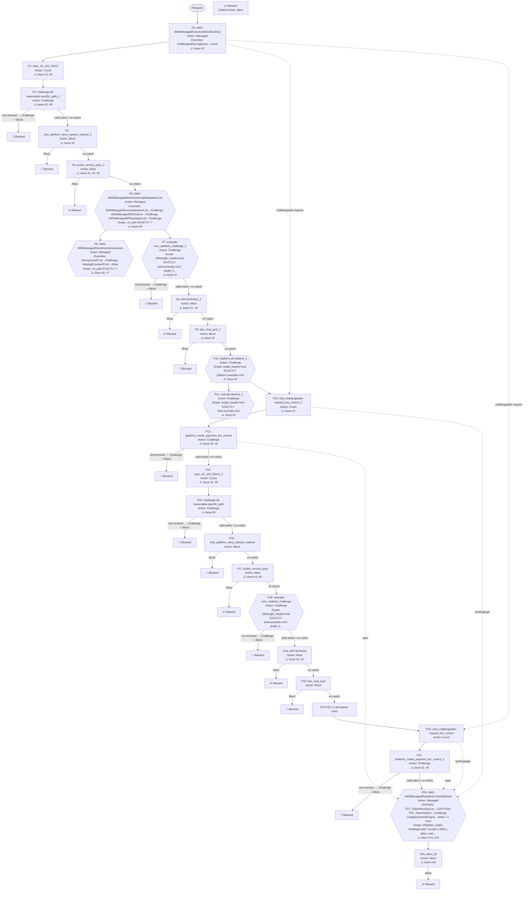

# AWS WAF Web ACL Rules Review Report

**Web ACL**: example-prod
**Review Date**: 2026-03-30
**Objective**: Review WAF configuration for security issues, misconfigurations, and optimization opportunities

## Summary

| Severity | Issue | Impact |
|----------|-------|--------|
| 🔴 Critical | #1 APP-BYPASS 规则基于可伪造的 User-Agent 实现全局 Allow 绕过 | `User-Agent` 是完全可伪造的请求头，攻击者只需在请求中添加 `User-Agent: example` 即可绕过所有后续 WAF 规则（IP ... |
| 🔴 Critical | #2 整个规则集存在大量重复规则，导致配置混乱且行为不可预测 | 重复规则浪费 WCU，增加维护复杂度，且容易导致未来修改时只改了一份而遗漏另一份。 |
| 🔴 Critical | #3 AntiDDoS AMR 的 ChallengeAllDuringEvent 被覆盖为 Count，核心 DDoS 防护失效 | `ChallengeAllDuringEvent` 是 AntiDDoS AMR 在检测到 DDoS 事件时对所有可 Challenge 请求执行软性缓解... |
| 🔴 Critical | #4 probe_service_pass 基于可伪造的自定义 Header 实现全局 Allow 绕过 | `x-detect-header` 是自定义请求头，完全可伪造。任何攻击者只要知道该 header 值，即可绕过所有后续 WAF 规则。 |
| 🔴 Critical | #6 IP 信誉和匿名 IP 规则组的 scope-down 限制为 URI='/'，实际上只检查首页请求 | 绝大多数实际流量（API 调用、页面导航、资源请求等）的 URI 不是 `/`，因此这两个规则组对这些流量完全无效。 |
| 🔴 Critical | #7 HostingProviderIPList 被覆盖为 Allow，允许云托管攻击流量绕过所有后续规则 | Allow 是终止动作，来自云托管/IDC IP 的请求将跳过所有后续规则（速率限制、Bot Control 等）。 |
| 🟡 Medium | #8 Challenge 动作用于 POST API 路径，等同于 Block | Challenge 动作返回 HTTP 202 + JavaScript 交互页面，只有浏览器 GET 请求（且 Accept 包含 text/html）... |
| 🟡 Medium | #9 spec_43_JA4_DDoS Count 规则无 label，只产生 CloudWatch 指标，无法被下游规则消费 | Count 规则不添加 label 时，只产生 CloudWatch 指标，下游规则无法基于该匹配结果执行任何动作。 |
| 🟡 Medium | #10 缺少 Always-on Challenge for HTML Pages，DDoS 防护存在检测延迟窗口 | AntiDDoS AMR 是响应式防护：需要约 15 分钟建立流量基线，检测到异常后才开始缓解。在此窗口期内，DDoS 流量可以不受阻拦地到达源站。 |
| 🟡 Medium | #11 缺少 CRS 和 KnownBadInputs 基础防护规则组 | CRS 提供 OWASP Top 10 防护（SQLi、XSS、路径遍历等），是 Web 应用 WAF 的基础防护层。 |
| 🟡 Medium | #12 缺少爬虫标记规则，AntiDDoS AMR 和 Always-on Challenge 可能影响搜索引擎索引 | AntiDDoS AMR 的 `ChallengeAllDuringEvent` 在 DDoS 事件期间会对所有可 Challenge 的请求执行 Cha... |
| 🟢 Low | #13 BotControlRuleSet 版本为 4.0，建议升级到 5.0 | BotControlRuleSet 5.0 的 Common level 可识别近 700 种 Bot 类型（基于 UA 和 IP），相比早期版本识别能力... |
| 🟢 Low | #14 CategorySearchEngine 和 CategorySeo 被覆盖为 Allow，允许未验证搜索引擎 Bot 绕过后续规则 | Category 规则只匹配**未验证**的 Bot（声称是搜索引擎爬虫但无法通过反向 DNS 验证）。已验证爬虫（真实 Googlebot 等）无论如何... |
| 🟢 Low | #15 token_domains 包含冗余子域名，apex 域名已自动覆盖 | `example.com`（apex 域名）自动覆盖所有一级子域名（`*.example.com`），包括 `www.example.com`、`chat... |
| 🟢 Low | #16 allow_all 规则冗余，与 default_action Allow 重复 | 该规则与 `default_action: Allow` 完全重复，任何到达 priority 26 的请求无论如何都会被 Allow（无论是被该规则匹配... |
| 🔵 Awareness | #5 probe_service_pass 的 search_string 包含疑似随机 token，需评估保密性 | 该值可能是系统脱敏后替换的哈希值，也可能是客户有意配置的共享密钥。 |
| 🔵 Awareness | #17 WCU 当前使用量及添加新规则的容量提示 | 本次评审建议添加多个规则组（CRS ~700 WCU、KnownBadInputs ~200 WCU、爬虫标记规则 ~少量、Always-on Chall... |
| 🔵 Awareness | #18 规则优先级顺序与推荐顺序存在偏差 | IP 白名单（Allow）规则（probe_service_pass、APP-BYPASS）应放在 AntiDDoS AMR 之前，避免这些流量影响 AM... |

---

## Issue 1 (Critical): APP-BYPASS 规则基于可伪造的 User-Agent 实现全局 Allow 绕过

**Rules**: APP-BYPASS_2 (priority 8), APP-BYPASS (priority 19)

**Current state**: 两条规则均匹配 `User-Agent` 以 `'example'` 开头的请求，动作为 Allow，无任何不可伪造的验证维度。

**Problem**:
- `User-Agent` 是完全可伪造的请求头，攻击者只需在请求中添加 `User-Agent: example` 即可绕过所有后续 WAF 规则（IP 信誉、匿名 IP、速率限制、Bot Control 等）。
- Allow 是终止动作，匹配后跳过所有后续规则，blast radius 为全局。
- 这两条规则在 Web ACL 中重复出现（见 Issue #2），意味着该绕过路径存在两次。

**Recommendation**:
- 短期：将两条规则的动作改为 Count，停止依赖 UA 进行 Allow 决策。
- 如果这是为原生 App 流量设计的绕过，正确做法是：
  1. 在 App 端集成 AWS WAF Mobile SDK，使原生 App 请求携带有效的 WAF token（不可伪造）。
  2. 集成 SDK 后，删除 UA-based Allow 规则；Bot Control 的 `SignalNonBrowserUserAgent` 需覆盖为 Count 以避免误报。
  3. 短期过渡方案：将 Bot Control 的 scope-down 配置为排除原生 App 流量（使用不可伪造的 label），而非在 Bot Control 之前用 Allow 绕过整个 WAF。
- **绝不要**仅凭 User-Agent、Cookie 或自定义 Header 的值来做 Allow 决策。

---

## Issue 2 (Critical): 整个规则集存在大量重复规则，导致配置混乱且行为不可预测

**Rules**: spec_43_JA4_DDoS (priority 1), challenge-all-reasonable-specific_path_2 (priority 2), chat_platform_deny_options_method_2 (priority 3), probe_service_pass_2 (priority 4), example-com_ratelimit_challenge_2 (priority 7), APP-BYPASS_2 (priority 8), ban_chat_ipv6_2 (priority 9), platform-all-ratelimit_2 (priority 10), chat-all-ratelimit_2 (priority 11), chat_challengeable-request_bot_control_2 (priority 12), platform_create_payment_bot_control (priority 13), spec_43_JA4_DDoS_2 (priority 14), challenge-all-reasonable-specific_path (priority 15), chat_platform_deny_options_method (priority 16), probe_service_pass (priority 17), example-com_ratelimit_challenge (priority 18), APP-BYPASS (priority 19), ban_chat_ipv6 (priority 20), platform-all-ratelimit (priority 21), chat-all-ratelimit (priority 22), chat_challengeable-request_bot_control (priority 23), platform_create_payment_bot_control_2 (priority 24)

**Current state**: Web ACL 中 priority 1–13 的规则与 priority 14–24 的规则几乎完全重复（带 `_2` 后缀 vs 不带后缀），逻辑完全相同。

**Problem**:
- 重复规则浪费 WCU，增加维护复杂度，且容易导致未来修改时只改了一份而遗漏另一份。
- 对于 Allow 规则（APP-BYPASS_2 和 APP-BYPASS），重复意味着绕过路径存在两次，增加了被利用的机会。
- 对于 Block 规则（ban_chat_ipv6），重复无害但冗余。
- 对于 Count 规则（spec_43_JA4_DDoS），重复导致同一流量被计数两次，CloudWatch 指标失真。
- 对于 Challenge 规则（rate limit 等），第一条规则匹配后请求已被 Challenge，第二条永远不会对同一请求生效（Challenge 是终止动作）。

**Recommendation**:
- 审查所有带 `_2` 后缀的规则，确认是否为误操作产生的重复。
- 保留一份，删除另一份。建议保留不带 `_2` 后缀的版本（priority 14–24），因为它们的优先级更低，在修复其他问题（如将 APP-BYPASS 移到更合理的位置）时调整空间更大。
- 删除重复规则后，重新整理 priority 编号，确保规则顺序符合推荐的优先级排列（见 Issue #11）。

---

## Issue 3 (Critical): AntiDDoS AMR 的 ChallengeAllDuringEvent 被覆盖为 Count，核心 DDoS 防护失效

**Rule**: AWS-AWSManagedRulesAntiDDoSRuleSet (priority 0)

**Current state**: `ChallengeAllDuringEvent` 规则被覆盖为 Count 动作，`sensitivity_to_block: LOW`，`usage_of_challenge_action: ENABLED`，`sensitivity_to_challenge: HIGH`。

**Problem**:
- `ChallengeAllDuringEvent` 是 AntiDDoS AMR 在检测到 DDoS 事件时对所有可 Challenge 请求执行软性缓解的核心机制。将其覆盖为 Count 意味着在 DDoS 事件期间，AMR 只会记录指标，不会对可疑流量执行 Challenge。
- 当前配置下，AMR 只能依赖 `ChallengeDDoSRequests`（Challenge 高可疑请求）和 `DDoSRequests`（Block 高可疑请求，sensitivity LOW = 仅 high-suspicion 触发 Block）进行缓解，防护范围大幅缩小。
- 如果禁用 `ChallengeAllDuringEvent` 是因为存在原生 App 流量（原生 App 无法完成 Challenge），正确做法是使用双 AMR 实例模式，而非直接禁用。

**Recommendation**:

**如果禁用原因是原生 App 流量**，采用双 AMR 实例模式：

1. 在两个 AMR 实例之前添加一条 Count+Label 规则，标记原生 App 请求（例如通过 UA 前缀 + 其他特征，加 label `native-app:identified`）。注意：这个 label 规则本身仍然可伪造，仅作为过渡方案。
2. **AMR 实例 1（浏览器流量）**：scope-down 排除 `native-app:identified` label，`ChallengeAllDuringEvent` 启用，Block sensitivity LOW（默认）。
3. **AMR 实例 2（原生 App 流量）**：scope-down 仅匹配 `native-app:identified` label，`ChallengeAllDuringEvent` 禁用，Block sensitivity MEDIUM（因为 Challenge 不可用，Block 是唯一缓解手段，需提高灵敏度）。
4. **如何添加两个 AMR 实例**：AWS 控制台不允许同一托管规则组添加两次。在 Web ACL JSON 编辑器中，复制现有 AMR 规则条目，粘贴为新条目，将 `Name` 和 `MetricName` 字段改为唯一值，然后保存。AWS WAF 会将它们视为两个独立的规则实例。

**如果没有原生 App 流量**，直接移除 `ChallengeAllDuringEvent` 的 Count 覆盖，恢复默认动作。

---

## Issue 4 (Critical): probe_service_pass 基于可伪造的自定义 Header 实现全局 Allow 绕过

**Rules**: probe_service_pass_2 (priority 4), probe_service_pass (priority 17)

**Current state**: 两条规则匹配 `x-detect-header: cloud-detect-16TNBPz9L00rabcdefgh`（精确匹配），动作为 Allow，并添加 label `probe_service`。

**Problem**:
- `x-detect-header` 是自定义请求头，完全可伪造。任何攻击者只要知道该 header 值，即可绕过所有后续 WAF 规则。
- 该 header 值 `cloud-detect-16TNBPz9L00rabcdefgh` 看起来包含随机 token 段（见 Issue #5 关于 opaque search_string 的说明），但其保密性无法从 WAF 配置本身得到保证。
- Allow 是终止动作，blast radius 为全局。
- 规则重复出现两次（见 Issue #2）。

**Recommendation**:
- 评估该 header 值是否已泄露（例如出现在访问日志、浏览器开发者工具、未加密的传输中）。
- 如果该规则用于监控探针服务的健康检查，考虑改用 IP set（将探针服务的固定 IP 加入白名单），IP 是不可伪造的。
- 如果必须使用 header，确保该 header 值通过安全渠道传递，且定期轮换。
- 删除重复规则（见 Issue #2）。

---

## Issue 5 (Awareness): probe_service_pass 的 search_string 包含疑似随机 token，需评估保密性

**Rules**: probe_service_pass_2 (priority 4), probe_service_pass (priority 17)

**Current state**: `x-detect-header` 的匹配值为 `cloud-detect-16TNBPz9L00rabcdefgh`，包含疑似随机 token 段。

**Problem**:
- 该值可能是系统脱敏后替换的哈希值，也可能是客户有意配置的共享密钥。
- 如果是共享密钥，其安全性完全依赖于该值的保密性。一旦泄露（例如出现在 HTTP 访问日志、被中间人捕获、或通过内部文档泄露），攻击者即可伪造该 header 绕过所有 WAF 规则。
- 由于规则动作为 Allow（全局终止），泄露的后果尤为严重。

**Recommendation**:
- 确认该值是否为真实的共享密钥，还是脱敏后的占位符。
- 如果是共享密钥：评估其传输和存储方式，确保不会出现在明文日志中；定期轮换该值；考虑改用 IP set 作为更可靠的验证维度（见 Issue #4）。

---

## Issue 6 (Critical): IP 信誉和匿名 IP 规则组的 scope-down 限制为 URI='/'，实际上只检查首页请求

**Rules**: AWS-AWSManagedRulesAmazonIpReputationList (priority 5), AWS-AWSManagedRulesAnonymousIpList (priority 6)

**Current state**: 两个规则组均配置了 scope-down `uri_path EXACTLY '/'`，意味着只有访问根路径 `/` 的请求才会被这两个规则组检查。

**Problem**:
- 绝大多数实际流量（API 调用、页面导航、资源请求等）的 URI 不是 `/`，因此这两个规则组对这些流量完全无效。
- 已知恶意 IP（`AWSManagedIPReputationList`、`AWSManagedReconnaissanceList`）和匿名代理 IP（`AnonymousIPList`）可以自由访问除首页以外的所有路径，包括 `/api/v1/payments`、`/api/event_logging/batch` 等敏感端点。
- 这两个规则组的 WCU 成本（25 + 50 = 75 WCU）被完全浪费。

**Recommendation**:
- 移除两个规则组的 scope-down，让它们检查所有流量。
- 如果添加 scope-down 的原因是担心误报，建议先将各规则覆盖为 Count 模式观察一段时间，再逐步恢复默认动作，而不是用过窄的 scope-down 使规则组完全失效。

---

## Issue 7 (Critical): HostingProviderIPList 被覆盖为 Allow，允许云托管攻击流量绕过所有后续规则

**Rule**: AWS-AWSManagedRulesAnonymousIpList (priority 6)

**Current state**: `HostingProviderIPList` 规则被覆盖为 Allow 动作。

**Problem**:
- Allow 是终止动作，来自云托管/IDC IP 的请求将跳过所有后续规则（速率限制、Bot Control 等）。
- 大量 DDoS 攻击和爬虫流量来自云服务器（AWS EC2、GCP、Azure 等），Allow 覆盖直接为这类攻击流量开了绿色通道。
- 即使 scope-down 当前限制为 URI='/'（见 Issue #6），一旦 scope-down 被修复，该 Allow 覆盖的危害将立即显现。

**Recommendation**:
- 将 `HostingProviderIPList` 的覆盖动作改为 **Count**（而非 Allow 或默认 Block）。
- Count 保留了 label（`awswaf:managed:aws:anonymous-ip-list:hosting-provider-ip`），下游规则可以基于该 label 进行速率限制，同时避免对通过云代理访问的合法企业用户造成误报。
- 如果业务确实需要允许来自云平台的流量，Count 是正确选择；如果需要对这类流量加强限制，可在下游添加基于该 label 的速率限制规则。

---

## Issue 8 (Medium): Challenge 动作用于 POST API 路径，等同于 Block

**Rules**: challenge-all-reasonable-specific_path_2 (priority 2), challenge-all-reasonable-specific_path (priority 15), platform_create_payment_bot_control (priority 13), platform_create_payment_bot_control_2 (priority 24)

**Current state**:
- `challenge-all-reasonable-specific_path_2` 和 `challenge-all-reasonable-specific_path`：对 URI `/api/event_logging/batch` 执行 Challenge，无 HTTP 方法限制（该路径通常接收 POST 请求）。
- `platform_create_payment_bot_control` 和 `platform_create_payment_bot_control_2`：对 `POST /api/v1/payments` 执行 Challenge，并添加 label `challenge:spec`。

**Problem**:
- Challenge 动作返回 HTTP 202 + JavaScript 交互页面，只有浏览器 GET 请求（且 Accept 包含 text/html）才能完成 Challenge 并重新提交原始请求。
- POST 请求、API 调用无法完成 Challenge，Challenge 对这类请求等同于 Block。
- `/api/event_logging/batch` 是事件日志批量上报接口，通常由前端 JS 发送 POST 请求；`/api/v1/payments` 是支付接口，必然是 POST。对这两个路径执行 Challenge 会导致合法用户的请求被拒绝。
- `platform_create_payment_bot_control` 的 label `challenge:spec` 被 Bot Control（priority 25）的 scope-down 消费，但由于 Challenge 已终止请求，Bot Control 实际上永远不会评估这些请求。

**Recommendation**:
- 对于 `/api/event_logging/batch`：如果目标是防止滥用，改用速率限制规则（rate-based rule）而非 Challenge。
- 对于 `POST /api/v1/payments`：如果目标是 Bot Control 检测，需要重新设计流程：
  - 方案 A：在支付页面加载时（GET 请求）执行 Challenge，获取 WAF token 后再允许 POST 请求。在 POST 路径上添加 `token:absent` label 检查的速率限制规则，而非直接 Challenge。
  - 方案 B：集成 AWS WAF Mobile SDK（如果有原生 App），使 POST 请求携带有效 token，然后用 `TGT_TokenAbsent` 规则检测无 token 的 POST 请求。
- 删除重复规则（见 Issue #2）。

---

## Issue 9 (Medium): spec_43_JA4_DDoS Count 规则无 label，只产生 CloudWatch 指标，无法被下游规则消费

**Rules**: spec_43_JA4_DDoS (priority 1), spec_43_JA4_DDoS_2 (priority 14)

**Current state**: 两条规则匹配 chat.example.com 上的 43 个 JA4 指纹，动作为 Count，但 `RuleLabels` 为空。

**Problem**:
- Count 规则不添加 label 时，只产生 CloudWatch 指标，下游规则无法基于该匹配结果执行任何动作。
- 如果这两条规则的意图是"标记匹配的请求，然后由下游规则处理"，当前配置无法实现该意图。
- 整个 Web ACL 中没有任何规则引用这两条规则可能产生的 label，说明即使添加了 label，也没有消费者。
- 规则重复出现两次（见 Issue #2），导致同一请求被计数两次，CloudWatch 指标失真。

**Recommendation**:
- 确认这两条规则的意图：
  - 如果仅用于监控（观察有多少请求匹配这些 JA4 指纹），当前配置是合理的，但需删除重复规则。
  - 如果意图是"匹配后执行 Block 或 Challenge"，需要：
    1. 添加 `RuleLabels`（例如 `ja4:ddos-fingerprint`）。
    2. 在下游添加消费该 label 的规则（例如速率限制规则以该 label 为 scope-down，或直接将动作改为 Block/Challenge）。
    3. 注意：如果直接改为 Block，需评估误报风险（43 个 JA4 指纹是否会匹配合法流量）。

---

## Issue 10 (Medium): 缺少 Always-on Challenge for HTML Pages，DDoS 防护存在检测延迟窗口

**Rule**: N/A (missing rule)

**Current state**: Web ACL 没有针对浏览器 HTML 页面请求（GET + Accept: text/html）的常态化 Challenge 规则。当前 DDoS 防护完全依赖 AntiDDoS AMR 的响应式检测（且 ChallengeAllDuringEvent 已被禁用，见 Issue #3）。

**Problem**:
- AntiDDoS AMR 是响应式防护：需要约 15 分钟建立流量基线，检测到异常后才开始缓解。在此窗口期内，DDoS 流量可以不受阻拦地到达源站。
- Always-on Challenge 是预防式防护：要求所有浏览器 HTML 页面请求在首次访问时完成 JS Challenge，获取 WAF token 后才能访问内容。大多数 DDoS 攻击工具无法执行 JavaScript，因此无法通过 Challenge，从第一个请求起就被过滤。
- 两者互补：Always-on Challenge 处理无法执行 JS 的攻击流量（立即生效），AntiDDoS AMR 处理使用真实浏览器或针对非 HTML 路径的复杂攻击。

**Recommendation**:

在 IP 信誉规则组和速率限制规则之后、Bot Control 之前添加以下规则（注意：需先添加爬虫标记规则，见 Issue #12）：

```json
{
  "Name": "always-on-challenge-html",
  "Priority": 8,
  "Action": { "Challenge": {} },
  "ChallengeConfig": {
    "ImmunityTimeProperty": {
      "ImmunityTime": 14400
    }
  },
  "VisibilityConfig": {
    "SampledRequestsEnabled": true,
    "CloudWatchMetricsEnabled": true,
    "MetricName": "always-on-challenge-html"
  },
  "Statement": {
    "AndStatement": {
      "Statements": [
        {
          "ByteMatchStatement": {
            "FieldToMatch": { "Method": {} },
            "PositionalConstraint": "EXACTLY",
            "SearchString": "GET",
            "TextTransformations": [{ "Priority": 0, "Type": "NONE" }]
          }
        },
        {
          "ByteMatchStatement": {
            "FieldToMatch": {
              "SingleHeader": { "Name": "accept" }
            },
            "PositionalConstraint": "CONTAINS",
            "SearchString": "text/html",
            "TextTransformations": [{ "Priority": 0, "Type": "NONE" }]
          }
        },
        {
          "NotStatement": {
            "Statement": {
              "LabelMatchStatement": {
                "Scope": "LABEL",
                "Key": "crawler:verified"
              }
            }
          }
        }
      ]
    }
  }
}
```

token 免疫时间设为 14400 秒（4 小时），真实用户完成一次 JS 验证后，4 小时内不会被重复 Challenge。`NotStatement` 排除已验证的爬虫（需先添加爬虫标记规则，见 Issue #12）。

---

## Issue 11 (Medium): 缺少 CRS 和 KnownBadInputs 基础防护规则组

**Rule**: N/A (missing rule)

**Current state**: Web ACL 没有 `AWSManagedRulesCommonRuleSet`（CRS）和 `AWSManagedRulesKnownBadInputsRuleSet`。

**Problem**:
- CRS 提供 OWASP Top 10 防护（SQLi、XSS、路径遍历等），是 Web 应用 WAF 的基础防护层。
- KnownBadInputs 防护已知恶意输入模式，包括 Log4Shell（CVE-2021-44228）、Java 反序列化漏洞等，WCU 成本低、误报率低。
- 当前 Web ACL 专注于 DDoS 和 Bot 防护，但缺乏应用层攻击防护。如果这是有意为之（例如 WAF 仅用于 DDoS 防护，应用层防护由其他机制负责），可忽略此项。

**Recommendation**:
- 添加 `AWSManagedRulesKnownBadInputsRuleSet`（WCU: 200），默认动作即可，误报率低。
- 添加 `AWSManagedRulesCommonRuleSet`（WCU: 700），但**必须**将 `SizeRestrictions_Body` 规则覆盖为 Count——该规则默认 Block 超过 8KB 的请求体，会对文件上传、大 payload API 等造成误报。
- 添加前确认 WCU 余量（当前 435/5000，添加两个规则组后约 1335/5000，仍有充足余量）。

---

## Issue 12 (Medium): 缺少爬虫标记规则，AntiDDoS AMR 和 Always-on Challenge 可能影响搜索引擎索引

**Rule**: N/A (missing rule)

**Current state**: Web ACL 没有基于 ASN + User-Agent 双重验证的爬虫标记规则（Count+Label）。

**Problem**:
- AntiDDoS AMR 的 `ChallengeAllDuringEvent` 在 DDoS 事件期间会对所有可 Challenge 的请求执行 Challenge，包括搜索引擎爬虫（Googlebot、Bingbot 等）。
- 如果按 Issue #10 的建议添加 Always-on Challenge，爬虫将在每次访问 HTML 页面时都被 Challenge，而不仅仅是在 DDoS 事件期间。
- 搜索引擎爬虫可能无法可靠地完成 JavaScript Challenge，实际案例中已观察到爬虫将 Challenge 交互页面（HTTP 202）索引为实际内容，严重损害 SEO 排名。
- Bot Control 的 `bot:verified` label 虽然可以标记已验证爬虫，但 Bot Control 必须放在 Web ACL 最后（成本最高），而 AntiDDoS AMR 和 Always-on Challenge 需要放在前面——`bot:verified` label 在这两条规则评估时尚不存在。

**Recommendation**:

在 AntiDDoS AMR 之前（priority 0 之前）添加以下爬虫标记规则：

```json
{
  "Name": "label-verified-crawlers",
  "Priority": 0,
  "Action": { "Count": {} },
  "RuleLabels": [{ "Name": "crawler:verified" }],
  "VisibilityConfig": {
    "SampledRequestsEnabled": true,
    "CloudWatchMetricsEnabled": true,
    "MetricName": "label-verified-crawlers"
  },
  "Statement": {
    "OrStatement": {
      "Statements": [
        {
          "AndStatement": {
            "Statements": [
              {
                "ByteMatchStatement": {
                  "SearchString": "googlebot",
                  "FieldToMatch": { "SingleHeader": { "Name": "user-agent" } },
                  "TextTransformations": [{ "Priority": 0, "Type": "LOWERCASE" }],
                  "PositionalConstraint": "CONTAINS"
                }
              },
              { "AsnMatchStatement": { "AsnList": [15169] } }
            ]
          }
        },
        {
          "AndStatement": {
            "Statements": [
              {
                "ByteMatchStatement": {
                  "SearchString": "bingbot",
                  "FieldToMatch": { "SingleHeader": { "Name": "user-agent" } },
                  "TextTransformations": [{ "Priority": 0, "Type": "LOWERCASE" }],
                  "PositionalConstraint": "CONTAINS"
                }
              },
              { "AsnMatchStatement": { "AsnList": [8075] } }
            ]
          }
        }
      ]
    }
  }
}
```

添加该规则后：
1. 将 AntiDDoS AMR 的 scope-down 配置为排除 `crawler:verified` label（见 Issue #3 的建议）。
2. Always-on Challenge 规则（见 Issue #10）中已包含排除 `crawler:verified` 的 `NotStatement`。
3. 如需覆盖更多搜索引擎（百度、Yahoo Japan 等），需从各搜索引擎官方文档确认其 ASN 列表后再添加，不要假设单一 ASN 覆盖所有爬虫 IP。

---

## Issue 13 (Low): BotControlRuleSet 版本为 4.0，建议升级到 5.0

**Rule**: AWS-AWSManagedRulesBotControlRuleSet (priority 25)

**Current state**: 使用 `Version_4.0`。

**Problem**:
- BotControlRuleSet 5.0 的 Common level 可识别近 700 种 Bot 类型（基于 UA 和 IP），相比早期版本识别能力大幅提升；Targeted level 也包含更多检测规则。
- 继续使用 4.0 意味着部分 Bot 类型无法被识别。

**Recommendation**:
- 将版本从 `Version_4.0` 升级到 `Version_5.0`。
- 升级前建议先在 Count 模式下观察新版本的匹配情况，确认无误报后再恢复默认动作。

---

## Issue 14 (Low): CategorySearchEngine 和 CategorySeo 被覆盖为 Allow，允许未验证搜索引擎 Bot 绕过后续规则

**Rule**: AWS-AWSManagedRulesBotControlRuleSet (priority 25)

**Current state**: `CategorySearchEngine` 和 `CategorySeo` 规则被覆盖为 Allow。

**Problem**:
- Category 规则只匹配**未验证**的 Bot（声称是搜索引擎爬虫但无法通过反向 DNS 验证）。已验证爬虫（真实 Googlebot 等）无论如何都不会被 Block，Allow 覆盖对它们没有影响。
- Allow 覆盖让未验证的搜索引擎 Bot 绕过所有后续 WAF 规则，blast radius 有限（仅影响该类别的未验证 Bot），但仍是不必要的风险。
- 伪造 Googlebot UA 的攻击者不会匹配 `CategorySearchEngine`（反向 DNS 验证失败，落入 `SignalNonBrowserUserAgent`），因此 Allow 覆盖不会为伪造 UA 的攻击者提供绕过路径。

**Recommendation**:
- 移除 `CategorySearchEngine` 和 `CategorySeo` 的 Allow 覆盖，恢复默认动作（Block 未验证 Bot）。
- 如果目标是保护 SEO，正确做法是使用 ASN + UA 爬虫标记规则（见 Issue #12），而非 Bot Control Allow 覆盖。

---

## Issue 15 (Low): token_domains 包含冗余子域名，apex 域名已自动覆盖

**Rule**: N/A (Web ACL 配置)

**Current state**: `token_domains` 包含 `example.com`、`www.example.com`、`chat.example.com`、`platform.example.com`、`api.example.com`、`api-docs.example.com`。

**Problem**:
- `example.com`（apex 域名）自动覆盖所有一级子域名（`*.example.com`），包括 `www.example.com`、`chat.example.com`、`platform.example.com`、`api.example.com`、`api-docs.example.com`。
- 显式列出这些子域名是冗余的，增加了维护负担（未来新增子域名时可能忘记更新列表）。

**Recommendation**:
- `token_domains` 只保留 `example.com`，删除其余五个子域名。
- 如果未来有二级子域名（例如 `a.b.example.com`），需要单独添加 `b.example.com`，因为 apex 域名只覆盖一级子域名。

---

## Issue 16 (Low): allow_all 规则冗余，与 default_action Allow 重复

**Rule**: allow_all (priority 26)

**Current state**: `allow_all` 规则匹配所有 URI（`uri_path STARTS_WITH '/'`），动作为 Allow。Web ACL 的 `default_action` 已经是 Allow。

**Problem**:
- 该规则与 `default_action: Allow` 完全重复，任何到达 priority 26 的请求无论如何都会被 Allow（无论是被该规则匹配还是落入 default action）。
- 浪费 WCU（虽然 byte_match 规则 WCU 较低）。
- 增加维护混乱：未来维护者可能在 priority 26 之后插入新规则，误以为这些规则会被评估，但实际上 `allow_all` 已经终止了所有请求的评估。

**Recommendation**:
- 删除 `allow_all` 规则。

---

## Issue 17 (Awareness): WCU 当前使用量及添加新规则的容量提示

**Rule**: N/A (Web ACL 配置)

**Current state**: 当前 WCU 为 435/5000。

**Problem**:
- 本次评审建议添加多个规则组（CRS ~700 WCU、KnownBadInputs ~200 WCU、爬虫标记规则 ~少量、Always-on Challenge ~少量）。
- 删除重复规则（约 11 条自定义规则）可释放部分 WCU。
- 预估添加建议规则后总 WCU 约 1400–1500，仍在 5000 上限内，但建议在 AWS 控制台确认实际数值后再操作。

**Recommendation**:
- 在应用所有变更前，在 AWS 控制台的 Web ACL 编辑页面确认 WCU 不超过 5000。

---

## Issue 18 (Awareness): 规则优先级顺序与推荐顺序存在偏差

**Rule**: N/A (全局顺序)

**Current state**: 当前规则顺序（清理重复规则后）大致为：AntiDDoS AMR (0) → JA4 Count (1) → Challenge API (2) → Block OPTIONS (3) → Allow probe (4) → IP Reputation (5) → Anonymous IP (6) → Rate limit (7/10/11) → APP-BYPASS Allow (8) → Ban IPv6 (9) → Bot Control label (12/13) → Bot Control (25) → allow_all (26)。

**Problem**:
- IP 白名单（Allow）规则（probe_service_pass、APP-BYPASS）应放在 AntiDDoS AMR 之前，避免这些流量影响 AMR 的基线计算。当前 probe_service_pass 在 priority 4（AMR 之后），APP-BYPASS 在 priority 8（AMR 之后）。
- IP 黑名单（Block）规则（ban_chat_ipv6）应放在 AntiDDoS AMR 之前，将已知恶意 IP 排除在 AMR 基线之外，提高基线准确性。当前 ban_chat_ipv6 在 priority 9（AMR 之后）。
- 爬虫标记规则（Count+Label）必须放在 AntiDDoS AMR 之前（见 Issue #12）。
- Always-on Challenge 应放在 IP 信誉、匿名 IP 和速率限制规则之后（见 Issue #10）。
- Bot Control 已正确放在最后（priority 25），符合推荐顺序。

**Recommendation**:

清理重复规则（见 Issue #2）并应用所有修复后，建议的规则优先级顺序：

1. 爬虫标记规则（Count+Label，新增）
2. IP 黑名单（ban_chat_ipv6）
3. IP 白名单（probe_service_pass，如保留）
4. AntiDDoS AMR
5. IP 信誉规则组（移除 scope-down）
6. 匿名 IP 规则组（移除 scope-down，修复 HostingProviderIPList）
7. 速率限制规则（example-com、platform、chat）
8. Always-on Challenge for HTML pages（新增）
9. Challenge API 路径规则（改为速率限制，见 Issue #8）
10. Block OPTIONS 方法
11. Ban IPv6 IP set
12. Bot Control label 规则（chat_challengeable-request、platform_create_payment）
13. Bot Control Targeted（升级到 v5.0）

---

---

## Appendix: Rule Execution Flow


