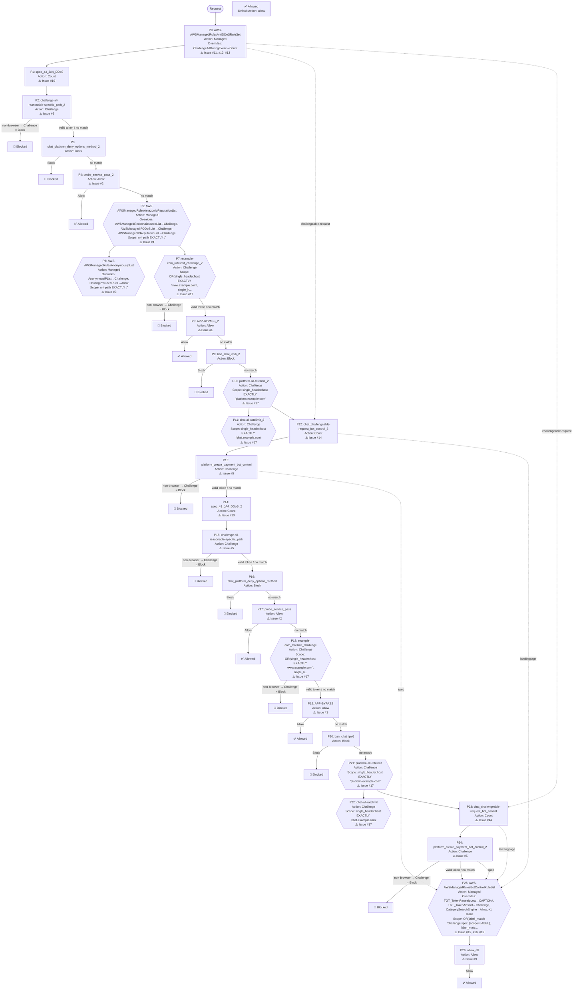

# AWS WAF Web ACL Rules Review Report

**Web ACL**: example-prod
**Review Date**: 2026-03-31
**Objective**: Review WAF configuration for security issues, misconfigurations, and optimization opportunities

## Summary

| Severity | Issue | Impact |
|----------|-------|--------|
| 🔴 Critical | #1 APP-BYPASS 规则基于可伪造的 User-Agent 实现全局 Allow 绕过 | User-Agent 是完全可伪造的请求头，攻击者只需在请求中添加 `User-Agent: example...` 即可绕过所有后续规则（包括 IP 信... |
| 🔴 Critical | #2 probe_service_pass 规则使用明文共享密钥实现全局 Allow | 自定义请求头（`x-detect-header`）是可伪造的——攻击者只需在请求中添加该 header 即可绕过所有 WAF 规则 |
| 🔴 Critical | #3 HostingProviderIPList 被覆盖为 Allow，云端攻击流量可绕过所有后续规则 | `HostingProviderIPList` 默认 Block 云托管和 Web 托管提供商的 IP。将其覆盖为 Allow 意味着来自云平台（AWS、... |
| 🟡 Medium | #4 IP 信誉和匿名 IP 规则组的 scope-down 过窄，仅检查首页 | 两个规则组实际上只对 `GET /` 请求生效，所有其他路径（`/api/*`、`/login`、`/signup`、`/messages` 等）均不受 ... |
| 🟡 Medium | #5 Challenge 规则作用于 API 路径，实际效果等同于 Block | Challenge 只能由浏览器 GET 请求完成（需要执行 JavaScript 并接受 HTML 响应） |
| 🟡 Medium | #6 缺少 CRS 和 KnownBadInputs 基线防护规则组 | CRS 提供 OWASP Top 10 防护（SQLi、XSS 等），是大多数 Web 应用的基础防护层 |
| 🟡 Medium | #11 ChallengeAllDuringEvent 被覆盖为 Count，DDoS 事件期间软缓解失效 | `ChallengeAllDuringEvent` 是 AntiDDoS AMR 的核心软缓解机制——在检测到 DDoS 事件时，对所有可 Challen... |
| 🟡 Medium | #12 AntiDDoS AMR 的豁免 URI 正则表达式未锚定，攻击者可利用路径注入绕过 | 正则表达式中 `\/query`、`\/models`、`\/messages`、`\/balance`、`\/completions`、`\/api\/... |
| 🟡 Medium | #13 缺少爬虫标记规则，DDoS 事件期间搜索引擎爬虫可能被 Challenge | `ChallengeAllDuringEvent`（即使当前被禁用，修复 Issue 11 后将重新启用）会在 DDoS 事件期间对所有可 Challen... |
| 🟡 Medium | #18 缺少 Always-on Challenge，DDoS 防护依赖 AMR 的响应延迟 | AntiDDoS AMR 是响应式防护——需要约 15 分钟建立流量基线，检测到攻击后才开始缓解，存在不可避免的检测延迟窗口 |
| 🟡 Medium | #20 规则优先级顺序存在问题，Allow 规则位于关键保护规则之前 | Allow 规则（P4、P8）位于 IP 信誉规则组（P5、P6）之前，意味着匹配 Allow 条件的请求完全跳过 IP 信誉检查 |
| 🟢 Low | #7 Token Domain 配置包含冗余子域名 | Token Domain 使用后缀匹配——`example.com` 自动覆盖所有子域名（`www.example.com`、`chat.example.... |
| 🟢 Low | #9 allow_all 规则与默认 Allow 动作重复 | 该规则匹配所有请求（任何 URI 都以 `/` 开头），action 为 Allow |
| 🟢 Low | #15 Bot Control 的 CategorySearchEngine 和 CategorySeo 被覆盖为 Allow | 这两个规则的 Allow 覆盖只影响"未验证"的搜索引擎 Bot（自称是搜索引擎爬虫但无法通过反向 DNS 验证的请求） |
| 🟢 Low | #19 Bot Control 版本过旧（Version_4.0），建议升级至 5.0 | BotControlRuleSet Version_5.0 的 Common level 可识别近 700 种 Bot 类型（基于 UA 和 IP），远超... |
| 🔵 Awareness | #8 未检测到 WAF 日志配置 | WAF 日志对于安全事件调查、规则调优和误报分析至关重要 |
| 🔵 Awareness | #10 spec_43_JA4_DDoS 规则为 Count 但未添加标签，仅产生指标 | Count 规则不添加标签时，只产生 CloudWatch 指标，下游规则无法基于此匹配结果采取行动 |
| 🔵 Awareness | #14 chat_challengeable-request_bot_control 使用业务 Cookie 作为安全判断条件 | Cookie 是可伪造的——攻击者只需在请求中添加 `ab_session_id` 或 `smidV2` cookie 即可绕过该规则的标签标记，从而不进... |
| 🔵 Awareness | #16 APP-BYPASS 修复后，原生 App 流量将进入 Bot Control，需配置 scope-down | 当前 APP-BYPASS 规则（Issue 1）将原生 App 流量直接 Allow，因此原生 App 流量不会到达 Bot Control |
| 🔵 Awareness | #17 速率限制规则存在重复，每对规则逻辑完全相同 | 对于重叠 scope-down 的速率限制规则，只有阈值最低的规则会对重叠流量生效 |
| 🔵 Awareness | #21 修复 Issue 1（APP-BYPASS）会影响多条下游规则，需同步处理 | 修复 Issue 1（将 APP-BYPASS 改为 Count+Label `custom:native-app`）后，原生 App 流量将不再被 Al... |

---

## Issue 1 (Critical): APP-BYPASS 规则基于可伪造的 User-Agent 实现全局 Allow 绕过

**Rule**: APP-BYPASS (priority 19) 和 APP-BYPASS_2 (priority 8)
**Current state**: `single_header:user-agent STARTS_WITH 'example'`，action 为 Allow，无 scope-down

**Problem**:
- User-Agent 是完全可伪造的请求头，攻击者只需在请求中添加 `User-Agent: example...` 即可绕过所有后续规则（包括 IP 信誉、Bot Control、速率限制等）
- 两条规则逻辑完全相同，分别位于 priority 8 和 19，任意一条命中即终止评估
- 该规则的 blast radius 为全局——所有流量路径均受影响，无 host 或 URI 限制

**Recommendation**:
- 如果此规则用于标识原生 App 流量（Native App），应将 action 改为 Count+Label（如 `custom:native-app`），然后在 Bot Control 的 scope-down 中排除该标签，而不是直接 Allow
- 如果此规则用于内部探针或监控工具，应改用不可伪造的条件（如 IP Set 或 WAF Token）
- 删除重复规则（APP-BYPASS_2 与 APP-BYPASS 逻辑相同，保留一条即可）

---

## Issue 2 (Critical): probe_service_pass 规则使用明文共享密钥实现全局 Allow

**Rule**: probe_service_pass (priority 17) 和 probe_service_pass_2 (priority 4)
**Current state**: `single_header:x-detect-header EXACTLY 'cloud-detect-16TNBPz9L00rabcdefgh'`，action 为 Allow

**Problem**:
- 自定义请求头（`x-detect-header`）是可伪造的——攻击者只需在请求中添加该 header 即可绕过所有 WAF 规则
- 密钥值 `cloud-detect-16TNBPz9L00rabcdefgh` 存储在 WAF 配置中，任何能读取 Web ACL 配置的人（包括 IAM 权限过宽的内部人员）均可获取
- 两条规则逻辑完全相同（priority 4 和 17），存在重复
- 一旦密钥泄露，攻击者可完全绕过所有 WAF 保护

**Recommendation**:
- 将 action 改为 Count+Label，不要直接 Allow；探针服务的流量不需要绕过 WAF
- 如果探针服务需要绕过特定规则（如速率限制），应使用 IP Set（探针服务的出口 IP）作为条件，IP Set 是不可伪造的
- 删除重复规则（probe_service_pass_2 与 probe_service_pass 逻辑相同）
- 定期轮换密钥值，并审计 WAF 配置的 IAM 访问权限

---

## Issue 3 (Critical): HostingProviderIPList 被覆盖为 Allow，云端攻击流量可绕过所有后续规则

**Rule**: AWS-AWSManagedRulesAnonymousIpList (priority 6)
**Current state**: `HostingProviderIPList` 规则被覆盖为 Allow

**Problem**:
- `HostingProviderIPList` 默认 Block 云托管和 Web 托管提供商的 IP。将其覆盖为 Allow 意味着来自云平台（AWS、GCP、Azure 等）的所有流量将直接被放行，跳过所有后续规则
- 现代 DDoS 攻击大量使用云托管基础设施（VPS、云函数、容器）——Allow 覆盖使这些攻击流量完全绕过 IP 信誉、Bot Control、速率限制等所有保护
- 正确做法是覆盖为 Count（保留标签，供下游规则使用），而非 Allow

**Recommendation**:
- 将 `HostingProviderIPList` 的覆盖从 Allow 改为 Count
- 如果担心企业用户通过云代理访问时被误封，Count 模式已经解决了这个问题（不会 Block，只添加标签）

---

## Issue 4 (Medium): IP 信誉和匿名 IP 规则组的 scope-down 过窄，仅检查首页

**Rule**: AWS-AWSManagedRulesAmazonIpReputationList (priority 5) 和 AWS-AWSManagedRulesAnonymousIpList (priority 6)
**Current state**: scope-down 为 `uri_path EXACTLY '/'`，仅对首页路径生效

**Problem**:
- 两个规则组实际上只对 `GET /` 请求生效，所有其他路径（`/api/*`、`/login`、`/signup`、`/messages` 等）均不受 IP 信誉检查保护
- 恶意 IP 只需访问任何非首页路径即可完全绕过这两个规则组
- 这使得 IP 信誉保护形同虚设，尤其对 API 路径的攻击毫无防护

**Recommendation**:
- 移除这两个规则组的 scope-down，让其检查所有流量
- 如果出于性能或成本考虑需要限制范围，至少应覆盖所有关键路径（`/api/*`、`/login`、`/signup` 等），而不是仅限于首页

---

## Issue 5 (Medium): Challenge 规则作用于 API 路径，实际效果等同于 Block

**Rule**: challenge-all-reasonable-specific_path_2 (priority 2)、challenge-all-reasonable-specific_path (priority 15)、platform_create_payment_bot_control (priority 13)、platform_create_payment_bot_control_2 (priority 24)
**Current state**: 对 `/api/event_logging/batch` 和 `POST /api/v1/payments` 应用 Challenge action

**Problem**:
- Challenge 只能由浏览器 GET 请求完成（需要执行 JavaScript 并接受 HTML 响应）
- `/api/event_logging/batch` 是 API 路径，客户端通常是原生 App 或 JavaScript fetch/XHR，无法完成 Challenge
- `POST /api/v1/payments` 是 POST 请求，Challenge 对 POST 请求无效——客户端会收到 HTTP 202 但无法重新提交原始 POST 请求
- 实际效果：这些规则对 API 客户端和原生 App 等同于 Block，可能导致合法支付请求被拒绝

**Recommendation**:
- 对 `/api/event_logging/batch`：如果目的是防止滥用，考虑改用速率限制（rate-based rule）而非 Challenge
- 对 `POST /api/v1/payments`：如果目的是验证用户是否为真实浏览器，应在支付页面的 GET 请求（landing page）上应用 Challenge，而不是在 POST 请求上。用户完成 Challenge 后获得 WAF Token，后续 POST 请求携带有效 Token 即可通过
- 两对重复规则（priority 2/15 和 13/24）逻辑相同，各保留一条即可

---
## Issue 6 (Medium): 缺少 CRS 和 KnownBadInputs 基线防护规则组

**Rule**: N/A（缺失规则）
**Current state**: Web ACL 中没有 AWSManagedRulesCommonRuleSet（CRS）和 AWSManagedRulesKnownBadInputsRuleSet

**Problem**:
- CRS 提供 OWASP Top 10 防护（SQLi、XSS 等），是大多数 Web 应用的基础防护层
- KnownBadInputsRuleSet 防护 Log4Shell（CVE-2021-44228）、Java 反序列化漏洞等已知恶意输入模式，WCU 消耗低、误报率低
- 当前 Web ACL 专注于 DDoS 和 Bot 防护，但缺乏应用层攻击防护

**Recommendation**:
- 添加 AWSManagedRulesKnownBadInputsRuleSet（WCU 消耗低，建议优先添加）
- 评估是否需要添加 CRS；如果添加，务必将 `SizeRestrictions_Body` 覆盖为 Count，避免对大 payload 的 API 端点产生误报（实现步骤见附录 F）
- 添加前请在 AWS 控制台确认剩余 WCU 容量（当前已使用 435 WCU，上限 5000）

---

## Issue 7 (Low): Token Domain 配置包含冗余子域名

**Rule**: N/A（Web ACL 全局配置）
**Current state**: token_domains 包含 `example.com`、`www.example.com`、`chat.example.com`、`platform.example.com`、`api.example.com`、`api-docs.example.com`

**Problem**:
- Token Domain 使用后缀匹配——`example.com` 自动覆盖所有子域名（`www.example.com`、`chat.example.com` 等）
- 列出子域名是冗余的，不会造成安全问题，但增加了配置维护成本

**Recommendation**:
- 仅保留 `example.com`，删除其他子域名条目

---

## Issue 8 (Awareness): 未检测到 WAF 日志配置

**Rule**: N/A（Web ACL 全局配置）
**Current state**: 配置文件中未包含日志配置信息

**Problem**:
- WAF 日志对于安全事件调查、规则调优和误报分析至关重要
- 如果未启用日志，发生攻击或误封时将无法追溯原因

**Recommendation**:
- 确认是否已启用 WAF 日志（Kinesis Data Firehose、S3 或 CloudWatch Logs）
- 建议至少保留 90 天的日志，并配置 CloudWatch 告警监控关键指标（Block 率、Challenge 率）

---

## Issue 9 (Low): allow_all 规则与默认 Allow 动作重复

**Rule**: allow_all (priority 26)
**Current state**: `uri_path STARTS_WITH '/'` → Allow，而 Web ACL 的 default_action 已经是 Allow

**Problem**:
- 该规则匹配所有请求（任何 URI 都以 `/` 开头），action 为 Allow
- Web ACL 的 default_action 已经是 Allow，因此该规则完全冗余
- 该规则消耗 WCU 且增加规则评估开销，没有任何实际作用

**Recommendation**:
- 删除 allow_all 规则

---

## Issue 10 (Awareness): spec_43_JA4_DDoS 规则为 Count 但未添加标签，仅产生指标

**Rule**: spec_43_JA4_DDoS (priority 1) 和 spec_43_JA4_DDoS_2 (priority 14)
**Current state**: Count action，无 RuleLabels，匹配 43 个 JA4 指纹

**Problem**:
- Count 规则不添加标签时，只产生 CloudWatch 指标，下游规则无法基于此匹配结果采取行动
- 两条规则逻辑完全相同（均针对 `chat.example.com` 的 43 个 JA4 指纹），存在重复
- 如果意图是"检测到这些 JA4 指纹后执行某种动作"，当前配置无法实现

**Recommendation**:
- 如果这些规则是监控用途（仅观察），保留一条并添加说明性命名即可，删除重复规则
- 如果意图是对匹配的 JA4 指纹采取行动（如 Block 或 Challenge），应将 action 改为目标动作，或添加标签供下游规则消费
- 两条规则保留一条即可

---
## Issue 11 (Medium): ChallengeAllDuringEvent 被覆盖为 Count，DDoS 事件期间软缓解失效

**Rule**: AWS-AWSManagedRulesAntiDDoSRuleSet (priority 0)
**Current state**: `ChallengeAllDuringEvent` 被覆盖为 Count

**Problem**:
- `ChallengeAllDuringEvent` 是 AntiDDoS AMR 的核心软缓解机制——在检测到 DDoS 事件时，对所有可 Challenge 的请求发起 Challenge，过滤无法执行 JavaScript 的攻击工具
- 将其覆盖为 Count 意味着 DDoS 事件期间该规则只产生指标，不执行任何缓解动作
- 当前配置中 `sensitivity_to_block: LOW`，只有高可信度的 DDoS 请求才会被 Block；`ChallengeAllDuringEvent` 被禁用后，中低可信度的攻击流量在事件期间将不受任何软缓解保护

**Recommendation**:
- 如果禁用原因是原生 App 流量无法完成 Challenge，推荐使用双 AMR 实例模式：一个实例针对浏览器流量（启用 ChallengeAllDuringEvent），另一个针对原生 App 流量（禁用 ChallengeAllDuringEvent，使用更激进的 Block 策略）。实现步骤见附录 B
- 如果原生 App 流量已通过 Issue 1 的修复（APP-BYPASS 改为 Count+Label）被标识，可在 AMR 的 scope-down 中排除该标签，然后重新启用 ChallengeAllDuringEvent

---

## Issue 12 (Medium): AntiDDoS AMR 的豁免 URI 正则表达式未锚定，攻击者可利用路径注入绕过

**Rule**: AWS-AWSManagedRulesAntiDDoSRuleSet (priority 0)
**Current state**: 豁免正则 `\/query|\/models|\/messages|\/balance|\/completions|\/api\/|...`，API 路径分支未使用 `^` 锚定

**Problem**:
- 正则表达式中 `\/query`、`\/models`、`\/messages`、`\/balance`、`\/completions`、`\/api\/` 均未以 `^` 锚定，这意味着它们是"包含"匹配而非"以...开头"匹配
- 攻击者可以构造包含这些关键词的任意路径来绕过 `ChallengeAllDuringEvent`，例如：
  - `/admin/messages/export` 会匹配 `\/messages`
  - `/internal/api/delete` 会匹配 `\/api\/`
  - `/user/balance/history` 会匹配 `\/balance`
- 这使得攻击者可以通过精心构造的路径，让攻击请求被豁免于 Challenge

**Recommendation**:
- 为所有 API 路径分支添加 `^` 锚定：`^\/query|^\/models|^\/messages|^\/balance|^\/completions|^\/api\/|...`
- 静态资源后缀匹配（`\.(css|js|png)$`）已正确使用 `$` 锚定，无需修改

---

## Issue 13 (Medium): 缺少爬虫标记规则，DDoS 事件期间搜索引擎爬虫可能被 Challenge

**Rule**: N/A（缺失规则）
**Current state**: Web ACL 中没有 ASN + UA 爬虫标记规则

**Problem**:
- `ChallengeAllDuringEvent`（即使当前被禁用，修复 Issue 11 后将重新启用）会在 DDoS 事件期间对所有可 Challenge 的请求发起 Challenge，包括搜索引擎爬虫（Googlebot、Bingbot 等）
- 真实案例表明，爬虫在 DDoS 事件期间可能索引 Challenge 拦截页（HTTP 202）而非实际内容，严重损害 SEO 排名
- Bot Control 的 `bot:verified` 标签虽然可以识别已验证爬虫，但 Bot Control 必须放在规则链末尾（成本优化），此时 AntiDDoS AMR 已经评估完毕，无法使用该标签

**Recommendation**:
- 在 AntiDDoS AMR 之前（priority < 0，或调整现有规则优先级）添加 ASN + UA 爬虫标记规则，为 Google（ASN 15169）、Bing（ASN 8075）等爬虫添加 `crawler:verified` 标签（完整规则 JSON 见附录 A）
- 在 AntiDDoS AMR 的 scope-down 中排除 `crawler:verified` 标签，防止爬虫被 Challenge

---
## Issue 14 (Awareness): chat_challengeable-request_bot_control 使用业务 Cookie 作为安全判断条件

**Rule**: chat_challengeable-request_bot_control (priority 23) 和 chat_challengeable-request_bot_control_2 (priority 12)
**Current state**: 条件包含 `NOT(cookie CONTAINS 'ab_session_id')` 和 `NOT(cookie CONTAINS 'smidV2')`，用于区分新老用户

**Problem**:
- Cookie 是可伪造的——攻击者只需在请求中添加 `ab_session_id` 或 `smidV2` cookie 即可绕过该规则的标签标记，从而不进入 Bot Control 检查
- 使用业务 Cookie 作为安全决策条件是常见的反模式
- WAF Token（`aws-waf-token`）是由 AWS 加密签名的不可伪造凭证，是替代业务 Cookie 进行用户验证的正确方式

**Recommendation**:
- 考虑使用 WAF Token 替代业务 Cookie 作为"已验证用户"的判断条件：对 landing page 应用 Always-on Challenge（见 Issue 15），用户完成 Challenge 后获得 WAF Token，后续请求携带有效 Token 即可被识别为已验证用户，无需依赖可伪造的业务 Cookie

---
## Issue 15 (Low): Bot Control 的 CategorySearchEngine 和 CategorySeo 被覆盖为 Allow

**Rule**: AWS-AWSManagedRulesBotControlRuleSet (priority 25)
**Current state**: `CategorySearchEngine` 和 `CategorySeo` 被覆盖为 Allow

**Problem**:
- 这两个规则的 Allow 覆盖只影响"未验证"的搜索引擎 Bot（自称是搜索引擎爬虫但无法通过反向 DNS 验证的请求）
- 真正的 Googlebot/Bingbot（已验证）本来就不会被这两个规则 Block——它们通过 `bot:verified` 标签直接放行，与覆盖无关
- 伪造 Googlebot UA 的攻击者不会匹配 `CategorySearchEngine`（反向 DNS 验证失败后落入 `SignalNonBrowserUserAgent`），也与覆盖无关
- Allow 覆盖让未验证的搜索引擎 Bot 绕过所有后续 WAF 规则，虽然 blast radius 有限，但并非必要

**Recommendation**:
- 移除 `CategorySearchEngine` 和 `CategorySeo` 的 Allow 覆盖，恢复默认 Block
- 如果担心 DDoS 事件期间爬虫被 Challenge 影响 SEO，正确做法是添加 ASN + UA 爬虫标记规则（见 Issue 13 和附录 A），而不是在 Bot Control 中使用 Allow 覆盖

---

## Issue 16 (Awareness): APP-BYPASS 修复后，原生 App 流量将进入 Bot Control，需配置 scope-down

**Rule**: AWS-AWSManagedRulesBotControlRuleSet (priority 25)
**Current state**: Bot Control 的 scope-down 为 `label_match 'challenge:spec' OR label_match 'challenge:landingpage'`

**Problem**:
- 当前 APP-BYPASS 规则（Issue 1）将原生 App 流量直接 Allow，因此原生 App 流量不会到达 Bot Control
- 修复 Issue 1（将 APP-BYPASS 改为 Count+Label）后，原生 App 流量将进入 Bot Control 评估
- Bot Control 的 `SignalNonBrowserUserAgent` 规则默认 Block 非浏览器 UA，会误封原生 App 流量
- 当前 Bot Control 的 scope-down 仅对带有 `challenge:spec` 或 `challenge:landingpage` 标签的请求生效，原生 App 流量不带这些标签，因此会被完整评估

**Recommendation**:
- 修复 Issue 1 时，将 APP-BYPASS 改为 Count+Label（如 `custom:native-app`）
- 在 Bot Control 的 scope-down 中添加对 `custom:native-app` 标签的排除，或将 `SignalNonBrowserUserAgent` 覆盖为 Count
- 中期方案：集成 AWS WAF Mobile SDK，让原生 App 请求携带有效 WAF Token，彻底解决原生 App 与 Bot Control 的兼容问题

---
## Issue 17 (Awareness): 速率限制规则存在重复，每对规则逻辑完全相同

**Rule**: example-com_ratelimit_challenge_2 (P7) / example-com_ratelimit_challenge (P18)；platform-all-ratelimit_2 (P10) / platform-all-ratelimit (P21)；chat-all-ratelimit_2 (P11) / chat-all-ratelimit (P22)
**Current state**: 三对速率限制规则，每对的 scope-down、limit 和 window 完全相同

**Problem**:
- 对于重叠 scope-down 的速率限制规则，只有阈值最低的规则会对重叠流量生效
- 由于每对规则阈值相同，高优先级的那条（_2 后缀，priority 7/10/11）会先触发，低优先级的那条（priority 18/21/22）永远不会对同一 IP 产生额外效果
- 重复规则消耗 WCU 且增加维护成本

**Recommendation**:
- 删除低优先级的重复规则（priority 18、21、22），保留高优先级版本（priority 7、10、11）
- 如果两组规则有不同的业务意图（例如一组用于监控、一组用于执行），应在命名和配置上加以区分

---
## Issue 18 (Medium): 缺少 Always-on Challenge，DDoS 防护依赖 AMR 的响应延迟

**Rule**: N/A（缺失规则）
**Current state**: Web ACL 中没有针对 landing page 的 Always-on Challenge 规则

**Problem**:
- AntiDDoS AMR 是响应式防护——需要约 15 分钟建立流量基线，检测到攻击后才开始缓解，存在不可避免的检测延迟窗口
- Always-on Challenge 是主动式防护——对 landing page 路径（`/`、`/login`、`/signup` 等）持续要求浏览器验证，无需等待攻击检测，从第一个请求起即过滤无法执行 JavaScript 的攻击工具
- 当前 `chat_challengeable-request_bot_control` 规则（priority 12/23）依赖 AntiDDoS AMR 产生的 `challengeable-request` 标签，仍属于响应式防护
- 缺少 Always-on Challenge 意味着在 AMR 检测到攻击之前，大量非浏览器攻击流量可以无阻碍地到达源站

**Recommendation**:
- 添加两条规则实现 Always-on Challenge（实现步骤见附录 C）：
  1. Count+Label 规则：匹配 landing page URI（`/`、`/login`、`/signup` 等），添加标签 `custom:landing-page`
  2. Challenge 规则：匹配 `custom:landing-page` 标签，应用 Challenge action；在条件中排除 `crawler:verified` 标签（需先实现 Issue 13 的爬虫标记规则）
- 将 Challenge 规则的 token immunity time 设置为至少 4 小时（14400 秒），避免真实用户频繁被 Challenge

---
## Issue 19 (Low): Bot Control 版本过旧（Version_4.0），建议升级至 5.0

**Rule**: AWS-AWSManagedRulesBotControlRuleSet (priority 25)
**Current state**: 使用 Version_4.0

**Problem**:
- BotControlRuleSet Version_5.0 的 Common level 可识别近 700 种 Bot 类型（基于 UA 和 IP），远超早期版本
- Targeted level 在 5.0 中也包含更多检测规则
- 继续使用 4.0 意味着遗漏大量可识别的 Bot 类型

**Recommendation**:
- 将 BotControlRuleSet 升级至 Version_5.0
- 升级前在测试环境验证，确认无误报增加

---

## Issue 20 (Medium): 规则优先级顺序存在问题，Allow 规则位于关键保护规则之前

**Rule**: 多条规则
**Current state**: APP-BYPASS_2 (P8) 和 probe_service_pass_2 (P4) 位于 IP 信誉规则组（P5/P6）之前；APP-BYPASS (P19) 和 probe_service_pass (P17) 位于速率限制规则（P18/P21/P22）之前

**Problem**:
- Allow 规则（P4、P8）位于 IP 信誉规则组（P5、P6）之前，意味着匹配 Allow 条件的请求完全跳过 IP 信誉检查
- 如果 Allow 条件被伪造（见 Issue 1、2），攻击者不仅绕过后续规则，还绕过了 IP 信誉保护
- 推荐的优先级顺序：爬虫标记规则 → AntiDDoS AMR → IP 信誉/匿名 IP → 速率限制 → 自定义规则 → Bot Control（最后）
- 当前规则链中，重复规则（_2 后缀）与原始规则交错排列，增加了理解和维护难度

**Recommendation**:
- 清理重复规则（见 Issue 1、2、5、10、17）后，重新整理优先级顺序
- 建议顺序（参考附录 D）：
  1. 爬虫标记规则（新增，见 Issue 13）
  2. AntiDDoS AMR（P0，保持）
  3. IP 信誉 + 匿名 IP（移除 scope-down 限制，见 Issue 4）
  4. 速率限制规则
  5. 自定义 Block/Challenge 规则（OPTIONS 封禁、IP 封禁等）
  6. Landing Page Always-on Challenge（新增，见 Issue 18）
  7. Bot Control（最后，按请求计费，放最后最省成本）

---
## Issue 21 (Awareness): 修复 Issue 1（APP-BYPASS）会影响多条下游规则，需同步处理

**Rule**: APP-BYPASS_2 (P8)、APP-BYPASS (P19)，以及 Bot Control (P25)
**Current state**: APP-BYPASS 直接 Allow 原生 App 流量，Bot Control 的 scope-down 仅检查带 `challenge:spec` 或 `challenge:landingpage` 标签的请求

**Problem**:
- 修复 Issue 1（将 APP-BYPASS 改为 Count+Label `custom:native-app`）后，原生 App 流量将不再被 Allow 终止，而是继续流向后续规则
- 影响链：
  - 速率限制规则（P7/10/11）：原生 App 流量将被速率限制计数，可能触发 Challenge（对原生 App 等同于 Block）
  - Bot Control（P25）：`SignalNonBrowserUserAgent` 将 Block 原生 App 流量（见 Issue 16）
- 如果不同步处理这些下游影响，修复 Issue 1 可能导致合法原生 App 流量被误封

**Recommendation**:
- 修复 Issue 1 时，同步执行以下操作：
  1. 在 Bot Control 的 scope-down 中添加 `NOT(label_match 'custom:native-app')`，或将 `SignalNonBrowserUserAgent` 覆盖为 Count
  2. 评估速率限制规则是否需要对原生 App 流量使用不同的阈值或动作（Challenge 对原生 App 等同于 Block）
  3. 中期：集成 AWS WAF Mobile SDK，让原生 App 携带有效 WAF Token

---

---

## Appendix: Rule Execution Flow



---

# 附录 / Appendix

## Appendix A: ASN + UA Crawler Labeling Rule

Place this rule **before** AntiDDoS AMR and Always-on Challenge. It labels verified search engine crawlers so downstream rules can exclude them via scope-down.

```json
{
  "Name": "label-verified-crawlers",
  "Priority": "<place before AntiDDoS AMR>",
  "Action": {
    "Count": {}
  },
  "RuleLabels": [
    { "Name": "crawler:verified" }
  ],
  "VisibilityConfig": {
    "SampledRequestsEnabled": true,
    "CloudWatchMetricsEnabled": true,
    "MetricName": "label-verified-crawlers"
  },
  "Statement": {
    "OrStatement": {
      "Statements": [
        {
          "AndStatement": {
            "Statements": [
              {
                "ByteMatchStatement": {
                  "SearchString": "googlebot",
                  "FieldToMatch": { "SingleHeader": { "Name": "user-agent" } },
                  "TextTransformations": [{ "Priority": 0, "Type": "LOWERCASE" }],
                  "PositionalConstraint": "CONTAINS"
                }
              },
              { "AsnMatchStatement": { "AsnList": [15169] } }
            ]
          }
        },
        {
          "AndStatement": {
            "Statements": [
              {
                "ByteMatchStatement": {
                  "SearchString": "bingbot",
                  "FieldToMatch": { "SingleHeader": { "Name": "user-agent" } },
                  "TextTransformations": [{ "Priority": 0, "Type": "LOWERCASE" }],
                  "PositionalConstraint": "CONTAINS"
                }
              },
              { "AsnMatchStatement": { "AsnList": [8075] } }
            ]
          }
        },
        {
          "AndStatement": {
            "Statements": [
              {
                "ByteMatchStatement": {
                  "SearchString": "yandexbot",
                  "FieldToMatch": { "SingleHeader": { "Name": "user-agent" } },
                  "TextTransformations": [{ "Priority": 0, "Type": "LOWERCASE" }],
                  "PositionalConstraint": "CONTAINS"
                }
              },
              { "AsnMatchStatement": { "AsnList": [13238, 208722] } }
            ]
          }
        }
      ]
    }
  }
}
```

Confirmed ASNs: Google 15169, Bing 8075, Yandex 13238 + 208722. For other search engines (Baidu, Yahoo Japan, etc.), verify current ASNs from their official documentation before adding.

---

## Appendix B: Dual AntiDDoS AMR Instance Pattern

When browser and native app traffic need different AntiDDoS strategies:

1. **Add a Count+Label rule before both AMR instances** to label native app traffic (e.g., label `native-app:identified`). This rule must have a higher priority (lower number) than both AMR instances.
2. **AMR instance 1 (browser traffic)**: scope-down excludes the native app label. `ChallengeAllDuringEvent` enabled. Block sensitivity: LOW (default).
3. **AMR instance 2 (native app traffic)**: scope-down matches the native app label only. `ChallengeAllDuringEvent` disabled. Block sensitivity: MEDIUM (since Challenge is unavailable, raise Block sensitivity for adequate protection).
4. **Implementation**: The AWS console does not allow adding the same managed rule group twice. First copy the existing AMR rule's JSON. Then create a new **custom rule** in the Web ACL, open its **JSON editor**, paste the copied AMR JSON, change `Name` and `MetricName` to unique values (e.g., `AntiDDoS-NativeApp`), then save.

Crawler exclusion scope-down (add to AMR scope-down via `AndStatement` if AMR already has one):

```json
{
  "NotStatement": {
    "Statement": {
      "LabelMatchStatement": {
        "Scope": "LABEL",
        "Key": "crawler:verified"
      }
    }
  }
}
```

---

## Appendix C: Always-on Challenge for Landing Pages

Two-rule pattern for proactive DDoS defense on landing page URIs:

1. **Label rule** (Count+Label): matches landing page URIs (e.g., `/`, `/login`, `/signup`) and adds label `custom:landing-page`. Action: Count (request continues).
2. **Challenge rule**: matches `custom:landing-page` label and applies Challenge action. Exclude verified crawlers by adding a `NotStatement` for `crawler:verified` label.

The user must define their own landing page URI list based on their application.

Recommended token immunity time: ≥ 4 hours (14400 seconds). Real users complete JS verification once and browse uninterrupted for the entire immunity period.

---

## Appendix D: Recommended Rule Priority Order

| Position | Rule Type | Rationale |
|----------|-----------|-----------|
| 1 | IP whitelist (Allow) | Trusted IPs bypass all rules |
| 2 | IP blacklist (Block) | Known malicious IPs blocked immediately |
| 3 | Count+Label rules | Tag traffic types for downstream scope-down |
| 4 | AntiDDoS AMR | Needs full traffic for accurate baseline |
| 5 | IP reputation rule group | Low WCU, filters known malicious IPs |
| 6 | Anonymous IP rule group | Filters anonymous/hosting provider IPs |
| 7 | Rate-based rules | Rate limiting before Challenge |
| 8 | Always-on Challenge | Proactive DDoS defense for landing pages |
| 9 | Custom rules | Business-specific logic |
| 10 | Application layer rule groups (CRS, KnownBadInputs) | OWASP Top 10 protections |
| 11 | Bot Control / ATP / ACFP | Per-request pricing — place last |

Key principles: label producers before consumers, AntiDDoS AMR as early as possible, cheaper rules before expensive ones.

---

## Appendix E: WCU Capacity Reminder

Current WCU: **435** / 5000.

After implementing any recommended changes, verify the new WCU total does not exceed 5000. Check in the AWS Console: WAF → Web ACLs → select your Web ACL → the capacity is shown in the overview.

---

## Appendix F: Common Override Recommendations

When adding or reviewing managed rule groups, consider these common overrides:

**AWSManagedRulesCommonRuleSet (CRS):**
- Override `SizeRestrictions_Body` to **Count**. This rule blocks request bodies larger than 8KB, which frequently causes false positives on file upload endpoints, API endpoints with large payloads, and form submissions with rich content.

**AWSManagedRulesBotControlRuleSet (Bot Control Common level):**
- Override `SignalNonBrowserUserAgent` to **Count**. Default Block will block legitimate non-browser clients (native apps using okhttp/gohttp, API clients, monitoring tools).
- Override `CategoryHttpLibrary` to **Count**. Same reason — legitimate HTTP libraries used by native apps and API clients will be blocked.

**AWSManagedRulesAnonymousIpList:**
- Review `HostingProviderIPList` carefully. Default Block will block requests from cloud platforms and hosting providers. If your clients may originate from cloud-hosted environments (e.g., enterprise users behind cloud proxies, SaaS integrations), override to **Count**. Never override to Allow — that lets cloud-hosted attack traffic bypass all subsequent rules.
