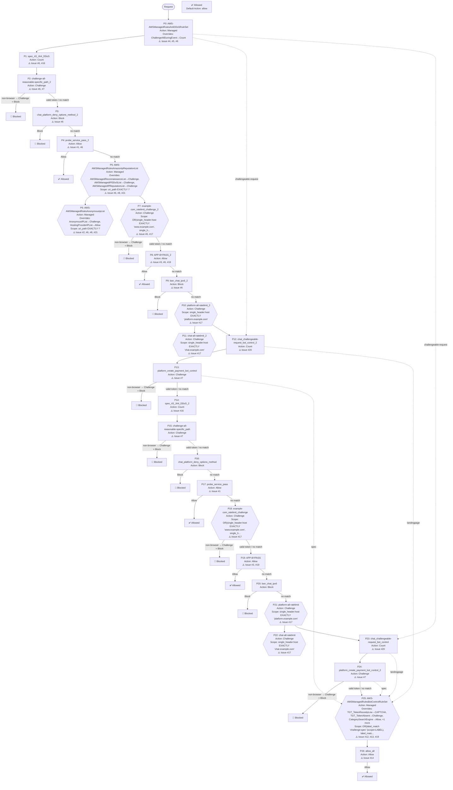

# AWS WAF Web ACL Rules Review Report

**Web ACL**: example-prod
**Review Date**: 2026-04-21
**Objective**: Review WAF configuration for security issues, misconfigurations, and optimization opportunities

## Summary

| Severity | Issue | Impact |
|----------|-------|--------|
| 🔴 Critical | #1 probe_service_pass_2 / probe_service_pass 基于可伪造条件实现全局 Allow 绕过 | single_header:x-detect-header 是完全可伪造的，攻击者只需在请求中添加 the matching custom header ... |
| 🔴 Critical | #2 HostingProviderIPList 被覆盖为 Allow，云端攻击流量可绕过所有后续规则 | `HostingProviderIPList` 默认 Block 云托管和 Web 托管提供商的 IP。将其覆盖为 Allow 意味着来自云平台（AWS、... |
| 🔴 Critical | #3 APP-BYPASS_2 / APP-BYPASS 基于可伪造条件实现全局 Allow 绕过 | single_header:user-agent 是完全可伪造的，攻击者只需在请求中添加 the matching User-Agent header 即... |
| 🟡 Medium | #4 ChallengeAllDuringEvent 被覆盖为 Count，DDoS 事件期间软缓解失效 | `ChallengeAllDuringEvent` 是 AntiDDoS AMR 的核心软缓解机制——在检测到 DDoS 事件时，对所有可 Challen... |
| 🟡 Medium | #5 AntiDDoS AMR 的豁免 URI 正则表达式未锚定，攻击者可利用路径注入绕过 | 以下正则分支未以 `^` 锚定，意味着它们是"包含"匹配而非"以...开头"匹配：`\/query`, `\/models`, `\/messages`,... |
| 🟡 Medium | #6 规则优先级顺序存在问题——发现 3 处顺序问题 | spec_43_JA4_DDoS (P1, Custom Block/Challenge rules) is before AWS-AWSManagedR... |
| 🟡 Medium | #7 Challenge 规则作用于 API/POST 路径，实际效果等同于 Block | Challenge 只能由浏览器 GET 请求完成（需要执行 JavaScript 并接受 HTML 响应） |
| 🟡 Medium | #8 IP 信誉和匿名 IP 规则组的 scope-down 过窄，仅检查首页 | 两个规则组实际上只对 `GET /` 请求生效，所有其他路径（`/api/*`、`/login`、`/signup` 等）均不受 IP 信誉检查保护 |
| 🟡 Medium | #9 缺少爬虫标记规则，DDoS 事件期间搜索引擎爬虫可能被 Challenge | `ChallengeAllDuringEvent` 会在 DDoS 事件期间对所有可 Challenge 的请求发起 Challenge，包括搜索引擎爬虫... |
| 🟡 Medium | #10 缺少 CRS and KnownBadInputs 基线防护规则组 | CRS 提供 OWASP Top 10 防护（SQLi、XSS 等），是大多数 Web 应用的基础防护层 |
| 🟡 Medium | #11 缺少 Always-on Challenge，DDoS 防护依赖响应式检测的延迟窗口 | 所有响应式防护（AntiDDoS AMR、速率限制规则）在攻击开始到缓解生效之间都存在不可避免的检测延迟窗口 |
| 🟡 Medium | #19 APP-BYPASS 修复后原生 App 流量将触发 Bot Control TGT_TokenAbsent，等同于 Block | 当前 APP-BYPASS 的 Allow 使原生 App 流量在 P8 终止，Bot Control（P25）从未被触发——这是一个"意外的保护" |
| 🟡 Medium | #20 chat_challengeable-request_bot_control 基于可伪造 Cookie 决定是否进入 Bot Control 评估 | 这两条规则使用 cookie 存在性（`ab_session_id`、`smidV2`）作为安全决策条件：有 cookie 则不打标签，无 cookie ... |
| 🟡 Medium | #21 修复 Issue 8（移除 IP 信誉 scope-down）将导致 API 路径的 Challenge 覆盖对非浏览器客户端等同于 Block | 当前 scope-down=uri=/ 使这些 Challenge 覆盖只影响首页流量，对 API 路径无影响 |
| 🟢 Low | #12 Bot Control 的 CategorySearchEngine 和 CategorySeo 被覆盖为 Allow | 这两个规则的 Allow 覆盖只影响"未验证"的搜索引擎 Bot（自称是搜索引擎爬虫但无法通过反向 DNS 验证的请求） |
| 🟢 Low | #13 Bot Control 版本过旧（Version_4.0），建议升级至 5.0 | BotControlRuleSet Version_5.0 的 Common level 可识别近 700 种 Bot 类型（基于 UA 和 IP），远超... |
| 🟢 Low | #14 allow_all 规则与默认 Allow 动作重复 | 该规则匹配所有请求（任何 URI 都以 `/` 开头），action 为 Allow |
| 🟢 Low | #15 Token Domain 配置包含冗余子域名 | Token Domain 使用后缀匹配——`example.com` 自动覆盖所有子域名 |
| 🔵 Awareness | #16 spec_43_JA4_DDoS / spec_43_JA4_DDoS_2 规则为 Count 但未添加标签，仅产生指标 | Count 规则不添加标签时，只产生 CloudWatch 指标，下游规则无法基于此匹配结果采取行动 |
| 🔵 Awareness | #17 多对规则逻辑完全相同，存在重复 | 对于 scope-down 重叠的速率限制规则，只有阈值最低的规则会对重叠流量生效——阈值更高的重复规则没有额外效果 |
| 🔵 Awareness | #18 未检测到 WAF 日志配置 | WAF JSON 导出不包含日志配置——此发现不代表日志未启用，仅表示无法从导出文件中验证 |

---

## Issue 1 (Critical): probe_service_pass_2 / probe_service_pass 基于可伪造条件实现全局 Allow 绕过

**Rule**: probe_service_pass_2 (priority 4), probe_service_pass (priority 17)
**Current state**: single_header:x-detect-header EXACTLY 'cloud-detect-16TNBPz9L00rabcdefgh'，action 为 Allow，无 scope-down

**Problem**:
- single_header:x-detect-header 是完全可伪造的，攻击者只需在请求中添加 the matching custom header 即可绕过所有后续规则（包括 IP 信誉、Bot Control、速率限制等）
- 该规则的 blast radius 为全局——所有流量路径均受影响，无 host 或 URI 限制
- 2 条规则逻辑完全相同，只需保留一条
- 匹配值 `cloud-detect-16TNBPz9L00rabcde...` 存储在 WAF 配置中，任何能读取 Web ACL 配置的人均可获取——泄露即意味着完全绕过 WAF

**Recommendation**:
- 将 action 改为 Count+Label（如 `custom:native-app` 或 `custom:probe`），不要直接 Allow——该流量不需要绕过 WAF
- 如果此规则用于内部探针或监控工具，应改用不可伪造的条件（如 IP Set 或 WAF Token）
- 删除重复规则，保留一条即可
- 定期轮换密钥值，并审计 WAF 配置的 IAM 访问权限

---
## Issue 2 (Critical): HostingProviderIPList 被覆盖为 Allow，云端攻击流量可绕过所有后续规则

**Rule**: AWS-AWSManagedRulesAnonymousIpList (priority 6)
**Current state**: `HostingProviderIPList` 规则被覆盖为 Allow

**Problem**:
- `HostingProviderIPList` 默认 Block 云托管和 Web 托管提供商的 IP。将其覆盖为 Allow 意味着来自云平台（AWS、GCP、Azure 等）的所有流量将直接被放行，跳过所有后续规则
- 现代 DDoS 攻击大量使用云托管基础设施（VPS、云函数、容器）——Allow 覆盖使这些攻击流量完全绕过 IP 信誉、Bot Control、速率限制等所有保护
- 正确做法是覆盖为 Count（保留标签，供下游规则使用），而非 Allow

**Recommendation**:
- 将 `HostingProviderIPList` 的覆盖从 Allow 改为 Count
- 如果担心企业用户通过云代理访问时被误封，Count 模式已经解决了这个问题（不会 Block，只添加标签）

---
## Issue 3 (Critical): APP-BYPASS_2 / APP-BYPASS 基于可伪造条件实现全局 Allow 绕过

**Rule**: APP-BYPASS_2 (priority 8), APP-BYPASS (priority 19)
**Current state**: single_header:user-agent STARTS_WITH 'example'，action 为 Allow，无 scope-down

**Problem**:
- single_header:user-agent 是完全可伪造的，攻击者只需在请求中添加 the matching User-Agent header 即可绕过所有后续规则（包括 IP 信誉、Bot Control、速率限制等）
- 该规则的 blast radius 为全局——所有流量路径均受影响，无 host 或 URI 限制
- 2 条规则逻辑完全相同，只需保留一条

**Recommendation**:
- 将 action 改为 Count+Label（如 `custom:native-app` 或 `custom:probe`），不要直接 Allow——该流量不需要绕过 WAF
- 如果此规则用于内部探针或监控工具，应改用不可伪造的条件（如 IP Set 或 WAF Token）
- 删除重复规则，保留一条即可

---
## Issue 4 (Medium): ChallengeAllDuringEvent 被覆盖为 Count，DDoS 事件期间软缓解失效

**Rule**: AWS-AWSManagedRulesAntiDDoSRuleSet (priority 0)
**Current state**: `ChallengeAllDuringEvent` 被覆盖为 Count

**Problem**:
- `ChallengeAllDuringEvent` 是 AntiDDoS AMR 的核心软缓解机制——在检测到 DDoS 事件时，对所有可 Challenge 的请求发起 Challenge，过滤无法执行 JavaScript 的攻击工具
- 将其覆盖为 Count 意味着 DDoS 事件期间该规则只产生指标，不执行任何缓解动作
- 当前配置中 `sensitivity_to_block: LOW`，只有high-suspicion DDoS 请求才会被 Block；`ChallengeAllDuringEvent` 被禁用后，medium and low-suspicion攻击流量在事件期间将不受任何软缓解保护

**Recommendation**:
- **最佳方案**：如果架构支持，使用前后端分离——前端 Web ACL（浏览器流量）启用 ChallengeAllDuringEvent 默认配置；后端 Web ACL（API/原生 App 流量）关闭 Challenge，提高 Block 灵敏度
- **推荐方案**：在同一 Web ACL 中部署双 AMR 实例——一个针对浏览器流量（启用 ChallengeAllDuringEvent），另一个针对 API/原生 App 流量（禁用 Challenge，Block 灵敏度 MEDIUM）。实现步骤见附录 B
- 不推荐"单实例 + 全部 Count + 自定义标签规则"方案——需要理解 6+ 个 AMR 标签的语义，Count 覆盖会禁用 AMR 内置联动逻辑，且仍需回答"哪些路径可以 Challenge"

---
## Issue 5 (Medium): AntiDDoS AMR 的豁免 URI 正则表达式未锚定，攻击者可利用路径注入绕过

**Rule**: AWS-AWSManagedRulesAntiDDoSRuleSet (priority 0)
**Current state**: 豁免正则 `\/query|\/models|\/messages|\/balance|\/completions|\/api\/|\.(acc|avi|css|gif|ico|jpe?g|js|json|mp[34]|ogg|otf|pdf|png|tiff?|ttf|webm|webp|woff2?|xml|svg)$`，API 路径分支未使用 `^` 锚定

**Problem**:
- 以下正则分支未以 `^` 锚定，意味着它们是"包含"匹配而非"以...开头"匹配：`\/query`, `\/models`, `\/messages`, `\/balance`, `\/completions`, `\/api\/`
- 攻击者可以构造包含这些关键词的任意路径来绕过 `ChallengeAllDuringEvent`，例如：`/admin/query/export`, `/admin/models/export`
- 这使得攻击者可以通过精心构造的路径，让攻击请求被豁免于 Challenge

**Recommendation**:
- 为所有 API 路径分支添加 `^` 锚定：`^\/query|^\/models|^\/messages|^\/balance|^\/completions|^\/api\/|^\.(acc|avi|css|gif|ico|jpe?g|js|json|mp[34]|ogg|otf|pdf|png|tiff?|ttf|webm|webp|woff2?|xml|svg)$`
- 静态资源后缀匹配已正确使用 `$` 锚定，无需修改

---
## Issue 6 (Medium): 规则优先级顺序存在问题——发现 3 处顺序问题

**Rule**: 多条规则
**Current state**: AWS-AWSManagedRulesAntiDDoSRuleSet (P0), spec_43_JA4_DDoS (P1), challenge-all-reasonable-specific_path_2 (P2), chat_platform_deny_options_method_2 (P3), probe_service_pass_2 (P4) ... (27 rules total)

**Problem**:
- spec_43_JA4_DDoS (P1, Custom Block/Challenge rules) is before AWS-AWSManagedRulesAmazonIpReputationList (P5, IP reputation / Anonymous IP), but recommended order is reversed
- spec_43_JA4_DDoS (P1, Custom Block/Challenge rules) is before example-com_ratelimit_challenge_2 (P7, Rate-based rules), but recommended order is reversed
- AWS-AWSManagedRulesBotControlRuleSet (P25, Bot Control / ATP / ACFP) is before allow_all (P26, Custom Block/Challenge rules), but recommended order is reversed

**Recommendation**:
- 清理重复规则后，重新整理优先级顺序
- 建议顺序（参考附录 D）：
  1. 爬虫标记规则
  2. AntiDDoS AMR
  3. IP 信誉 + 匿名 IP
  4. 速率限制规则
  5. 自定义 Block/Challenge 规则
  6. Landing Page Always-on Challenge
  7. Bot Control（最后，按请求计费，放最后最省成本）

---
## Issue 7 (Medium): Challenge 规则作用于 API/POST 路径，实际效果等同于 Block

**Rule**: challenge-all-reasonable-specific_path_2 (priority 2), platform_create_payment_bot_control (priority 13), challenge-all-reasonable-specific_path (priority 15), platform_create_payment_bot_control_2 (priority 24)
**Current state**: 对 API 路径和/或 POST 请求应用 Challenge action

**Problem**:
- Challenge 只能由浏览器 GET 请求完成（需要执行 JavaScript 并接受 HTML 响应）
- API 路径通常由原生 App 或 JavaScript fetch/XHR 访问，无法完成 Challenge
- POST 请求无法完成 Challenge——客户端会收到 HTTP 202 但无法重新提交原始 POST 请求
- 实际效果：这些规则对 API 客户端和原生 App 等同于 Block

**Recommendation**:
- 对 API 滥用防护：考虑改用速率限制（rate-based rule）而非 Challenge
- 对 POST 端点：应在对应的 GET 页面（landing page）上应用 Challenge，而不是在 POST 请求上

---
## Issue 8 (Medium): IP 信誉和匿名 IP 规则组的 scope-down 过窄，仅检查首页

**Rule**: AWS-AWSManagedRulesAmazonIpReputationList (priority 5) and AWS-AWSManagedRulesAnonymousIpList (priority 6)
**Current state**: scope-down 为 `uri_path EXACTLY '/'`，仅对首页路径生效

**Problem**:
- 两个规则组实际上只对 `GET /` 请求生效，所有其他路径（`/api/*`、`/login`、`/signup` 等）均不受 IP 信誉检查保护
- 恶意 IP 只需访问任何非首页路径即可完全绕过这两个规则组
- 这使得 IP 信誉保护形同虚设，尤其对 API 路径的攻击毫无防护

**Recommendation**:
- 移除这两个规则组的 scope-down，让其检查所有流量
- 如果出于性能或成本考虑需要限制范围，至少应覆盖所有关键路径，而不是仅限于首页

---
## Issue 9 (Medium): 缺少爬虫标记规则，DDoS 事件期间搜索引擎爬虫可能被 Challenge

**Rule**: N/A（缺失规则）
**Current state**: Web ACL 中没有 ASN + UA 爬虫标记规则

**Problem**:
- `ChallengeAllDuringEvent` 会在 DDoS 事件期间对所有可 Challenge 的请求发起 Challenge，包括搜索引擎爬虫（Googlebot、Bingbot 等）
- 真实案例表明，爬虫在 DDoS 事件期间可能索引 Challenge 拦截页（HTTP 202）而非实际内容，严重损害 SEO 排名
- Bot Control 的 `bot:verified` 标签虽然可以识别已验证爬虫，但 Bot Control 必须放在规则链末尾（成本优化），此时 AntiDDoS AMR 已经评估完毕，无法使用该标签

**Recommendation**:
- 在 AntiDDoS AMR 之前添加 ASN + UA 爬虫标记规则，为 Google（ASN 15169）、Bing（ASN 8075）等爬虫添加 `crawler:verified` 标签（完整规则 JSON 见附录 A）
- 在 AntiDDoS AMR 的 scope-down 中排除 `crawler:verified` 标签，防止爬虫被 Challenge

---
## Issue 10 (Medium): 缺少 CRS and KnownBadInputs 基线防护规则组

**Rule**: N/A（缺失规则）
**Current state**: Web ACL 中没有 CRS and KnownBadInputs

**Problem**:
- CRS 提供 OWASP Top 10 防护（SQLi、XSS 等），是大多数 Web 应用的基础防护层
- KnownBadInputsRuleSet 防护 Log4Shell（CVE-2021-44228）、Java 反序列化漏洞等已知恶意输入模式，WCU 消耗低、误报率低
- 当前 Web ACL 专注于 DDoS 和 Bot 防护，但缺乏应用层攻击防护

**Recommendation**:
- 评估是否需要添加 CRS；如果添加，务必将 `SizeRestrictions_Body` 覆盖为 Count，避免对大 payload 的 API 端点产生误报（实现步骤见附录 F）
- 添加 AWSManagedRulesKnownBadInputsRuleSet（WCU 消耗低，建议优先添加）
- 添加前请在 AWS 控制台确认剩余 WCU 容量（当前已使用 435 WCU，上限 5000）
---
## Issue 11 (Medium): 缺少 Always-on Challenge，DDoS 防护依赖响应式检测的延迟窗口

**Rule**: N/A（缺失规则）
**Current state**: Web ACL 中没有针对 landing page 的 Always-on Challenge 规则

**Problem**:
- 所有响应式防护（AntiDDoS AMR、速率限制规则）在攻击开始到缓解生效之间都存在不可避免的检测延迟窗口
- Always-on Challenge 是主动式防护——对 landing page 路径持续要求浏览器验证，无需等待攻击检测，从第一个请求起即过滤无法执行 JavaScript 的攻击工具
- 缺少 Always-on Challenge 意味着在检测延迟窗口内，大量非浏览器攻击流量可以无阻碍地到达源站

**Recommendation**:
- 添加两条规则实现 Always-on Challenge（实现步骤见附录 C）：
  1. Count+Label 规则：匹配 landing page URI（`/`、`/login`、`/signup` 等），添加标签 `custom:landing-page`
  2. Challenge 规则：匹配 `custom:landing-page` 标签，应用 Challenge action；在条件中排除 `crawler:verified` 标签（需先实现爬虫标记规则）
- 将 Challenge 规则的 token immunity time 设置为至少 4 小时（14400 秒），避免真实用户频繁被 Challenge

---
## Issue 12 (Low): Bot Control 的 CategorySearchEngine 和 CategorySeo 被覆盖为 Allow

**Rule**: AWS-AWSManagedRulesBotControlRuleSet (priority 25)
**Current state**: `CategorySearchEngine / CategorySeo` 被覆盖为 Allow

**Problem**:
- 这两个规则的 Allow 覆盖只影响"未验证"的搜索引擎 Bot（自称是搜索引擎爬虫但无法通过反向 DNS 验证的请求）
- 真正的 Googlebot/Bingbot（已验证）本来就不会被这两个规则 Block——它们通过 `bot:verified` 标签直接放行，与覆盖无关
- 伪造 Googlebot UA 的攻击者不会匹配 `CategorySearchEngine`（反向 DNS 验证失败后落入 `SignalNonBrowserUserAgent`），也与覆盖无关
- Allow 覆盖让未验证的搜索引擎 Bot 绕过所有后续 WAF 规则，虽然 blast radius 有限，但并非必要

**Recommendation**:
- 移除 `CategorySearchEngine / CategorySeo` 的 Allow 覆盖，恢复默认 Block
- 如果担心 DDoS 事件期间爬虫被 Challenge 影响 SEO，正确做法是添加 ASN + UA 爬虫标记规则（见附录 A），而不是在 Bot Control 中使用 Allow 覆盖

---
## Issue 13 (Low): Bot Control 版本过旧（Version_4.0），建议升级至 5.0

**Rule**: AWS-AWSManagedRulesBotControlRuleSet (priority 25)
**Current state**: 使用 Version_4.0

**Problem**:
- BotControlRuleSet Version_5.0 的 Common level 可识别近 700 种 Bot 类型（基于 UA 和 IP），远超早期版本

**Recommendation**:
- 将 BotControlRuleSet 升级至 Version_5.0
- 升级前在测试环境验证，确认无误报增加

---
## Issue 14 (Low): allow_all 规则与默认 Allow 动作重复

**Rule**: allow_all (priority 26)
**Current state**: `uri_path STARTS_WITH '/'` → Allow，而 Web ACL 的 default_action 已经是 Allow

**Problem**:
- 该规则匹配所有请求（任何 URI 都以 `/` 开头），action 为 Allow
- Web ACL 的 default_action 已经是 Allow，因此该规则完全冗余
- 该规则消耗 WCU 且增加规则评估开销，没有任何实际作用

**Recommendation**:
- 删除 allow_all 规则

---
## Issue 15 (Low): Token Domain 配置包含冗余子域名

**Rule**: N/A（Web ACL 全局配置）
**Current state**: token_domains 包含 `example.com`, `www.example.com`, `chat.example.com`, `platform.example.com`, `api.example.com`, `api-docs.example.com`

**Problem**:
- Token Domain 使用后缀匹配——`example.com` 自动覆盖所有子域名
- 列出子域名是冗余的，不会造成安全问题，但增加了配置维护成本

**Recommendation**:
- 仅保留 `example.com`，删除其他子域名条目

---
## Issue 16 (Awareness): spec_43_JA4_DDoS / spec_43_JA4_DDoS_2 规则为 Count 但未添加标签，仅产生指标

**Rule**: spec_43_JA4_DDoS (priority 1), spec_43_JA4_DDoS_2 (priority 14)
**Current state**: Count action，无 RuleLabels

**Problem**:
- Count 规则不添加标签时，只产生 CloudWatch 指标，下游规则无法基于此匹配结果采取行动
- 如果意图是基于匹配结果执行某种动作，当前配置无法实现
- 2 条规则可能逻辑相同——请检查是否存在重复

**Recommendation**:
- 如果这些规则是监控用途（仅观察），保留一条并添加说明性命名即可，删除重复规则
- 如果意图是对匹配结果采取行动（如 Block 或 Challenge），应将 action 改为目标动作，或添加标签供下游规则消费
- 如果逻辑相同，删除重复规则

---
## Issue 17 (Awareness): 多对规则逻辑完全相同，存在重复

**Rule**: example-com_ratelimit_challenge_2 (P7) / example-com_ratelimit_challenge (P18); platform-all-ratelimit_2 (P10) / platform-all-ratelimit (P21); chat-all-ratelimit_2 (P11) / chat-all-ratelimit (P22); chat_platform_deny_options_method_2 (P3) / chat_platform_deny_options_method (P16); ban_chat_ipv6_2 (P9) / ban_chat_ipv6 (P20)
**Current state**: 5 对规则，每对的 statement、action、scope-down 完全相同

**Problem**:
- 3 对速率限制规则（scope-down、limit、window 完全相同）：只有高优先级版本会对重叠流量生效，低优先级版本没有额外效果
- chat_platform_deny_options_method_2 (P3) 和 chat_platform_deny_options_method (P16)：逻辑完全相同（Block OPTIONS 方法，chat/platform host），P16 永远不会被触发
- ban_chat_ipv6_2 (P9) 和 ban_chat_ipv6 (P20)：逻辑完全相同（Block IPv6 IP set + chat host），P20 永远不会被触发
- 所有重复规则消耗 WCU 且增加维护成本

**Recommendation**:
- 删除所有低优先级的重复规则，保留高优先级版本（P3、P7、P9、P10、P11）
- 如果两组规则有不同的业务意图（例如一组用于监控、一组用于执行），应在命名和配置上加以区分

---
## Issue 18 (Awareness): 未检测到 WAF 日志配置

**Rule**: N/A（Web ACL 全局配置）
**Current state**: WAF JSON 导出文件中不包含日志配置信息

**Problem**:
- WAF JSON 导出不包含日志配置——此发现不代表日志未启用，仅表示无法从导出文件中验证
- WAF 日志对于安全事件调查、规则调优和误报分析至关重要

**Recommendation**:
- 通过 AWS 控制台或 CLI 确认是否已启用 WAF 日志（Kinesis Data Firehose、S3 或 CloudWatch Logs）
- 建议至少保留 90 天的日志，并配置 CloudWatch 告警监控关键指标（Block 率、Challenge 率）

---
## Issue 19 (Medium): APP-BYPASS 修复后原生 App 流量将触发 Bot Control TGT_TokenAbsent，等同于 Block

**Rule**: APP-BYPASS_2 (priority 8), APP-BYPASS (priority 19), AWS-AWSManagedRulesBotControlRuleSet (priority 25)
**Current state**: APP-BYPASS 以 Allow 终止原生 App 流量，Bot Control 从未评估这部分流量；`SignalNonBrowserUserAgent` 和 `CategoryHttpLibrary` 未覆盖为 Count；`TGT_TokenAbsent` 已覆盖为 Challenge

**Problem**:
- 当前 APP-BYPASS 的 Allow 使原生 App 流量在 P8 终止，Bot Control（P25）从未被触发——这是一个"意外的保护"
- 修复 Issue 3（将 APP-BYPASS 改为 Count+Label `custom:native-app`）后，原生 App 流量将继续向下评估
- 如果原生 App 流量匹配 `challenge:spec` 或 `challenge:landingpage` 标签（Bot Control 的 scope-down 条件），将进入 Bot Control Targeted 评估：
  - `TGT_TokenAbsent`（已覆盖为 Challenge）：原生 App 无 WAF token，必然触发 Challenge → 等同于 Block
  - `SignalNonBrowserUserAgent`（默认 Block）：原生 App 使用非浏览器 UA，必然触发 Block
- 即使原生 App 流量不匹配 Bot Control scope-down，速率限制规则（P7/P10/P11）的 Challenge action 对 API 请求也等同于 Block（Issue 7 已指出）

**Recommendation**:
- 修复 Issue 3 时，必须同步执行以下操作（否则修复会导致原生 App 流量被 Block）：
  1. **短期方案**：为 Bot Control 添加 scope-down 排除 `custom:native-app` 标签，绕过整个 Bot Control 规则组对原生 App 流量的评估
  2. **同步操作**：将 Bot Control 的 `SignalNonBrowserUserAgent` 和 `CategoryHttpLibrary` 覆盖为 Count（无论是否使用 scope-down 排除，这都是最佳实践）
  3. **中期方案**：集成 AWS WAF Mobile SDK，为原生 App 请求生成有效 WAF token，移除 scope-down 排除后 `TGT_TokenAbsent` 不再触发
- **不要单独修复 Issue 3**——必须与上述 Bot Control 调整同步进行

---
## Issue 20 (Medium): chat_challengeable-request_bot_control 基于可伪造 Cookie 决定是否进入 Bot Control 评估

**Rule**: chat_challengeable-request_bot_control_2 (priority 12), chat_challengeable-request_bot_control (priority 23)
**Current state**: 条件为 `label_match challengeable-request AND host=chat.example.com AND NOT(cookie CONTAINS 'ab_session_id') AND NOT(cookie CONTAINS 'smidV2')`，action 为 Count+Label `challenge:landingpage`

**Problem**:
- 这两条规则使用 cookie 存在性（`ab_session_id`、`smidV2`）作为安全决策条件：有 cookie 则不打标签，无 cookie 则打 `challenge:landingpage` 标签进入 Bot Control Targeted 评估
- Cookie 是完全可伪造的——攻击者只需在请求中添加 `ab_session_id=x` 或 `smidV2=x` cookie，即可绕过这两条规则的标签打标，从而不进入 Bot Control 评估
- 这意味着攻击者可以通过伪造 cookie 绕过 Bot Control 对 chat.example.com 的 Targeted 检测
- 正确的用户识别应使用不可伪造的 WAF token（`aws-waf-token` cookie，由 AWS 加密签名），而非业务 cookie

**Recommendation**:
- 将 cookie 存在性检查替换为 WAF token 检查：使用 `label_match awswaf:managed:token:accepted` 标签（由 Bot Control/AntiDDoS AMR 产出）来识别已通过验证的用户，而非依赖可伪造的业务 cookie
- 如果业务 cookie 的目的是识别"已登录用户"（不需要 Bot Control 检查），应改用 WAF token 的 `token:accepted` 标签——持有有效 WAF token 的请求已经通过了 Challenge 验证，无需再次进入 Bot Control
- 短期过渡方案：保留 cookie 检查，但同时添加 `NOT(label_match awswaf:managed:token:accepted)` 条件，确保持有有效 token 的请求也被排除

---
## Issue 21 (Medium): 修复 Issue 8（移除 IP 信誉 scope-down）将导致 API 路径的 Challenge 覆盖对非浏览器客户端等同于 Block

**Rule**: AWS-AWSManagedRulesAmazonIpReputationList (priority 5), AWS-AWSManagedRulesAnonymousIpList (priority 6)
**Current state**: IP 信誉规则组的 3 条规则（AWSManagedReconnaissanceList、AWSManagedIPDDoSList、AWSManagedIPReputationList）均已覆盖为 Challenge；AnonymousIPList 覆盖为 Challenge

**Problem**:
- 当前 scope-down=uri=/ 使这些 Challenge 覆盖只影响首页流量，对 API 路径无影响
- 修复 Issue 8（移除 scope-down）后，所有路径的流量都会经过这些规则
- Challenge 对 API 路径的 POST 请求、原生 App 请求等同于 Block——客户端无法完成 Challenge
- 恶意 IP 访问 API 路径时会被 Challenge（等同于 Block），这可能是预期行为；但如果有合法的 API 客户端来自被标记的 IP（如企业 VPN、云代理），也会被 Block

**Recommendation**:
- 修复 Issue 8 时，评估 Challenge 覆盖对 API 流量的影响：
  - 如果 API 路径只有浏览器访问：Challenge 覆盖合理，直接移除 scope-down 即可
  - 如果 API 路径有原生 App 或 API 客户端访问：考虑将 Challenge 覆盖改为 Block（更明确，避免 Challenge 的"假 202"响应混淆客户端），或为 API 路径添加单独的 scope-down 排除
- 建议修复顺序：先修复 Issue 3（APP-BYPASS），再修复 Issue 8，观察 CloudWatch 指标后再决定是否调整 Challenge 覆盖

---

---

## Appendix: Rule Execution Flow


```mermaid
flowchart TD
    START(["Request"]) --> rule_0

    rule_0["P0: AWS-AWSManagedRulesAntiDDoSRuleSet\nAction: Managed\nOverrides: ChallengeAllDuringEvent→Count\n⚠️ Issue #4, #5, #6"]

    rule_1["P1: spec_43_JA4_DDoS\nAction: Count\n⚠️ Issue #6, #16"]

    rule_2["P2: challenge-all-reasonable-specific_path_2\nAction: Challenge\n⚠️ Issue #6, #7"]
    rule_2 -->|"non-browser → Challenge = Block"| BLOCK_rule_2["🚫 Blocked"]

    rule_3["P3: chat_platform_deny_options_method_2\nAction: Block\n⚠️ Issue #6"]
    rule_3 -->|"Block"| BLOCK_rule_3["🚫 Blocked"]

    rule_4["P4: probe_service_pass_2\nAction: Allow\n⚠️ Issue #1, #6"]
    rule_4 -->|"Allow"| ALLOW_rule_4["✅ Allowed"]

    rule_5{{"P5: AWS-AWSManagedRulesAmazonIpReputationList\nAction: Managed\nOverrides: AWSManagedReconnaissanceList→Challenge, AWSManagedIPDDoSList→Challenge, AWSManagedIPReputationList→Challenge\nScope: uri_path EXACTLY '/'\n⚠️ Issue #6, #8, #21"}}
    rule_6{{"P6: AWS-AWSManagedRulesAnonymousIpList\nAction: Managed\nOverrides: AnonymousIPList→Challenge, HostingProviderIPList→Allow\nScope: uri_path EXACTLY '/'\n⚠️ Issue #2, #6, #8, #21"}}
    rule_5 --> rule_6

    rule_7{{"P7: example-com_ratelimit_challenge_2\nAction: Challenge\nScope: OR(single_header:host EXACTLY 'www.example.com', single_h...\n⚠️ Issue #6, #17"}}
    rule_7 -->|"non-browser → Challenge = Block"| BLOCK_rule_7["🚫 Blocked"]

    rule_8["P8: APP-BYPASS_2\nAction: Allow\n⚠️ Issue #3, #6, #19"]
    rule_8 -->|"Allow"| ALLOW_rule_8["✅ Allowed"]

    rule_9["P9: ban_chat_ipv6_2\nAction: Block\n⚠️ Issue #6"]
    rule_9 -->|"Block"| BLOCK_rule_9["🚫 Blocked"]

    rule_10{{"P10: platform-all-ratelimit_2\nAction: Challenge\nScope: single_header:host EXACTLY 'platform.example.com'\n⚠️ Issue #17"}}
    rule_11{{"P11: chat-all-ratelimit_2\nAction: Challenge\nScope: single_header:host EXACTLY 'chat.example.com'\n⚠️ Issue #17"}}
    rule_10 --> rule_11

    rule_12["P12: chat_challengeable-request_bot_control_2\nAction: Count\n⚠️ Issue #20"]

    rule_13["P13: platform_create_payment_bot_control\nAction: Challenge\n⚠️ Issue #7"]
    rule_13 -->|"non-browser → Challenge = Block"| BLOCK_rule_13["🚫 Blocked"]

    rule_14["P14: spec_43_JA4_DDoS_2\nAction: Count\n⚠️ Issue #16"]

    rule_15["P15: challenge-all-reasonable-specific_path\nAction: Challenge\n⚠️ Issue #7"]
    rule_15 -->|"non-browser → Challenge = Block"| BLOCK_rule_15["🚫 Blocked"]

    rule_16["P16: chat_platform_deny_options_method\nAction: Block"]
    rule_16 -->|"Block"| BLOCK_rule_16["🚫 Blocked"]

    rule_17["P17: probe_service_pass\nAction: Allow\n⚠️ Issue #1"]
    rule_17 -->|"Allow"| ALLOW_rule_17["✅ Allowed"]

    rule_18{{"P18: example-com_ratelimit_challenge\nAction: Challenge\nScope: OR(single_header:host EXACTLY 'www.example.com', single_h...\n⚠️ Issue #17"}}
    rule_18 -->|"non-browser → Challenge = Block"| BLOCK_rule_18["🚫 Blocked"]

    rule_19["P19: APP-BYPASS\nAction: Allow\n⚠️ Issue #3, #19"]
    rule_19 -->|"Allow"| ALLOW_rule_19["✅ Allowed"]

    rule_20["P20: ban_chat_ipv6\nAction: Block"]
    rule_20 -->|"Block"| BLOCK_rule_20["🚫 Blocked"]

    rule_21{{"P21: platform-all-ratelimit\nAction: Challenge\nScope: single_header:host EXACTLY 'platform.example.com'\n⚠️ Issue #17"}}
    rule_22{{"P22: chat-all-ratelimit\nAction: Challenge\nScope: single_header:host EXACTLY 'chat.example.com'\n⚠️ Issue #17"}}
    rule_21 --> rule_22

    rule_23["P23: chat_challengeable-request_bot_control\nAction: Count\n⚠️ Issue #20"]

    rule_24["P24: platform_create_payment_bot_control_2\nAction: Challenge\n⚠️ Issue #7"]
    rule_24 -->|"non-browser → Challenge = Block"| BLOCK_rule_24["🚫 Blocked"]

    rule_25{{"P25: AWS-AWSManagedRulesBotControlRuleSet\nAction: Managed\nOverrides: TGT_TokenReuseIpLow→CAPTCHA, TGT_TokenAbsent→Challenge, CategorySearchEngine→Allow, +1 more\nScope: OR(label_match 'challenge:spec' (scope=LABEL), label_matc...\n⚠️ Issue #12, #13, #19"}}

    rule_26["P26: allow_all\nAction: Allow\n⚠️ Issue #14"]
    rule_26 -->|"Allow"| ALLOW_rule_26["✅ Allowed"]

    rule_0 --> rule_1
    rule_1 --> rule_2
    rule_2 -->|"valid token / no match"| rule_3
    rule_3 -->|"no match"| rule_4
    rule_4 -->|"no match"| rule_5
    rule_5 --> rule_7
    rule_7 -->|"valid token / no match"| rule_8
    rule_8 -->|"no match"| rule_9
    rule_9 -->|"no match"| rule_10
    rule_10 --> rule_12
    rule_12 --> rule_13
    rule_13 -->|"valid token / no match"| rule_14
    rule_14 --> rule_15
    rule_15 -->|"valid token / no match"| rule_16
    rule_16 -->|"no match"| rule_17
    rule_17 -->|"no match"| rule_18
    rule_18 -->|"valid token / no match"| rule_19
    rule_19 -->|"no match"| rule_20
    rule_20 -->|"no match"| rule_21
    rule_21 --> rule_23
    rule_23 --> rule_24
    rule_24 -->|"valid token / no match"| rule_25
    rule_25 --> rule_26
    DEFAULT_ACTION["✅ Allowed\nDefault Action: allow"]

    rule_0 -.->|"challengeable-request"| rule_12
    rule_0 -.->|"challengeable-request"| rule_23
    rule_13 -.->|"spec"| rule_25
    rule_24 -.->|"spec"| rule_25
    rule_12 -.->|"landingpage"| rule_25
    rule_23 -.->|"landingpage"| rule_25
```

---

# 附录 / Appendix

## Appendix A: ASN + UA Crawler Labeling Rule

Place this rule **before** AntiDDoS AMR and Always-on Challenge. It labels verified search engine crawlers so downstream rules can exclude them via scope-down.

```json
{
  "Name": "label-verified-crawlers",
  "Priority": "<place before AntiDDoS AMR>",
  "Action": {
    "Count": {}
  },
  "RuleLabels": [
    { "Name": "crawler:verified" }
  ],
  "VisibilityConfig": {
    "SampledRequestsEnabled": true,
    "CloudWatchMetricsEnabled": true,
    "MetricName": "label-verified-crawlers"
  },
  "Statement": {
    "OrStatement": {
      "Statements": [
        {
          "AndStatement": {
            "Statements": [
              {
                "ByteMatchStatement": {
                  "SearchString": "googlebot",
                  "FieldToMatch": { "SingleHeader": { "Name": "user-agent" } },
                  "TextTransformations": [{ "Priority": 0, "Type": "LOWERCASE" }],
                  "PositionalConstraint": "CONTAINS"
                }
              },
              { "AsnMatchStatement": { "AsnList": [15169] } }
            ]
          }
        },
        {
          "AndStatement": {
            "Statements": [
              {
                "ByteMatchStatement": {
                  "SearchString": "bingbot",
                  "FieldToMatch": { "SingleHeader": { "Name": "user-agent" } },
                  "TextTransformations": [{ "Priority": 0, "Type": "LOWERCASE" }],
                  "PositionalConstraint": "CONTAINS"
                }
              },
              { "AsnMatchStatement": { "AsnList": [8075] } }
            ]
          }
        },
        {
          "AndStatement": {
            "Statements": [
              {
                "ByteMatchStatement": {
                  "SearchString": "yandexbot",
                  "FieldToMatch": { "SingleHeader": { "Name": "user-agent" } },
                  "TextTransformations": [{ "Priority": 0, "Type": "LOWERCASE" }],
                  "PositionalConstraint": "CONTAINS"
                }
              },
              { "AsnMatchStatement": { "AsnList": [13238, 208722] } }
            ]
          }
        }
      ]
    }
  }
}
```

Confirmed ASNs: Google 15169, Bing 8075, Yandex 13238 + 208722. For other search engines (Baidu, Yahoo Japan, etc.), verify current ASNs from their official documentation before adding.

---

## Appendix B: Dual AntiDDoS AMR Instance Pattern

When browser and native app traffic need different AntiDDoS strategies:

1. **Add a Count+Label rule before both AMR instances** to label native app traffic (e.g., label `native-app:identified`). This rule must have a higher priority (lower number) than both AMR instances.
2. **AMR instance 1 (browser traffic)**: scope-down excludes the native app label. `ChallengeAllDuringEvent` enabled. Block sensitivity: LOW (default).
3. **AMR instance 2 (native app traffic)**: scope-down matches the native app label only. `ChallengeAllDuringEvent` disabled. Block sensitivity: MEDIUM (since Challenge is unavailable, raise Block sensitivity for adequate protection).
4. **Implementation**: The AWS console does not allow adding the same managed rule group twice. First copy the existing AMR rule's JSON. Then create a new **custom rule** in the Web ACL, open its **JSON editor**, paste the copied AMR JSON, change `Name` and `MetricName` to unique values (e.g., `AntiDDoS-NativeApp`), then save.

Crawler exclusion scope-down (add to AMR scope-down via `AndStatement` if AMR already has one):

```json
{
  "NotStatement": {
    "Statement": {
      "LabelMatchStatement": {
        "Scope": "LABEL",
        "Key": "crawler:verified"
      }
    }
  }
}
```

---

## Appendix C: Always-on Challenge for Landing Pages

Two-rule pattern for proactive DDoS defense on landing page URIs:

1. **Label rule** (Count+Label): matches landing page URIs (e.g., `/`, `/login`, `/signup`) and adds label `custom:landing-page`. Action: Count (request continues).
2. **Challenge rule**: matches `custom:landing-page` label and applies Challenge action. Exclude verified crawlers by adding a `NotStatement` for `crawler:verified` label.

The user must define their own landing page URI list based on their application.

Recommended token immunity time: ≥ 4 hours (14400 seconds). Real users complete JS verification once and browse uninterrupted for the entire immunity period.

---

## Appendix D: Recommended Rule Priority Order

| Position | Rule Type | Rationale |
|----------|-----------|-----------|
| 1 | IP whitelist (Allow) | Trusted IPs bypass all rules |
| 2 | IP blacklist (Block) | Known malicious IPs blocked immediately |
| 3 | Count+Label rules | Tag traffic types for downstream scope-down |
| 4 | AntiDDoS AMR | Needs full traffic for accurate baseline |
| 5 | IP reputation rule group | Low WCU, filters known malicious IPs |
| 6 | Anonymous IP rule group | Filters anonymous/hosting provider IPs |
| 7 | Rate-based rules | Rate limiting before Challenge |
| 8 | Always-on Challenge | Proactive DDoS defense for landing pages |
| 9 | Custom rules | Business-specific logic |
| 10 | Application layer rule groups (CRS, KnownBadInputs) | OWASP Top 10 protections |
| 11 | Bot Control / ATP / ACFP | Per-request pricing — place last |

Key principles: label producers before consumers, AntiDDoS AMR as early as possible, cheaper rules before expensive ones.

---

## Appendix E: WCU Capacity Reminder

Current WCU: **435** / 5000.

After implementing any recommended changes, verify the new WCU total does not exceed 5000. Check in the AWS Console: WAF → Web ACLs → select your Web ACL → the capacity is shown in the overview.

---

## Appendix F: Common Override Recommendations

When adding or reviewing managed rule groups, consider these common overrides:

**AWSManagedRulesCommonRuleSet (CRS):**
- Override `SizeRestrictions_Body` to **Count**. This rule blocks request bodies larger than 8KB, which frequently causes false positives on file upload endpoints, API endpoints with large payloads, and form submissions with rich content.

**AWSManagedRulesBotControlRuleSet (Bot Control Common level):**
- Override `SignalNonBrowserUserAgent` to **Count**. Default Block will block legitimate non-browser clients (native apps using okhttp/gohttp, API clients, monitoring tools).
- Override `CategoryHttpLibrary` to **Count**. Same reason — legitimate HTTP libraries used by native apps and API clients will be blocked.

**AWSManagedRulesAnonymousIpList:**
- Review `HostingProviderIPList` carefully. Default Block will block requests from cloud platforms and hosting providers. If your clients may originate from cloud-hosted environments (e.g., enterprise users behind cloud proxies, SaaS integrations), override to **Count**. Never override to Allow — that lets cloud-hosted attack traffic bypass all subsequent rules.
