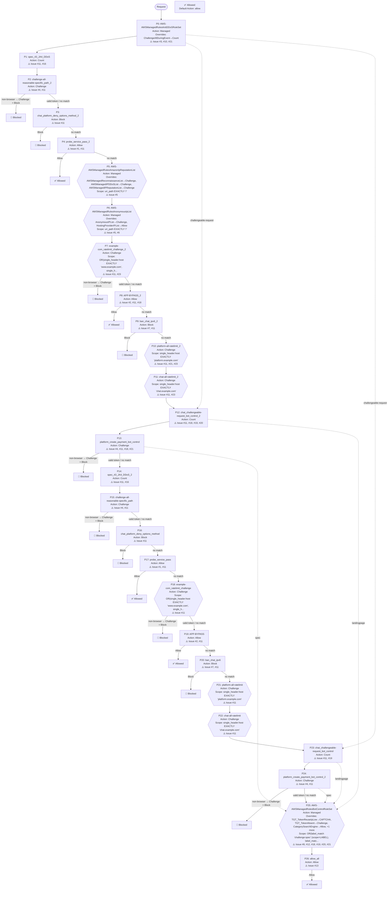

# AWS WAF Web ACL 规则评审报告

**Web ACL**：example-prod
**评审日期**：2026-09-29
**目的**：检查 WAF 配置中的安全问题、配置错误和可优化之处

## 摘要

| 严重程度 | 问题 | 影响 |
|----------|-------|--------|
| 🔴 Critical | #1 probe_service_pass_2 / probe_service_pass 基于可伪造条件实现全局 Allow 绕过 | single_header:x-detect-header 是完全可伪造的，攻击者只需在请求中添加匹配的自定义请求头即可绕过所有后续规则（包括 IP 信誉... |
| 🔴 Critical | #2 APP-BYPASS_2 / APP-BYPASS 基于可伪造条件实现全局 Allow 绕过 | single_header:user-agent 是完全可伪造的，攻击者只需在请求中添加匹配的 User-Agent 头即可绕过所有后续规则（包括 IP ... |
| 🟡 Medium | #3 AntiDDoS AMR 的豁免 URI 正则表达式未锚定，攻击者可利用路径注入绕过 | 以下正则分支未以 `^` 锚定，意味着它们是"包含"匹配而非"以...开头"匹配：`\/query`, `\/models`, `\/messages`,... |
| 🟡 Medium | #4 Challenge 规则作用于 API/POST 路径，没有有效 token 的请求等同于 Block | Challenge 只能由浏览器的 GET 请求完成（要执行 JavaScript、接受 HTML 响应）。POST 请求、fetch/XHR 和原生 A... |
| 🟡 Medium | #5 IP 信誉和匿名 IP 规则组的 scope-down 过窄，仅检查首页 | 两个规则组实际上只对 `GET /` 请求生效，所有其他路径（`/api/*`、`/login`、`/signup` 等）均不受 IP 信誉检查保护 |
| 🟡 Medium | #6 HostingProviderIPList 被覆盖为 Allow，云主机流量会跳过所有后续规则 | `HostingProviderIPList` 默认 Block 云托管和 Web 托管提供商的 IP。覆盖为 Allow 后，来自这些 IP 的请求直接... |
| 🟡 Medium | #7 规则顺序问题，发现 2 处 | IP 黑名单 `ban_chat_ipv6_2`（priority 9）排在 Allow 规则 `probe_service_pass_2`、`APP-B`... |
| 🟡 Medium | #8 Bot Control 跑的是旧版本，识别能力弱很多 | Bot Control 固定在 Version_4.0 |
| 🟡 Medium | #9 缺少 CRS 和 KnownBadInputs 基线防护规则组 ⏳ | CRS 提供 OWASP Top 10 防护（SQLi、XSS 等），是大多数 Web 应用的基础防护层 |
| 🟡 Medium | #18 修掉 UA 放行后，原生 App 流量会被 Challenge 和 Bot Control 拦下 ⏳ | 这个 Web ACL 的 Bot Control 是 TARGETED 级别，除了 UA 和来源 IP，还做浏览器指纹、行为分析和 token 检查。但它... |
| 🟡 Medium | #19 进不进 Bot Control 靠业务 cookie 决定，带上 cookie 就能跳过 | cookie 由客户端自己发送。攻击者随便带上一个名为 `ab_session_id` 或 `smidV2` 的 cookie（规则只看名字，不看值），请... |
| 🟡 Medium | #20 Always-on Challenge 只覆盖 chat，token 免疫时间是默认 300 秒 ⏳ | `example.com`、`www.example.com` 和 `platform.example.com` 的 landing page 没有 al... |
| 🟡 Medium | #21 支付接口可能在 PCI DSS 范围内，动态防护和 Count 规则要和 QSA 确认 ⏳ | 如果这个支付接口会接收、处理或传输卡数据，它背后的系统就在 PCI DSS 范围内。ASV 扫描（Requirement 11.3.2，每季度一次，重大变... |
| 🟢 Low | #10 ChallengeAllDuringEvent 被覆盖为 Count，DDoS 事件期间的兜底 Challenge 关掉了 | `ChallengeAllDuringEvent` 是 AntiDDoS AMR 兜底的软缓解。检测到 DDoS 事件时，它对所有可 Challenge ... |
| 🟢 Low | #11 有 11 组规则完全相同 | 每组里排在前面的规则已经决定了它匹配到的请求怎么处理，后面的副本不会改变任何结果，只是多占 WCU，改规则时还得记得两边一起改 |
| 🟢 Low | #12 Bot Control 的 CategorySearchEngine 和 CategorySeo 被覆盖为 Allow | 这两个规则的 Allow 覆盖只影响"未验证"的搜索引擎 Bot（自称是搜索引擎爬虫但无法通过反向 DNS 验证的请求） |
| 🟢 Low | #13 allow_all 规则与默认 Allow 动作重复 | 该规则匹配所有请求（任何 URI 都以 `/` 开头），action 为 Allow |
| 🟢 Low | #14 缺少爬虫标记规则，DDoS 事件期间搜索引擎爬虫可能被 Challenge | `ChallengeAllDuringEvent` 会在 DDoS 事件期间对所有可 Challenge 的请求发起 Challenge，包括搜索引擎爬虫... |
| 🟢 Low | #15 Token Domain 配置包含冗余子域名 | Token Domain 使用后缀匹配，`example.com` 自动覆盖所有子域名 |
| 🟢 Low | #23 限速规则没有覆盖 api 主机，平台限速的 Challenge 对 API 等同于 Block ⏳ | token domain 里有 `api.example.com` 和 `api-docs.example.com`，但没有任何限速规则覆盖这两个主机。如... |
| 🔵 Awareness | #16 spec_43_JA4_DDoS / spec_43_JA4_DDoS_2 规则为 Count 但未添加标签，仅产生指标 | Count 规则不添加标签时，只产生 CloudWatch 指标，下游规则无法基于此匹配结果采取行动 |
| 🔵 Awareness | #17 未检测到 WAF 日志配置 | WAF JSON 导出不包含日志配置。这一条不代表日志未启用，仅表示无法从导出文件中验证 |
| 🔵 Awareness | #22 各项修复之间的依赖和建议顺序 | Issue 1 和 Issue 2 改成 Count+Label 后，探针和原生 App 流量会继续经过限速（priority 7、10、11 都是 Ch... |

---

## Issue 1 (Critical): probe_service_pass_2 / probe_service_pass 基于可伪造条件实现全局 Allow 绕过

**Rules**: probe_service_pass_2 (priority 4), probe_service_pass (priority 17)
**Current state**: single_header:x-detect-header EXACTLY 'cloud-detect-16TNBPz9L00rabcdefgh'，action 为 Allow，无 scope-down

**Problem**:
- single_header:x-detect-header 是完全可伪造的，攻击者只需在请求中添加匹配的自定义请求头即可绕过所有后续规则（包括 IP 信誉、Bot Control、速率限制等）
- 该规则的 blast radius 是全局的：所有路径都受影响，没有 host 或 URI 限制
- 匹配值 `cloud-detect-16TNBPz9L00rabcde...` 存储在 WAF 配置中，任何能读取 Web ACL 配置的人都能拿到，一旦泄露就能完全绕过 WAF

**Recommendation**:
- 将 action 改为 Count+Label（如 `custom:native-app` 或 `custom:probe`），不要直接 Allow，这些流量不需要绕过 WAF
- 如果此规则用于内部探针或监控工具，应改用不可伪造的条件（如 IP Set 或 WAF Token）
- 定期轮换密钥值，并审计 WAF 配置的 IAM 访问权限

---
## Issue 2 (Critical): APP-BYPASS_2 / APP-BYPASS 基于可伪造条件实现全局 Allow 绕过

**Rules**: APP-BYPASS_2 (priority 8), APP-BYPASS (priority 19)
**Current state**: single_header:user-agent STARTS_WITH 'example'，action 为 Allow，无 scope-down

**Problem**:
- single_header:user-agent 是完全可伪造的，攻击者只需在请求中添加匹配的 User-Agent 头即可绕过所有后续规则（包括 IP 信誉、Bot Control、速率限制等）
- 该规则的 blast radius 是全局的：所有路径都受影响，没有 host 或 URI 限制

**Recommendation**:
- 将 action 改为 Count+Label（如 `custom:native-app` 或 `custom:probe`），不要直接 Allow，这些流量不需要绕过 WAF
- 如果此规则用于内部探针或监控工具，应改用不可伪造的条件（如 IP Set 或 WAF Token）

---
## Issue 3 (Medium): AntiDDoS AMR 的豁免 URI 正则表达式未锚定，攻击者可利用路径注入绕过

**Rule**: AWS-AWSManagedRulesAntiDDoSRuleSet (priority 0)
**Current state**: 豁免正则 `\/query|\/models|\/messages|\/balance|\/completions|\/api\/|\.(acc|avi|css|gif|ico|jpe?g|js|json|mp[34]|ogg|otf|pdf|png|tiff?|ttf|webm|webp|woff2?|xml|svg)$`，API 路径分支未使用 `^` 锚定

**Problem**:
- 以下正则分支未以 `^` 锚定，意味着它们是"包含"匹配而非"以...开头"匹配：`\/query`, `\/models`, `\/messages`, `\/balance`, `\/completions`, `\/api\/`
- 攻击者可以构造包含这些关键词的任意路径，让 `ChallengeDDoSRequests` 跳过这些请求，例如：`/admin/query/export`, `/admin/models/export`
- 这使得攻击者可以通过精心构造的路径，让攻击请求被豁免于 Challenge

**Recommendation**:
- 为所有 API 路径分支添加 `^` 锚定：`^\/query|^\/models|^\/messages|^\/balance|^\/completions|^\/api\/|\.(acc|avi|css|gif|ico|jpe?g|js|json|mp[34]|ogg|otf|pdf|png|tiff?|ttf|webm|webp|woff2?|xml|svg)$`
- 先确认真实路径。如果 API 挂在 `/v1/` 这样的前缀下，要连前缀一起锚定（`^\/v1\/query`），否则加了 `^` 的分支就匹配不上了
- 静态资源后缀匹配已正确使用 `$` 锚定，无需修改

---
## Issue 4 (Medium): Challenge 规则作用于 API/POST 路径，没有有效 token 的请求等同于 Block

**Rules**: challenge-all-reasonable-specific_path_2 (priority 2), platform_create_payment_bot_control (priority 13), challenge-all-reasonable-specific_path (priority 15), platform_create_payment_bot_control_2 (priority 24)
**Current state**: `challenge-all-reasonable-specific_path` 对所有主机的 `/api/event_logging/batch` 做 Challenge，不限方法；`platform_create_payment_bot_control` 对 `platform.example.com` 的 `POST /api/v1/payments` 做 Challenge

**Problem**:
- Challenge 只能由浏览器的 GET 请求完成（要执行 JavaScript、接受 HTML 响应）。POST 请求、fetch/XHR 和原生 App 收到 HTTP 202 后没法完成验证，原请求也不会重发
- 请求带着未过期的 WAF token 时，Challenge 的效果和 Count 一样。所以这几条规则实际做的是"没有有效 token 就拦"：浏览器先在别的页面拿到 token，再调这两个接口，可以正常通过
- 这个 Web ACL 没有配置 `challenge_config`，token 免疫时间是默认的 300 秒。如果前端没有集成 JS SDK 在后台刷新 token，用户在页面上停留超过 5 分钟再提交支付，这个请求就会被拦
- 原生 App 和其他 API 客户端没有 token，调这两个接口一律被拦。`challenge-all-reasonable-specific_path_2` 在 priority 2，排在 `APP-BYPASS_2`（priority 8）前面，App 的 UA 放行对它不起作用

**Recommendation**:
- 先确认这两个接口的调用方。如果只有浏览器调用，这道 token 门槛是合理的，可以保留，同时在前端集成 JS SDK，或者把 token 免疫时间调长（见附录 C）
- 如果有原生 App 调用，集成 AWS WAF Mobile SDK 让 App 请求也带上 token。在那之前，用标签把 App 流量排除在这两条规则之外（见 Issue 18）。打标签的规则要排在 priority 2 之前，现在的 `APP-BYPASS_2` 在 priority 8，产生的标签到不了 `challenge-all-reasonable-specific_path_2`
- 如果目的是防接口被滥用，限速规则（rate-based rule）比 Challenge 更合适

---
## Issue 5 (Medium): IP 信誉和匿名 IP 规则组的 scope-down 过窄，仅检查首页

**Rules**: AWS-AWSManagedRulesAmazonIpReputationList (priority 5), AWS-AWSManagedRulesAnonymousIpList (priority 6)
**Current state**: scope-down 为 `uri_path EXACTLY '/'`，仅对首页路径生效

**Problem**:
- 两个规则组实际上只对 `GET /` 请求生效，所有其他路径（`/api/*`、`/login`、`/signup` 等）均不受 IP 信誉检查保护
- 恶意 IP 只需访问任何非首页路径即可完全绕过这两个规则组
- 这使得 IP 信誉保护形同虚设，尤其对 API 路径的攻击毫无防护

**Recommendation**:
- 移除这两个规则组的 scope-down，让其检查所有流量
- 如果出于性能或成本考虑需要限制范围，至少应覆盖所有关键路径，而不是仅限于首页

---
## Issue 6 (Medium): HostingProviderIPList 被覆盖为 Allow，云主机流量会跳过所有后续规则

**Rule**: AWS-AWSManagedRulesAnonymousIpList (priority 6)
**Current state**: `HostingProviderIPList` 规则被覆盖为 Allow，规则组的 scope-down 为 `uri_path EXACTLY '/'`

**Problem**:
- `HostingProviderIPList` 默认 Block 云托管和 Web 托管提供商的 IP。覆盖为 Allow 后，来自这些 IP 的请求直接放行，后面的规则都不再检查
- 现代 DDoS 攻击大量使用云托管基础设施（VPS、云函数、容器）。Allow 覆盖让这些攻击流量完全绕过 IP 信誉、Bot Control、速率限制等所有保护
- 正确做法是覆盖为 Count（保留标签，供下游规则使用），而非 Allow
- 规则组的 scope-down 是 `uri_path EXACTLY '/'`，只有匹配它的请求才会进入规则组。所以被放行的是匹配这个 scope-down 的云主机请求
- 要去掉或放宽这个 scope-down，先改掉这个 override，否则放行范围会跟着扩大

**Recommendation**:
- 将 `HostingProviderIPList` 的覆盖从 Allow 改为 Count
- 如果担心企业用户通过云代理访问时被误封，Count 模式已经解决了这个问题（不会 Block，只添加标签）

---
## Issue 7 (Medium): 规则顺序问题，发现 2 处

**Rules**: ban_chat_ipv6_2 (priority 9), ban_chat_ipv6 (priority 20)
**Current state**: 现有规则的评估顺序，影响到了哪些请求会被检查或拦截

**Problem**:
- IP 黑名单 `ban_chat_ipv6_2`（priority 9）排在 Allow 规则 `probe_service_pass_2`、`APP-BYPASS_2` 后面。被这些规则放行的请求不会再经过黑名单，已经拉黑的 IP 只要同时命中这些 Allow 规则，就会被放行
- `ban_chat_ipv6_2` 还排在 `AWS-AWSManagedRulesAnonymousIpList`（priority 6）后面，这个规则组把 `HostingProviderIPList` 覆盖成了 Allow（Issue 6）。黑名单里的云主机 IP 访问 `chat.example.com` 的 `/` 时，会先被这个覆盖放行
- IP 黑名单 `ban_chat_ipv6`（priority 20）排在 Allow 规则 `probe_service_pass_2`、`APP-BYPASS_2`、`probe_service_pass`、`APP-BYPASS` 后面。被这些规则放行的请求不会再经过黑名单，已经拉黑的 IP 只要同时命中这些 Allow 规则，就会被放行

**Recommendation**:
- 把 IP 黑名单调到所有 Allow 规则前面
- 新增规则类型时放在哪个位置，参考附录 D

---
## Issue 8 (Medium): Bot Control 跑的是旧版本，识别能力弱很多

**Rule**: AWS-AWSManagedRulesBotControlRuleSet (priority 25)
**Current state**: Version_4.0

**Problem**:
- Bot Control 固定在 Version_4.0
- 之后的版本陆续加入了：
  - 5.0：新增 400 多种 bot，新增 `CategoryPagePreview` 和 `CategoryWebhooks` 两个类别，并调整了匹配顺序，具体的 bot 规则先于通用信号匹配
  - 6.0：Web Bot Authentication 支持区域资源，用这种方式验证过的 bot 在所有类别里都算已验证
  - 6.1：多个类别继续增加特征，包括 Security、SEO 和爬虫框架
- 旧版本能认出的 bot 少得多，各个类别规则能命中的流量也少得多

**Recommendation**:
- 固定到最新的静态版本（见 AWS Managed Rules changelog）。先用 Count 跑一段时间，对比升级前后的标签：5.0 调整了规则的匹配顺序并新增了类别，同一个请求升级后可能命中不同的标签
- 订阅规则组的 SNS 主题，并给固定的版本设置 `DaysToExpiry` 的 CloudWatch 告警

---
## Issue 9 (Medium): 缺少 CRS 和 KnownBadInputs 基线防护规则组 ⏳

**Rule**: N/A (缺失规则)
**Current state**: Web ACL 中没有 CRS 和 KnownBadInputs

**Problem**:
- CRS 提供 OWASP Top 10 防护（SQLi、XSS 等），是大多数 Web 应用的基础防护层
- KnownBadInputsRuleSet 防护 Log4Shell（CVE-2021-44228）、Java 反序列化漏洞等已知恶意输入模式，WCU 消耗低、误报率低
- 这个 Web ACL 里的规则几乎都是 DDoS、限速和 bot 相关的，没有任何检查请求内容的规则。`platform.example.com` 上还有支付接口 `/api/v1/payments`
- ⏳ 如果内容检测放在别的层（比如另一个 Web ACL 或应用自带的防护），这一条可以降级

**Recommendation**:
- 评估是否需要添加 CRS；如果添加，务必将 `SizeRestrictions_BODY` 覆盖为 Count，避免对大 payload 的 API 端点产生误报（实现步骤见附录 F）
- 添加 AWSManagedRulesKnownBadInputsRuleSet（WCU 消耗低，建议优先添加）
- 放在 IP 信誉和限速规则之后
- 添加前请在 AWS 控制台确认剩余 WCU 容量（当前已使用 435 WCU，上限 5000）

---
## Issue 10 (Low): ChallengeAllDuringEvent 被覆盖为 Count，DDoS 事件期间的兜底 Challenge 关掉了

**Rule**: AWS-AWSManagedRulesAntiDDoSRuleSet (priority 0)
**Current state**: `ChallengeAllDuringEvent` 被覆盖为 Count

**Problem**:
- `ChallengeAllDuringEvent` 是 AntiDDoS AMR 兜底的软缓解。检测到 DDoS 事件时，它对所有可 Challenge 的请求发起 Challenge，不管是否可疑，用来过滤不能执行 JavaScript 的攻击工具
- 覆盖为 Count 后，事件期间这条规则只产生指标，不做任何缓解
- `DDoSRequests` 会 Block 可疑度为高的请求（`sensitivity_to_block: LOW`）
- `ChallengeDDoSRequests` 仍会 Challenge 可疑度为低、中、高的请求（Challenge 灵敏度 `HIGH`）。少掉的是兜底的 Challenge：事件期间，没有被规则组标为可疑的可 Challenge 请求不再被 Challenge

**Recommendation**:
- **最佳方案**：如果架构支持，使用前后端分离：前端 Web ACL（浏览器流量）启用 ChallengeAllDuringEvent 默认配置；后端 Web ACL（API/原生 App 流量）关闭 Challenge，提高 Block 灵敏度
- **如果前后端共用同一域名**：在同一 Web ACL 中部署双 AMR 实例，一个针对浏览器流量（启用 ChallengeAllDuringEvent），另一个针对 API/原生 App 流量（禁用 Challenge，Block 灵敏度 MEDIUM）。实现步骤见附录 B
- 不推荐"单实例 + 全部 Count + 自定义标签规则"方案：需要理解 6+ 个 AMR 标签的语义，Count 覆盖会禁用 AMR 内置联动逻辑，且仍需回答"哪些路径可以 Challenge"

---
## Issue 11 (Low): 有 11 组规则完全相同

**Rules**: spec_43_JA4_DDoS (priority 1), spec_43_JA4_DDoS_2 (priority 14), challenge-all-reasonable-specific_path_2 (priority 2), challenge-all-reasonable-specific_path (priority 15), chat_platform_deny_options_method_2 (priority 3), chat_platform_deny_options_method (priority 16), probe_service_pass_2 (priority 4), probe_service_pass (priority 17), example-com_ratelimit_challenge_2 (priority 7), example-com_ratelimit_challenge (priority 18), APP-BYPASS_2 (priority 8), APP-BYPASS (priority 19), ban_chat_ipv6_2 (priority 9), ban_chat_ipv6 (priority 20), platform-all-ratelimit_2 (priority 10), platform-all-ratelimit (priority 21), chat-all-ratelimit_2 (priority 11), chat-all-ratelimit (priority 22), chat_challengeable-request_bot_control_2 (priority 12), chat_challengeable-request_bot_control (priority 23), platform_create_payment_bot_control (priority 13), platform_create_payment_bot_control_2 (priority 24)
**Current state**: 这些规则除了名字和 priority，其他配置完全一样

**Problem**:
- 每组里排在前面的规则已经决定了它匹配到的请求怎么处理，后面的副本不会改变任何结果，只是多占 WCU，改规则时还得记得两边一起改
- `spec_43_JA4_DDoS`（priority 1） / `spec_43_JA4_DDoS_2`（priority 14）
- `challenge-all-reasonable-specific_path_2`（priority 2） / `challenge-all-reasonable-specific_path`（priority 15）
- `chat_platform_deny_options_method_2`（priority 3） / `chat_platform_deny_options_method`（priority 16）
- `probe_service_pass_2`（priority 4） / `probe_service_pass`（priority 17）
- `example-com_ratelimit_challenge_2`（priority 7） / `example-com_ratelimit_challenge`（priority 18）
- `APP-BYPASS_2`（priority 8） / `APP-BYPASS`（priority 19）
- `ban_chat_ipv6_2`（priority 9） / `ban_chat_ipv6`（priority 20）
- `platform-all-ratelimit_2`（priority 10） / `platform-all-ratelimit`（priority 21）
- `chat-all-ratelimit_2`（priority 11） / `chat-all-ratelimit`（priority 22）
- `chat_challengeable-request_bot_control_2`（priority 12） / `chat_challengeable-request_bot_control`（priority 23）
- `platform_create_payment_bot_control`（priority 13） / `platform_create_payment_bot_control_2`（priority 24）

**Recommendation**:
- 每组删掉排在后面的那条。前面那条先执行，删掉后 ACL 的行为不变
- 检查有没有 CloudWatch 告警或仪表盘用到被删规则的指标名
- 如果两条本来就想做不同的事，把条件改成真正不一样

---
## Issue 12 (Low): Bot Control 的 CategorySearchEngine 和 CategorySeo 被覆盖为 Allow

**Rule**: AWS-AWSManagedRulesBotControlRuleSet (priority 25)
**Current state**: `CategorySearchEngine / CategorySeo` 被覆盖为 Allow

**Problem**:
- 这两个规则的 Allow 覆盖只影响"未验证"的搜索引擎 Bot（自称是搜索引擎爬虫但无法通过反向 DNS 验证的请求）
- 真正的 Googlebot/Bingbot（已验证）本来就不会被这两个规则 Block，它们带着 `bot:verified` 标签直接放行，与覆盖无关
- 伪造 Googlebot UA 的攻击者不会匹配 `CategorySearchEngine`（反向 DNS 验证失败后落入 `SignalNonBrowserUserAgent`），也与覆盖无关
- Bot Control 在 priority 25，后面只剩 `allow_all`（Issue 13），default action 也是 Allow。所以这个覆盖的实际效果是：未验证的搜索引擎 Bot 不再被 Block
- Bot Control 的 scope-down 只放进带 `challenge:spec` 或 `challenge:landingpage` 标签的请求，这个覆盖只影响这部分流量。影响面很小，但没有必要

**Recommendation**:
- 移除 `CategorySearchEngine / CategorySeo` 的 Allow 覆盖，恢复默认 Block
- 如果担心 DDoS 事件期间爬虫被 Challenge 影响 SEO，正确做法是添加 ASN + UA 爬虫标记规则（见附录 A），而不是在 Bot Control 中使用 Allow 覆盖

---
## Issue 13 (Low): allow_all 规则与默认 Allow 动作重复

**Rule**: allow_all (priority 26)
**Current state**: `uri_path STARTS_WITH '/'` → Allow，而 Web ACL 的 default_action 已经是 Allow

**Problem**:
- 该规则匹配所有请求（任何 URI 都以 `/` 开头），action 为 Allow
- Web ACL 的 default_action 已经是 Allow，因此该规则完全冗余
- 该规则消耗 WCU 且增加规则评估开销，没有任何实际作用

**Recommendation**:
- 删除 allow_all 规则

---
## Issue 14 (Low): 缺少爬虫标记规则，DDoS 事件期间搜索引擎爬虫可能被 Challenge

**Rule**: N/A (缺失规则)
**Current state**: Web ACL 中没有 ASN + UA 爬虫标记规则

**Problem**:
- `ChallengeAllDuringEvent` 会在 DDoS 事件期间对所有可 Challenge 的请求发起 Challenge，包括搜索引擎爬虫（Googlebot、Bingbot 等）
- 真实案例表明，爬虫在 DDoS 事件期间可能索引 Challenge 拦截页（HTTP 202）而非实际内容，严重损害 SEO 排名
- Bot Control 的 `bot:verified` 标签虽然可以识别已验证爬虫，但 Bot Control 必须放在规则链末尾（成本优化），此时 AntiDDoS AMR 已经评估完毕，无法使用该标签
- `ChallengeAllDuringEvent` 现在是 Count，规则组目前不会对爬虫一律 Challenge。重新打开它之前先加上这条规则

**Recommendation**:
- 在 AntiDDoS AMR 之前添加 ASN + UA 爬虫标记规则，为 Google（ASN 15169）、Bing（ASN 8075）等爬虫添加 `crawler:verified` 标签（完整规则 JSON 见附录 A）
- 在 AntiDDoS AMR 的 scope-down 中排除 `crawler:verified` 标签，防止爬虫被 Challenge

---
## Issue 15 (Low): Token Domain 配置包含冗余子域名

**Rule**: N/A (Web ACL 全局配置)
**Current state**: token_domains 包含 `example.com`, `www.example.com`, `chat.example.com`, `platform.example.com`, `api.example.com`, `api-docs.example.com`

**Problem**:
- Token Domain 使用后缀匹配，`example.com` 自动覆盖所有子域名
- 列出子域名是冗余的，不会造成安全问题，但增加了配置维护成本

**Recommendation**:
- 仅保留 `example.com`，删除其他子域名条目

---
## Issue 16 (Awareness): spec_43_JA4_DDoS / spec_43_JA4_DDoS_2 规则为 Count 但未添加标签，仅产生指标

**Rules**: spec_43_JA4_DDoS (priority 1), spec_43_JA4_DDoS_2 (priority 14)
**Current state**: Count action，无 RuleLabels

**Problem**:
- Count 规则不添加标签时，只产生 CloudWatch 指标，下游规则无法基于此匹配结果采取行动
- 如果意图是基于匹配结果执行某种动作，当前配置无法实现
- 规则名带 DDoS，看起来是打算以后改成 Block。它匹配 `chat.example.com` 上 43 个 JA4 指纹中的任意一个。其中 `t13d1516h2_8daaf6152771_02713d6af862` 在公开的 JA4 资料里常被列为 Chrome 浏览器的指纹。如果名单里混有常见浏览器的指纹，直接改成 Block 会拦掉大量正常用户

**Recommendation**:
- 如果这些规则只是用来观察，把名字改得能看出用途
- 改成 Block 或 Challenge 之前，先用 WAF 日志核对每个指纹对应的 User-Agent 和流量占比，去掉正常浏览器的指纹
- 如果意图是对匹配结果采取行动，可以把 action 改为目标动作，或添加标签供下游规则消费。只对个别指纹有把握时，优先加标签，再配合限速或 Challenge 使用

---
## Issue 17 (Awareness): 未检测到 WAF 日志配置

**Rule**: N/A (Web ACL 全局配置)
**Current state**: WAF JSON 导出文件中不包含日志配置信息

**Problem**:
- WAF JSON 导出不包含日志配置。这一条不代表日志未启用，仅表示无法从导出文件中验证
- WAF 日志对于安全事件调查、规则调优和误报分析至关重要

**Recommendation**:
- 通过 AWS 控制台或 CLI 确认是否已启用 WAF 日志（Kinesis Data Firehose、S3 或 CloudWatch Logs）
- 建议至少保留 90 天的日志，并配置 CloudWatch 告警监控关键指标（Block 率、Challenge 率）

---
## Issue 18 (Medium): 修掉 UA 放行后，原生 App 流量会被 Challenge 和 Bot Control 拦下 ⏳

**Rules**: AWS-AWSManagedRulesBotControlRuleSet (priority 25), APP-BYPASS_2 (priority 8), chat_challengeable-request_bot_control_2 (priority 12), platform_create_payment_bot_control (priority 13)
**Current state**: Bot Control 用 TARGETED 级别，开了机器学习，固定在 Version_4.0；scope-down 只放进带 `challenge:spec` 或 `challenge:landingpage` 标签的请求；`TGT_TokenAbsent` 覆盖为 Challenge，`TGT_TokenReuseIpLow` 覆盖为 CAPTCHA

**Problem**:
- 这个 Web ACL 的 Bot Control 是 TARGETED 级别，除了 UA 和来源 IP，还做浏览器指纹、行为分析和 token 检查。但它只检查两类请求：`platform.example.com` 上带有效 token 的 `POST /api/v1/payments`（`challenge:spec`，没有 token 的在 priority 13 就被 Challenge 拦了），以及 `chat.example.com` 上可 Challenge、没带两个业务 cookie 的 GET 请求（`challenge:landingpage`）。其他流量都不经过 Bot Control
- 原生 App 现在靠 `APP-BYPASS_2`（priority 8）的 UA 放行跳过后面所有规则。按 Issue 2 改成 Count+Label 以后，App 流量会继续往下走：支付 POST 在 priority 13 被 Challenge 拦下；`chat.example.com` 上路径不在豁免正则里的 GET 请求会拿到 `challenge:landingpage` 标签进入 Bot Control，没有 token 就被 `TGT_TokenAbsent` Challenge，非浏览器 UA 还会被 `SignalNonBrowserUserAgent`（默认 Block）拦下
- 在 Bot Control 范围内，`TGT_TokenReuseIpLow` 的 CAPTCHA 对 POST 支付请求没法完成，命中就等同于 Block

**Recommendation**:
- 短期：把 `APP-BYPASS_2` 改成 Count+Label（如 `custom:native-app`），在 Bot Control 的 scope-down 和 `platform_create_payment_bot_control` 里用 NOT 排除这个标签。这个标签来自 UA，仍然能伪造，但伪造后只能跳过这两条规则，IP 信誉、黑名单和限速照样生效
- 中期：集成 AWS WAF Mobile SDK，让 App 请求带上 WAF token，然后去掉上面的排除。TARGETED 级别下，带 token 的 App 请求不会触发 `TGT_TokenAbsent`。去掉排除时，把 `SignalNonBrowserUserAgent` 和 `CategoryHttpLibrary` 覆盖为 Count（见附录 F）
- 保留 `TGT_TokenAbsent` 的 Challenge 覆盖，它是 chat 首页上逐个请求检查 token 的那一层。App 的问题用排除来解决，不要把它改回 Count
- ⏳ 请确认原生 App 会调用哪些主机和路径，UA 是否都以 `example` 开头

---
## Issue 19 (Medium): 进不进 Bot Control 靠业务 cookie 决定，带上 cookie 就能跳过

**Rules**: chat_challengeable-request_bot_control_2 (priority 12), chat_challengeable-request_bot_control (priority 23), AWS-AWSManagedRulesBotControlRuleSet (priority 25)
**Current state**: `challenge:landingpage` 标签只打给没带 `ab_session_id` 和 `smidV2` 两个 cookie 的 chat 请求，两个 cookie 条件的 oversize 处理都是 MATCH

**Problem**:
- cookie 由客户端自己发送。攻击者随便带上一个名为 `ab_session_id` 或 `smidV2` 的 cookie（规则只看名字，不看值），请求就拿不到 `challenge:landingpage` 标签，整个跳过 Bot Control，`TGT_TokenAbsent` 的 Challenge 和 TARGETED 的行为检测都不会发生
- 两个 cookie 条件的 oversize 处理是 MATCH，又包在 NOT 里。cookie 超出 WAF 的检查上限时，条件按"有这个 cookie"处理，请求同样拿不到标签。发一个超大的 Cookie 头也能跳过
- 对 DDoS 脚本来说，加一个固定的 cookie 几乎没有成本。这条规则想做的事（不打扰老用户、少花 Bot Control 的钱）可以用不能伪造的条件来做

**Recommendation**:
- 用 WAF token 代替业务 cookie。AntiDDoS AMR 在 priority 0 已经给请求打上 `awswaf:managed:token:accepted` 等 token 标签，把两个 cookie 条件换成 NOT `awswaf:managed:token:accepted` 的标签匹配。老用户带着有效 token，照样不进 Bot Control，但这个条件没法伪造
- 这样改完，Bot Control 实际只对没有 token 的请求做 Challenge，TARGETED 的会话级检测（比如 token 重用）用不上。如果需要会话级检测，就去掉 cookie 条件，让 chat 的首页请求都进 Bot Control，代价是 TARGETED 按请求计费
- 改之前先看 `landing_page_tag_label` 指标，估算进入 Bot Control 的请求量会怎么变

---
## Issue 20 (Medium): Always-on Challenge 只覆盖 chat，token 免疫时间是默认 300 秒 ⏳

**Rules**: AWS-AWSManagedRulesBotControlRuleSet (priority 25), chat_challengeable-request_bot_control_2 (priority 12)
**Current state**: 起到 always-on Challenge 作用的只有 Bot Control 的 `TGT_TokenAbsent`（Challenge），范围只到 `chat.example.com`；Web ACL 没有配置 `challenge_config`

**Problem**:
- `example.com`、`www.example.com` 和 `platform.example.com` 的 landing page 没有 always-on Challenge。这些主机上只有限速规则会发 Challenge，要等超过阈值，再加上 20 到 30 秒的检测延迟才生效。AntiDDoS AMR 的 `ChallengeAllDuringEvent` 又是 Count（Issue 10），事件期间也没有兜底
- chat 上的这层 Challenge 在 priority 25。`probe_service_pass_2`、`APP-BYPASS_2` 这些 Allow 规则放行的请求到不了这里，带业务 cookie 的请求也进不来（Issue 19）
- 用 TARGETED Bot Control 来做 always-on Challenge，进入范围的每个请求都按 TARGETED 计费（每百万请求 10 美元），比一条普通的 Challenge 规则贵
- token 免疫时间是默认的 300 秒，用户每 5 分钟就要重新过一次 JS 验证

**Recommendation**:
- ⏳ 请确认 `example.com`、`www.example.com`、`platform.example.com` 上哪些 URI 是浏览器访问的 landing page。对这些 URI 按附录 C 加两条规则（Count+Label，再 Challenge），放在限速规则之后、Bot Control 之前。先加 Issue 14 的爬虫标记规则，再在 Challenge 规则里排除 `crawler:verified`
- 把 token 免疫时间调到至少 14400 秒（Web ACL 级别的 challenge 配置）
- chat 可以沿用现在的 Bot Control 做法，也可以换成同样的两条规则，把 Bot Control 留给需要会话级检测的请求

---
## Issue 21 (Medium): 支付接口可能在 PCI DSS 范围内，动态防护和 Count 规则要和 QSA 确认 ⏳

**Rules**: platform_create_payment_bot_control (priority 13), platform-all-ratelimit_2 (priority 10), AWS-AWSManagedRulesBotControlRuleSet (priority 25), AWS-AWSManagedRulesAntiDDoSRuleSet (priority 0)
**Current state**: `platform.example.com` 上有 `POST /api/v1/payments`；这个主机有每分钟 20 次的限速 Challenge、支付接口 Challenge 和 TARGETED Bot Control；没有 CRS 和 KnownBadInputs；日志状态未知

**Problem**:
- 如果这个支付接口会接收、处理或传输卡数据，它背后的系统就在 PCI DSS 范围内。ASV 扫描（Requirement 11.3.2，每季度一次，重大变更后也要做）不能被随流量变化的防护干扰（ASV Program Guide section 5.6）。这里的限速 Challenge、支付接口 Challenge、Bot Control 和 AntiDDoS AMR 都可能让扫描器收到 202、CAPTCHA 或 Block。干扰没解决的话，扫描结果算不确定，最后按不通过处理（section 7.6）
- Requirement 6.4.2 要求面向公网的 Web 应用有自动化方案检测并阻止 Web 攻击：要么拦截，要么告警并马上调查，还要保留审计日志。这个 Web ACL 没有 CRS 和 KnownBadInputs（Issue 9），`spec_43_JA4_DDoS` 一直是 Count 且不打标签（Issue 16），日志是否开启也无法确认（Issue 17）

**Recommendation**:
- ⏳ 请确认 `platform.example.com` 的支付接口是否在 PCI DSS 范围内
- 如果在范围内，只在限速、Challenge、Bot Control 和 AntiDDoS AMR 这些动态防护上给 ASV 的扫描 IP 加例外（IP set 加 NOT 条件，或写进 scope-down），不要在 ACL 顶部加一条 Allow 规则
- 补上 Issue 9 的内容检测规则组，确认日志已开启并保留，给长期 Count 的规则配告警。是否满足 6.4.2 请和客户的 QSA 确认，不要直接下"不合规"的结论

---
## Issue 22 (Awareness): 各项修复之间的依赖和建议顺序

**Rule**: N/A (Web ACL 全局配置)
**Current state**: 本报告的多项修复会改变同一批流量经过的规则，部分修复必须一起上线或按顺序上线

**Problem**:
- Issue 1 和 Issue 2 改成 Count+Label 后，探针和原生 App 流量会继续经过限速（priority 7、10、11 都是 Challenge）、支付接口 Challenge（priority 13）和 Bot Control。探针不是浏览器，打到 `www.example.com` 时每分钟超过 10 次就会被 Challenge 拦下，监控会误报。App 的影响见 Issue 18
- Issue 5 去掉 scope-down 之前必须先做 Issue 6，否则 `HostingProviderIPList` 的 Allow 会从首页扩大到所有路径。去掉 scope-down 后，`AnonymousIPList` 的 Challenge 会作用到 API 和 POST 请求，用 VPN 的用户调接口会被拦
- Issue 3 给豁免正则加 `^` 以后，原来被豁免的路径（比如 `/v1/models` 这种前缀下的路径）会拿到 `challengeable-request` 标签。在 chat 上，这些请求会被 `chat_challengeable-request_bot_control_2` 打上 `challenge:landingpage`，进入 Bot Control 后被 `TGT_TokenAbsent` Challenge，API 调用就会被拦
- Issue 10 打开 `ChallengeAllDuringEvent` 或改成双 AMR 实例之前，要先有 Issue 14 的爬虫标记规则。改成双实例时，两个实例都要排在 priority 12 之前，并确认 chat 的 GET 请求仍然带 `challengeable-request` 标签，否则 Issue 19、Issue 20 依赖的标签会断
- Issue 9 新增的 CRS 和 KnownBadInputs 如果放在 `APP-BYPASS_2`（priority 8）后面，而 Issue 1、Issue 2 还没修，被放行的请求不会被检查
- Issue 7、Issue 11、Issue 13、Issue 15 可以单独做。删掉 priority 23、24 的副本不会断标签：priority 12、13 仍在 Bot Control 前面产生同样的 `challenge:landingpage` 和 `challenge:spec`

**Recommendation**:
- 第一批：Issue 7、Issue 11、Issue 13、Issue 15、Issue 12，互相没有依赖
- 第二批：先 Issue 6，再 Issue 5。匿名 IP 只在面向终端用户的主机上检查，机器对机器调用的主机不用
- 第三批：Issue 1、Issue 2 和 Issue 18 的排除规则一起上线。探针优先改成 IP set 条件，并和 header 条件一起用
- 第四批：先 Issue 14，再 Issue 10 和 Issue 20
- 第五批：Issue 3、Issue 19。先用日志核对真实的 API 路径，看 `landing_page_tag_label` 指标的变化
- Issue 8 和 Issue 9 先用 Count 跑一段时间，对比指标后再切换动作
- 每一批改完，看 CloudWatch 里各规则的 Challenge 和 Block 指标，确认没有异常再做下一批

---

## Issue 23 (Low): 限速规则没有覆盖 api 主机，平台限速的 Challenge 对 API 等同于 Block ⏳

**Rules**: example-com_ratelimit_challenge_2 (priority 7), platform-all-ratelimit_2 (priority 10), chat-all-ratelimit_2 (priority 11)
**Current state**: 三条限速规则都按 IP 计数，窗口 60 秒，动作都是 Challenge：`example.com` 和 `www.example.com` 每分钟 10 次，`platform.example.com` 每分钟 20 次，`chat.example.com` 每分钟 150 次

**Problem**:
- token domain 里有 `api.example.com` 和 `api-docs.example.com`，但没有任何限速规则覆盖这两个主机。如果它们也挂在这个 Web ACL 上，接口被刷时只能靠 AntiDDoS AMR
- `platform-all-ratelimit_2` 覆盖整个 `platform.example.com`，包括 `/api/v1/payments` 这类 API。超过阈值后，没有有效 token 的 API 请求收到 202，效果等同于 Block。公司出口、运营商 NAT 这类共享 IP 更容易超过每分钟 20 次
- `example.com` 和 `www.example.com` 每分钟 10 次的阈值很低。限速按所有请求计数，包括 CSS、JS、图片，快速浏览几个页面就可能超过。浏览器页面请求能过 Challenge，但还没拿到 token 的静态资源和 XHR 请求会失败
- `APP-BYPASS_2`（priority 8）排在 platform 和 chat 的限速前面，UA 以 `example` 开头的请求完全不受这两条限速约束（Issue 2）

**Recommendation**:
- ⏳ 请确认 `api.example.com` 是否由这个 Web ACL 保护。如果是，给它加一条限速规则。调用方是 API 客户端，动作用 Block，不要用 Challenge
- 用 CloudWatch 指标和日志看各主机单个 IP 的正常峰值，再定阈值。platform 的 API 路径可以单独设一条阈值更高、动作为 Block 的限速
- 把 `www.example.com` 的限速 scope-down 改成只统计页面请求（排除静态资源后缀），或者提高阈值

---

<!-- waf-appendix:start -->
## 附录：规则执行流程


```mermaid
flowchart TD
    START(["Request"]) --> rule_0

    rule_0["P0: AWS-AWSManagedRulesAntiDDoSRuleSet\nAction: Managed\nOverrides: ChallengeAllDuringEvent→Count\n⚠️ Issue #3, #10, #21"]

    rule_1["P1: spec_43_JA4_DDoS\nAction: Count\n⚠️ Issue #11, #16"]

    rule_2["P2: challenge-all-reasonable-specific_path_2\nAction: Challenge\n⚠️ Issue #4, #11"]
    rule_2 -->|"non-browser → Challenge = Block"| BLOCK_rule_2["🚫 Blocked"]

    rule_3["P3: chat_platform_deny_options_method_2\nAction: Block\n⚠️ Issue #11"]
    rule_3 -->|"Block"| BLOCK_rule_3["🚫 Blocked"]

    rule_4["P4: probe_service_pass_2\nAction: Allow\n⚠️ Issue #1, #11"]
    rule_4 -->|"Allow"| ALLOW_rule_4["✅ Allowed"]

    rule_5{{"P5: AWS-AWSManagedRulesAmazonIpReputationList\nAction: Managed\nOverrides: AWSManagedReconnaissanceList→Challenge, AWSManagedIPDDoSList→Challenge, AWSManagedIPReputationList→Challenge\nScope: uri_path EXACTLY '/'\n⚠️ Issue #5"}}
    rule_6{{"P6: AWS-AWSManagedRulesAnonymousIpList\nAction: Managed\nOverrides: AnonymousIPList→Challenge, HostingProviderIPList→Allow\nScope: uri_path EXACTLY '/'\n⚠️ Issue #5, #6"}}
    rule_5 --> rule_6

    rule_7{{"P7: example-com_ratelimit_challenge_2\nAction: Challenge\nScope: OR(single_header:host EXACTLY 'www.example.com', single_h...\n⚠️ Issue #11, #23"}}
    rule_7 -->|"non-browser → Challenge = Block"| BLOCK_rule_7["🚫 Blocked"]

    rule_8["P8: APP-BYPASS_2\nAction: Allow\n⚠️ Issue #2, #11, #18"]
    rule_8 -->|"Allow"| ALLOW_rule_8["✅ Allowed"]

    rule_9["P9: ban_chat_ipv6_2\nAction: Block\n⚠️ Issue #7, #11"]
    rule_9 -->|"Block"| BLOCK_rule_9["🚫 Blocked"]

    rule_10{{"P10: platform-all-ratelimit_2\nAction: Challenge\nScope: single_header:host EXACTLY 'platform.example.com'\n⚠️ Issue #11, #21, #23"}}
    rule_11{{"P11: chat-all-ratelimit_2\nAction: Challenge\nScope: single_header:host EXACTLY 'chat.example.com'\n⚠️ Issue #11, #23"}}
    rule_10 --> rule_11

    rule_12["P12: chat_challengeable-request_bot_control_2\nAction: Count\n⚠️ Issue #11, #18, #19, #20"]

    rule_13["P13: platform_create_payment_bot_control\nAction: Challenge\n⚠️ Issue #4, #11, #18, #21"]
    rule_13 -->|"non-browser → Challenge = Block"| BLOCK_rule_13["🚫 Blocked"]

    rule_14["P14: spec_43_JA4_DDoS_2\nAction: Count\n⚠️ Issue #11, #16"]

    rule_15["P15: challenge-all-reasonable-specific_path\nAction: Challenge\n⚠️ Issue #4, #11"]
    rule_15 -->|"non-browser → Challenge = Block"| BLOCK_rule_15["🚫 Blocked"]

    rule_16["P16: chat_platform_deny_options_method\nAction: Block\n⚠️ Issue #11"]
    rule_16 -->|"Block"| BLOCK_rule_16["🚫 Blocked"]

    rule_17["P17: probe_service_pass\nAction: Allow\n⚠️ Issue #1, #11"]
    rule_17 -->|"Allow"| ALLOW_rule_17["✅ Allowed"]

    rule_18{{"P18: example-com_ratelimit_challenge\nAction: Challenge\nScope: OR(single_header:host EXACTLY 'www.example.com', single_h...\n⚠️ Issue #11"}}
    rule_18 -->|"non-browser → Challenge = Block"| BLOCK_rule_18["🚫 Blocked"]

    rule_19["P19: APP-BYPASS\nAction: Allow\n⚠️ Issue #2, #11"]
    rule_19 -->|"Allow"| ALLOW_rule_19["✅ Allowed"]

    rule_20["P20: ban_chat_ipv6\nAction: Block\n⚠️ Issue #7, #11"]
    rule_20 -->|"Block"| BLOCK_rule_20["🚫 Blocked"]

    rule_21{{"P21: platform-all-ratelimit\nAction: Challenge\nScope: single_header:host EXACTLY 'platform.example.com'\n⚠️ Issue #11"}}
    rule_22{{"P22: chat-all-ratelimit\nAction: Challenge\nScope: single_header:host EXACTLY 'chat.example.com'\n⚠️ Issue #11"}}
    rule_21 --> rule_22

    rule_23["P23: chat_challengeable-request_bot_control\nAction: Count\n⚠️ Issue #11, #19"]

    rule_24["P24: platform_create_payment_bot_control_2\nAction: Challenge\n⚠️ Issue #4, #11"]
    rule_24 -->|"non-browser → Challenge = Block"| BLOCK_rule_24["🚫 Blocked"]

    rule_25{{"P25: AWS-AWSManagedRulesBotControlRuleSet\nAction: Managed\nOverrides: TGT_TokenReuseIpLow→CAPTCHA, TGT_TokenAbsent→Challenge, CategorySearchEngine→Allow, +1 more\nScope: OR(label_match 'challenge:spec' (scope=LABEL), label_matc...\n⚠️ Issue #8, #12, #18, #19, #20, #21"}}

    rule_26["P26: allow_all\nAction: Allow\n⚠️ Issue #13"]
    rule_26 -->|"Allow"| ALLOW_rule_26["✅ Allowed"]

    rule_0 --> rule_1
    rule_1 --> rule_2
    rule_2 -->|"valid token / no match"| rule_3
    rule_3 -->|"no match"| rule_4
    rule_4 -->|"no match"| rule_5
    rule_6 --> rule_7
    rule_7 -->|"valid token / no match"| rule_8
    rule_8 -->|"no match"| rule_9
    rule_9 -->|"no match"| rule_10
    rule_11 --> rule_12
    rule_12 --> rule_13
    rule_13 -->|"valid token / no match"| rule_14
    rule_14 --> rule_15
    rule_15 -->|"valid token / no match"| rule_16
    rule_16 -->|"no match"| rule_17
    rule_17 -->|"no match"| rule_18
    rule_18 -->|"valid token / no match"| rule_19
    rule_19 -->|"no match"| rule_20
    rule_20 -->|"no match"| rule_21
    rule_22 --> rule_23
    rule_23 --> rule_24
    rule_24 -->|"valid token / no match"| rule_25
    rule_25 --> rule_26
    DEFAULT_ACTION["✅ Allowed\nDefault Action: allow"]

    rule_0 -.->|"challengeable-request"| rule_12
    rule_0 -.->|"challengeable-request"| rule_23
    rule_13 -.->|"spec"| rule_25
    rule_24 -.->|"spec"| rule_25
    rule_12 -.->|"landingpage"| rule_25
    rule_23 -.->|"landingpage"| rule_25
```

---

# 附录

## 附录 A：ASN + UA 爬虫标记规则

这条规则放在 AntiDDoS AMR 和 Always-on Challenge **之前**。它给验证过的搜索引擎爬虫打上标签，后面的规则可以用 scope-down 把它们排除掉。

```json
{
  "Name": "label-verified-crawlers",
  "Priority": "<place before AntiDDoS AMR>",
  "Action": {
    "Count": {}
  },
  "RuleLabels": [
    { "Name": "crawler:verified" }
  ],
  "VisibilityConfig": {
    "SampledRequestsEnabled": true,
    "CloudWatchMetricsEnabled": true,
    "MetricName": "label-verified-crawlers"
  },
  "Statement": {
    "OrStatement": {
      "Statements": [
        {
          "AndStatement": {
            "Statements": [
              {
                "ByteMatchStatement": {
                  "SearchString": "googlebot",
                  "FieldToMatch": { "SingleHeader": { "Name": "user-agent" } },
                  "TextTransformations": [{ "Priority": 0, "Type": "LOWERCASE" }],
                  "PositionalConstraint": "CONTAINS"
                }
              },
              { "AsnMatchStatement": { "AsnList": [15169] } }
            ]
          }
        },
        {
          "AndStatement": {
            "Statements": [
              {
                "ByteMatchStatement": {
                  "SearchString": "bingbot",
                  "FieldToMatch": { "SingleHeader": { "Name": "user-agent" } },
                  "TextTransformations": [{ "Priority": 0, "Type": "LOWERCASE" }],
                  "PositionalConstraint": "CONTAINS"
                }
              },
              { "AsnMatchStatement": { "AsnList": [8075] } }
            ]
          }
        },
        {
          "AndStatement": {
            "Statements": [
              {
                "ByteMatchStatement": {
                  "SearchString": "yandexbot",
                  "FieldToMatch": { "SingleHeader": { "Name": "user-agent" } },
                  "TextTransformations": [{ "Priority": 0, "Type": "LOWERCASE" }],
                  "PositionalConstraint": "CONTAINS"
                }
              },
              { "AsnMatchStatement": { "AsnList": [13238, 208722] } }
            ]
          }
        }
      ]
    }
  }
}
```

已确认的 ASN：Google 15169，Bing 8075，Yandex 13238 和 208722。其他搜索引擎（百度、Yahoo Japan 等）请先查它们官方文档里的最新 ASN 再添加。

---

## 附录 B：双 AntiDDoS AMR 实例

浏览器流量和原生 App 流量需要不同的 AntiDDoS 策略时使用：

1. **在两个 AMR 实例之前加一条 Count+Label 规则**，给原生 App 流量打标签（如 `native-app:identified`）。这条规则的 priority 数字要比两个 AMR 实例都小。
2. **AMR 实例 1（浏览器流量）**：scope-down 排除原生 App 标签。启用 `ChallengeAllDuringEvent`，Block 灵敏度 LOW（默认值）。
3. **AMR 实例 2（原生 App 流量）**：scope-down 只匹配原生 App 标签。关闭 `ChallengeAllDuringEvent`，Block 灵敏度 MEDIUM（这类流量用不了 Challenge，要靠提高 Block 灵敏度补上）。
4. **操作方法**：AWS 控制台不允许把同一个托管规则组加两次。先复制现有 AMR 规则的 JSON，在 Web ACL 里新建一条**自定义规则**，打开 **JSON 编辑器**，粘贴复制的 JSON，把 `Name` 和 `MetricName` 改成不重复的值（如 `AntiDDoS-NativeApp`），再保存。

排除爬虫的 scope-down（如果 AMR 已经有 scope-down，用 `AndStatement` 合并进去）：

```json
{
  "NotStatement": {
    "Statement": {
      "LabelMatchStatement": {
        "Scope": "LABEL",
        "Key": "crawler:verified"
      }
    }
  }
}
```

---

## 附录 C：Landing page 的 Always-on Challenge

在 landing page 上主动防 DDoS，用两条规则：

1. **标签规则**（Count+Label）：匹配 landing page 的 URI（如 `/`、`/login`、`/signup`），加标签 `custom:landing-page`。动作是 Count，请求继续往下走。
2. **Challenge 规则**：匹配 `custom:landing-page` 标签，动作是 Challenge。再加一个针对 `crawler:verified` 标签的 `NotStatement`，把验证过的爬虫排除掉。

landing page 的 URI 列表要按自己的应用来定。

token 免疫时间建议至少 4 小时（14400 秒）。真实用户完成一次 JS 验证后，整个免疫期内都不会再被打断。

---

## 附录 D：规则顺序参考

| 位置 | 规则类型 | 原因 |
|------|----------|------|
| 1 | IP 白名单（Allow） | 可信 IP 跳过所有规则 |
| 2 | IP 黑名单（Block） | 已知恶意 IP 直接拦截 |
| 3 | Count+Label 规则 | 给流量打标签，供后面的规则做 scope-down |
| 4 | AntiDDoS AMR | 要看到全部流量才能建准基线 |
| 5 | IP 信誉规则组 | WCU 低，先过滤已知恶意 IP |
| 6 | 匿名 IP 规则组 | 过滤匿名 IP 和云主机 IP |
| 7 | 限速规则 | 放在 Challenge 之前 |
| 8 | Always-on Challenge | landing page 的主动 DDoS 防护 |
| 9 | 自定义规则 | 业务相关的逻辑 |
| 10 | 应用层规则组（CRS、KnownBadInputs） | OWASP Top 10 防护 |
| 11 | Bot Control / ATP / ACFP | 按请求数收费，放在最后 |

原则：产生标签的规则放在使用标签的规则前面，AntiDDoS AMR 尽量靠前，便宜的规则放在贵的前面。

---

## 附录 E：WCU 容量

当前 WCU：**435** / 5000。

按建议改完规则后，确认新的 WCU 总量没有超过 5000。查看位置：AWS 控制台 → WAF → Web ACLs → 选中这个 Web ACL，概览页里有容量。

---

## 附录 F：常见的 override 建议

添加或检查托管规则组时，可以参考这些常见的 override：

**AWSManagedRulesCommonRuleSet (CRS)：**
- 把 `SizeRestrictions_BODY` 设为 **Count**。这条规则会拦截超过 8KB 的请求体，在文件上传、大 payload 的 API 和内容较多的表单提交上经常误报。

**AWSManagedRulesBotControlRuleSet（Bot Control COMMON 级别）：**
- 把 `SignalNonBrowserUserAgent` 设为 **Count**。默认 Block 会拦掉正常的非浏览器客户端（用 okhttp、gohttp 的原生 App，API 客户端，监控工具）。
- 把 `CategoryHttpLibrary` 设为 **Count**。原因同上，原生 App 和 API 客户端用的 HTTP 库也会被拦。

**AWSManagedRulesAnonymousIpList：**
- 仔细评估 `HostingProviderIPList`。默认 Block 会拦截来自云平台和主机托管商的请求。如果你的客户端可能从云上发起（例如经过云代理的企业用户、SaaS 集成），把它设为 **Count**。不要设为 Allow，那样会让云上的攻击流量跳过后面所有规则。

<!-- waf-appendix:end -->
